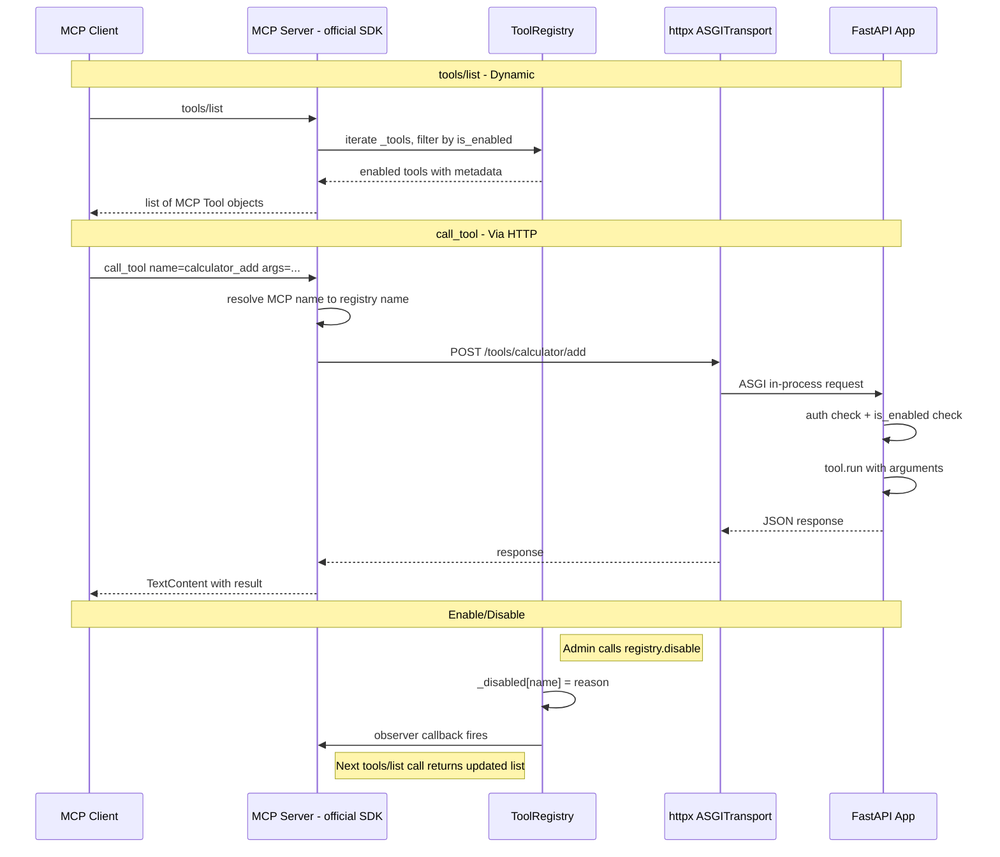

# Refactoring Plan: Hub Server Integration with ToolRegistry

## Background

`toolregistry-hub` was originally split out from `toolregistry` as an independent collection of tool implementations. The hub's server layer (`server/routes/`) currently has no awareness of `toolregistry` — each route file manually defines Request/Response Pydantic models and FastAPI endpoints that wrap the tool logic by hand.

This plan refactors the server layer to be driven by `ToolRegistry` instead of hand-written boilerplate. The result is:

- Auto-generated FastAPI endpoints from `ToolRegistry` tool schemas
- Runtime enable/disable of tools (two-level: group + method) with reason tracking
- Tool self-declaration of environment requirements
- No manual Request/Response model writing for new tools
- An admin web panel usable from both hub and standalone `toolregistry` contexts

---

## Current State Analysis

### Dependency Graph (as-is)

```
toolregistry                    (agent SDK)
  ├── hub extra → toolregistry-hub   (optional, for convenience import)
  └── no other knowledge of hub

toolregistry-hub                (tool implementations + server)
  ├── core: no toolregistry dependency
  └── server extras: fastapi, uvicorn, fastmcp (no toolregistry)
```

### Key Code Facts (verified against source)

1. **`normalize_tool_name()`** converts `-` to `_` (along with CamelCase → snake_case). So `"calculator-add"` normalizes to `"calculator_add"`.

2. **`update_namespace()`** uses `-` as separator: `"calculator"` + `"add"` → `"calculator-add"`. The tool name stored in `_tools` retains the hyphen.

3. **Ambiguity problem**: For `file_ops-replace_lines`, the hyphen correctly separates namespace from method. But if any code path normalizes it → `file_ops_replace_lines`, the boundary is lost because `_` appears in both parts.

4. **`_update_sub_registries()`** splits on `"."` to find sub-registries, but `update_namespace()` uses `"-"`. Calling `_update_sub_registries()` after registration clears the set to empty. This is a latent bug.

5. **`get_tools_json()`** iterates `self._tools.values()` directly — does NOT go through `list_tools()`.

6. **`execute_tool_calls()`** uses `self.get_tool()` which reads from `self._tools` directly — does NOT go through `list_tools()`.

7. **Websearch classes** (`BraveSearch`, `TavilySearch`, etc.) inherit from `BaseSearch(ABC)`, have `__init__` with optional params, and expose a `search()` instance method. They are NOT static-method classes.

8. **`APIKeyParser.__init__`** raises `ValueError` if no API key is found in params or environment. This means websearch class instantiation fails when env vars are missing.

9. **`register_from_class()`** for non-static classes: attempts `cls()` (no-arg instantiation), then registers all public callable methods from the instance.

10. **Name collision**: If multiple classes are registered with the same namespace and they have methods with the same name (e.g., all websearch classes have `search`), later registrations overwrite earlier ones silently.

11. **Hub's current server extras**: `server_openapi` (fastapi+uvicorn), `server_mcp` (fastapi+fastmcp), `server` (all three). None include `toolregistry`.

12. **`Calculator`** inherits from `BaseCalculator`. `Calculator.__dict__` contains `evaluate`, `list_allowed_fns`, `help`, `_allowed_functions`. The inherited methods (`add`, `subtract`, etc.) are in `BaseCalculator.__dict__`. `_is_all_static_methods(Calculator)` checks `Calculator.__dict__` only, but `register_from_class` with `_register_static_methods` also only iterates `cls.__dict__`. The inherited static methods from `BaseCalculator` would NOT be registered. However, `register_from_class` currently works because `_is_all_static_methods` returns `True` for `Calculator` (its own `__dict__` only has static methods), and `_register_static_methods` iterates `cls.__dict__` — so only `Calculator`'s own methods get registered, not `BaseCalculator`'s. This needs verification and may need fixing.

---

## Dependency Design

### Problem: Circular Dependency

Currently `toolregistry` declares an optional dependency on `toolregistry-hub`:

```toml
# toolregistry/pyproject.toml
[project.optional-dependencies]
hub = ["toolregistry-hub>=0.4.14"]
```

If `toolregistry-hub` were to depend on `toolregistry`, a package-level circular dependency would form, rejected by pip/uv at resolve time.

**Solution:** Remove the `hub` extra from `toolregistry`'s pyproject.toml. The `toolregistry/src/toolregistry/hub/__init__.py` shim already re-exports gracefully at runtime (raises `ImportError` with instructions if hub not installed). The `from toolregistry.hub import Calculator` import path continues to work for any user who has both packages installed. The only change is `pip install toolregistry[hub]` is dropped in favor of `pip install toolregistry-hub`.

### Hub Core vs. Hub Server

Hub's core tool classes (Calculator, BraveSearch, etc.) are pure Python — they don't need `toolregistry`. Only the server layer needs it. Therefore:

- **Hub core** (`toolregistry_hub` package): no `toolregistry` dependency
- **Hub server** (`toolregistry_hub[server]` extra): depends on `toolregistry` + `fastapi` + `uvicorn`

```toml
# toolregistry-hub/pyproject.toml
[project]
dependencies = [
    # no toolregistry here — already the case today
    "pydantic>=2.7.2,<3.0.0",
    "loguru>=0.7.3",
    "httpx>=0.28.1",
    ...
]

[project.optional-dependencies]
server_openapi = [
    "toolregistry>=0.4.14",
    "fastapi>=0.119.0",
    "uvicorn[standard]>=0.24.0",
]
server_mcp = [
    "toolregistry>=0.4.14",
    "fastapi>=0.119.0",
    "fastmcp>=2.12.4; python_version >= '3.10'",
]
server = [
    "toolregistry-hub[server_openapi]",
    "toolregistry-hub[server_mcp]",
]
```

> **Note:** Three separate extras are retained: `server_openapi` (FastAPI + uvicorn), `server_mcp` (FastAPI + fastmcp), and `server` (self-referencing combo that pulls in both). This allows users to install only the transport they need.

Final dependency graph — strictly unidirectional, no cycles:

```
toolregistry          (agent SDK, no hub knowledge)
      ^
      |  [server] extra only
toolregistry-hub      (tool implementations, zero toolregistry dep in core)
```

---

## Phase 1 — Dependency Restructuring ✅

> **Issues:** [Oaklight/ToolRegistry#50](https://github.com/Oaklight/ToolRegistry/issues/50) ✅ | [Oaklight/toolregistry-hub#29](https://github.com/Oaklight/toolregistry-hub/issues/29) ✅

**In `toolregistry`:**

- [x] Remove `hub = ["toolregistry-hub>=..."]` from `[project.optional-dependencies]` in `pyproject.toml`
- [x] Keep `hub/__init__.py` shim as-is (runtime re-export still works)
- [x] Update README/docs: hub is now a standalone install (`pip install toolregistry-hub`)

**In `toolregistry-hub`:**

- [x] Add `toolregistry>=0.4.14` to `server_openapi`, `server_mcp`, and `server` optional extras
- [x] Retain three separate extras: `server_openapi`, `server_mcp`, and `server` (self-referencing combo)
- [x] Add `fastmcp` to `server_mcp` extra
- [x] Update `cli.py` error messages to reflect new extra names

---

## Phase 2 — ToolRegistry Core: Tool Model & Name Consistency ✅

> **Issues:** [Oaklight/ToolRegistry#51](https://github.com/Oaklight/ToolRegistry/issues/51) ✅ | [Oaklight/ToolRegistry#52](https://github.com/Oaklight/ToolRegistry/issues/52) ✅
>
> **PR:** [Oaklight/ToolRegistry#57](https://github.com/Oaklight/ToolRegistry/pull/57) ✅ (merged)

These changes belong in `toolregistry` and benefit all consumers.

### 2a. Explicit `namespace` and `method_name` Fields on `Tool`

**Problem:** Tool names encode namespace+method in a single string with `-` separator, but `normalize_tool_name()` converts `-` to `_`. This creates ambiguity (see Current State Analysis #3) and makes URL path construction fragile.

**Solution:** Add two fields to `Tool`:

```python
class Tool(BaseModel):
    name: str                    # existing: full name, e.g. "calculator-add"
    namespace: Optional[str] = None  # new: e.g. "calculator"
    method_name: Optional[str] = None  # new: original function name, e.g. "add"
    ...
```

- [x] **Where to populate:** `Tool.from_function()` already receives `namespace` — store it. The original function name is available as `func.__name__` before normalization — store it as `method_name`.

- [x] In `native/integration.py`, `_register_static_methods` and `_register_instance_methods` pass `namespace` to `registry.register()`, which passes it to `Tool.from_function()`. The chain already exists; we just need to persist the values.

- [x] **`_update_sub_registries()` fix:** Rewrite to collect `tool.namespace` values directly:

```python
def _update_sub_registries(self) -> None:
    self._sub_registries = {
        tool.namespace for tool in self._tools.values()
        if tool.namespace is not None
    }
```

Files: `src/toolregistry/tool.py`, `src/toolregistry/native/integration.py`, `src/toolregistry/tool_registry.py`

### 2b. Fix `register_from_class` for Inherited Static Methods

**Problem:** `_register_static_methods` iterates `cls.__dict__` only, missing inherited static methods. For `Calculator(BaseCalculator)`, only `Calculator`'s own methods (`evaluate`, `list_allowed_fns`, `help`) get registered — not `BaseCalculator`'s (`add`, `subtract`, `multiply`, etc.).

**Solution:** Added `traverse_mro` parameter (default `True`) to `_is_all_static_methods` and `_register_static_methods` to iterate the MRO:

```python
def _register_static_methods(self, cls: Type, namespace: Optional[str]) -> None:
    for klass in cls.__mro__:
        if klass is object:
            continue
        for name, member in klass.__dict__.items():
            if not name.startswith("_") and isinstance(member, staticmethod):
                if name not in registered:  # avoid duplicates from MRO
                    self.registry.register(member.__func__, namespace=namespace)
                    registered.add(name)
```

- [x] `_is_all_static_methods` now traverses MRO by default (`traverse_mro=True`), correctly detecting inherited static methods
- [x] `_register_static_methods` now traverses MRO by default (`traverse_mro=True`), registering inherited static methods from parent classes
- [x] `Calculator(BaseCalculator)` now correctly registers all methods including inherited ones (`add`, `subtract`, `multiply`, etc.)

Files: `src/toolregistry/native/integration.py`

---

## Phase 3 — ToolRegistry Core: Enable/Disable with Reason ✅

> **Issues:** [Oaklight/ToolRegistry#53](https://github.com/Oaklight/ToolRegistry/issues/53)
>
> **PR:** [Oaklight/ToolRegistry#58](https://github.com/Oaklight/ToolRegistry/pull/58) ✅ (merged)

### 3a. Two-Level Enable/Disable ✅

Add enable/disable management to `ToolRegistry`. Pure Python, no new dependencies.

**Two levels:**
- **Group level**: disable/enable an entire namespace (e.g., `"brave_search"`)
- **Method level**: disable/enable a single tool by its full name (e.g., `"calculator-divide"`)

```python
def __init__(self, name=None):
    ...
    self._disabled: Dict[str, str] = {}  # name or namespace → reason

def disable(self, name: str, reason: str = "") -> None:
    """Disable a tool or namespace. Uses raw name (not normalized)."""
    self._disabled[name] = reason

def enable(self, name: str) -> None:
    """Re-enable a tool or namespace."""
    self._disabled.pop(name, None)

def is_enabled(self, tool_name: str) -> bool:
    """Check if a tool is enabled (not disabled at method or group level)."""
    if tool_name in self._disabled:
        return False
    tool = self._tools.get(tool_name)
    if tool and tool.namespace and tool.namespace in self._disabled:
        return False
    return True

def get_disable_reason(self, tool_name: str) -> Optional[str]:
    if tool_name in self._disabled:
        return self._disabled[tool_name]
    tool = self._tools.get(tool_name)
    if tool and tool.namespace:
        return self._disabled.get(tool.namespace)
    return None
```

> **Key decision:** `disable()`/`enable()` use the raw tool name (as stored in `_tools` keys), NOT `normalize_tool_name()`. This avoids the `-` vs `_` mismatch between `_disabled` keys and `_tools` keys.

### 3b. Update `list_tools`, `get_tools_json`, `execute_tool_calls` ✅

These methods must respect `is_enabled()`:

```python
def list_tools(self) -> List[str]:
    """List enabled tools only."""
    return [n for n in self._tools if self.is_enabled(n)]

def list_all_tools(self) -> List[str]:
    """List all tools including disabled (for admin panel)."""
    return list(self._tools.keys())

def get_tools_json(self, tool_name=None, *, api_format="openai") -> List[Dict]:
    if tool_name:
        target_tool = self.get_tool(tool_name)
        tools = [target_tool] if target_tool else []
    else:
        # Only return enabled tools
        tools = [t for t in self._tools.values() if self.is_enabled(t.name)]
    return [tool.get_json_schema(api_format) for tool in tools]

def execute_tool_calls(self, tool_calls, execution_mode=None) -> Dict[str, str]:
    # In executor, check is_enabled before executing:
    # if not is_enabled(function_name): return error message
    ...
```

Files: `src/toolregistry/tool_registry.py`, `src/toolregistry/executor.py`

---

## Phase 4 — Hub: Tool Environment Requirements ✅

> **Issues:** [Oaklight/toolregistry-hub#30](https://github.com/Oaklight/toolregistry-hub/issues/30) ✅
>
> **PR:** [Oaklight/toolregistry-hub#35](https://github.com/Oaklight/toolregistry-hub/pull/35) ✅ (merged)

### Design Considerations: Library vs. Server Usage

`toolregistry-hub` serves two usage patterns:

1. **Library mode** — Users instantiate tool classes directly, passing API keys via constructor parameters:
   ```python
   search = BraveSearch(api_keys="my-key-here")
   results = search.search("query")
   ```

2. **Server mode** — The hub server uses `build_registry()` to auto-register all tools, relying on environment variables for configuration:
   ```python
   registry = build_registry()  # reads env vars, auto-disables unconfigured tools
   ```

The design must support both patterns without forcing one over the other. Key principles:

- `requires_env` is **pure metadata** — it does not block instantiation or method calls
- `build_registry()` uses **instance state** (not just env vars) to determine if a tool should be disabled
- `build_registry()` accepts optional `tool_kwargs` for passing constructor arguments (supporting non-env-var configuration)
- A `Configurable` Protocol provides a generic `is_configured()` check, extensible beyond websearch classes

### 4a. `requires_env` Decorator

This decorator is hub-specific metadata — lives in `toolregistry_hub`, not in `toolregistry`. Zero dependencies. It does **not** enforce anything at runtime — it only attaches metadata for `build_registry()` and documentation purposes:

```python
# toolregistry_hub/utils/requirements.py

def requires_env(*envs: str):
    """Declare required environment variables for a tool class.
    
    This is pure metadata — it does NOT block instantiation or method calls.
    Users can always pass API keys directly via constructor parameters.
    The metadata is used by build_registry() for auto-disable decisions
    and by documentation/admin panel for displaying requirements.
    """
    def decorator(cls):
        cls._required_envs = list(envs)
        return cls
    return decorator
```

Apply to websearch classes:

```python
@requires_env("BRAVE_API_KEY")
class BraveSearch(BaseSearch):
    ...

@requires_env("TAVILY_API_KEY")
class TavilySearch(BaseSearch):
    ...

@requires_env("SEARXNG_URL")
class SearXNGSearch(BaseSearch):
    ...
```

### 4b. Graceful Websearch Instantiation

**Problem:** `APIKeyParser.__init__` raises `ValueError` when env vars are missing. This means `BraveSearch()` fails before we can register its methods.

**Solution:** Modify websearch `__init__` to defer validation. The `APIKeyParser` should not raise on missing keys at construction time; instead, `get_next_api_key()` should raise at call time. This is a minimal change:

```python
# In APIKeyParser.__init__:
# Change: raise ValueError("API keys are required...")
# To: self.api_keys = []  # empty, will fail at get_next_api_key() time

# In APIKeyParser.get_next_api_key():
if not self.api_keys:
    raise ValueError("No API keys available. Set the environment variable.")
```

This allows websearch classes to be instantiated (and their methods registered) even without API keys. The `requires_env` decorator + `build_registry()` will mark them as disabled, and actual API calls will fail with a clear error at runtime.

Files: `src/toolregistry_hub/utils/api_key_parser.py`, `src/toolregistry_hub/websearch/*.py`

### 4c. `Configurable` Protocol

Define a `Configurable` protocol for generic configuration readiness checks. This is a structural type (duck typing) — any class with an `is_configured()` method automatically satisfies it, no inheritance required:

```python
# toolregistry_hub/utils/configurable.py

from typing import Protocol, runtime_checkable


@runtime_checkable
class Configurable(Protocol):
    """Protocol for classes that can report their configuration readiness.
    
    Any class implementing is_configured() automatically satisfies this protocol.
    Used by build_registry() to determine whether to auto-disable a tool.
    """

    def is_configured(self) -> bool:
        """Check if the instance has valid configuration to operate.
        
        Returns:
            True if the instance is properly configured, False otherwise.
        """
        ...
```

Implement in `BaseSearch`:

```python
# websearch/base.py

class BaseSearch(ABC):
    ...
    
    def is_configured(self) -> bool:
        """Check if the search engine has valid configuration.
        
        Default implementation checks if api_key_parser has keys.
        Subclasses should override for custom configuration checks.
        """
        if hasattr(self, 'api_key_parser'):
            return bool(self.api_key_parser.api_keys)
        return True
```

Override in `SearXNGSearch`:

```python
# websearch/websearch_searxng.py

class SearXNGSearch(BaseSearch):
    ...
    
    def is_configured(self) -> bool:
        """Check if SearXNG URL is configured."""
        return self.search_url is not None
```

Files: `src/toolregistry_hub/utils/configurable.py` (new), `src/toolregistry_hub/websearch/base.py`, `src/toolregistry_hub/websearch/websearch_searxng.py`

### 4d. Central Registry with Auto-Disable

Create `toolregistry_hub/server/registry.py`. Key changes from the original design:

1. **Instance-state based disable** — uses `Configurable.is_configured()` instead of only checking env vars
2. **`tool_kwargs` parameter** — allows passing constructor arguments for non-env-var configuration
3. **`_required_envs` for error messages** — the decorator metadata is still used for generating human-readable disable reasons

```python
# server/registry.py
import os
from typing import Dict, List, Optional, Tuple, Type

from loguru import logger
from toolregistry import ToolRegistry

from ..utils.configurable import Configurable
from ..utils.fn_namespace import _is_all_static_methods
from ..calculator import Calculator
from ..datetime_utils import DateTime
from ..fetch import Fetch
from ..filesystem import FileSystem
from ..file_ops import FileOps
from ..think_tool import ThinkTool
from ..todo_list import TodoList
from ..unit_converter import UnitConverter
from ..websearch import (
    BraveSearch, TavilySearch, SearXNGSearch, BrightDataSearch, ScrapelessSearch
)

ALL_TOOLS: List[Tuple[Type, str]] = [
    # Static-method tool classes
    (Calculator,       "calculator"),
    (DateTime,         "datetime"),
    (Fetch,            "fetch"),
    (FileSystem,       "filesystem"),
    (FileOps,          "file_ops"),
    (ThinkTool,        "think"),
    (TodoList,         "todolist"),
    (UnitConverter,    "unit_converter"),
    # Instance-method tool classes (websearch engines)
    (BraveSearch,      "brave_search"),
    (TavilySearch,     "tavily_search"),
    (SearXNGSearch,    "searxng_search"),
    (BrightDataSearch, "brightdata_search"),
    (ScrapelessSearch, "scrapeless_search"),
]


def build_registry(
    tool_kwargs: Optional[Dict[str, dict]] = None,
) -> ToolRegistry:
    """Build the hub tool registry with all tools registered and auto-disabled
    based on instance configuration state.
    
    Args:
        tool_kwargs: Optional mapping of namespace -> constructor kwargs.
            Allows passing API keys or other config without env vars.
            Example: {"brave_search": {"api_keys": "my-key"}}
    """
    registry = ToolRegistry(name="hub")

    for cls, namespace in ALL_TOOLS:
        kwargs = (tool_kwargs or {}).get(namespace, {})
        
        if _is_all_static_methods(cls):
            registry.register_from_class(cls, with_namespace=namespace)
        else:
            instance = cls(**kwargs)
            registry.register_from_class(instance, with_namespace=namespace)

            # Check instance readiness via Configurable protocol
            if isinstance(instance, Configurable) and not instance.is_configured():
                required_envs: List[str] = getattr(cls, "_required_envs", [])
                reason = (
                    f"Missing env: {', '.join(required_envs)}"
                    if required_envs
                    else "Not configured"
                )
                for tool_name, tool in registry._tools.items():
                    if tool.namespace == namespace:
                        registry.disable(tool_name, reason=reason)
                logger.info(f"Disabled {namespace}: {reason}")

    return registry


_registry: Optional[ToolRegistry] = None


def get_registry() -> ToolRegistry:
    """Get or create the singleton hub tool registry."""
    global _registry
    if _registry is None:
        _registry = build_registry()
    return _registry
```

**Usage scenarios:**

```python
# Scenario A: Server mode — relies on env vars (default behavior)
registry = build_registry()

# Scenario B: Library mode — direct instantiation (unaffected by requires_env)
search = BraveSearch(api_keys="my-key")
results = search.search("query")

# Scenario C: Custom registry with direct API keys
registry = build_registry(tool_kwargs={
    "brave_search": {"api_keys": "my-key"},
    "tavily_search": {"api_keys": "another-key"},
})

# Scenario D: Mixed — some env vars, some direct params
os.environ["BRAVE_API_KEY"] = "env-key"
registry = build_registry(tool_kwargs={
    "tavily_search": {"api_keys": "direct-key"},
})
```

---

## Phase 5 — Auto-Route Generation

> **Issues:** [Oaklight/toolregistry-hub#31](https://github.com/Oaklight/toolregistry-hub/issues/31)

The server layer stops hand-writing route files and instead generates FastAPI routes directly from `ToolRegistry`.

### 5a. URL Path Construction

Paths are derived from `Tool.namespace` and `Tool.method_name` (Phase 2a fields), never from splitting the `name` string:

```
namespace="calculator",       method_name="add"           →  POST /tools/calculator/add
namespace="brave_search",     method_name="search"        →  POST /tools/brave_search/search
namespace="tavily_search",    method_name="search"        →  POST /tools/tavily_search/search
namespace="file_ops",         method_name="replace_lines" →  POST /tools/file_ops/replace_lines
```

No ambiguity from `-` or `_` in names. Each websearch engine gets its own namespace.

### 5b. `_schema_to_pydantic` Implementation

Convert a JSON Schema dict (from `tool.parameters`) into a Pydantic model at runtime:

```python
from typing import Any, Dict, List, Optional, Type
from pydantic import BaseModel, Field, create_model

# JSON Schema type → Python type mapping
_TYPE_MAP = {
    "string": str,
    "integer": int,
    "number": float,
    "boolean": bool,
    "array": list,
    "object": dict,
}

def _schema_to_pydantic(name: str, schema: Dict[str, Any]) -> Type[BaseModel]:
    """Convert a JSON Schema to a Pydantic model using create_model.

    Handles basic types, required/optional fields, defaults, and descriptions.
    For nested objects, creates nested Pydantic models recursively.
    """
    if not schema or "properties" not in schema:
        # No parameters — return empty model
        return create_model(name)

    properties = schema.get("properties", {})
    required = set(schema.get("required", []))
    fields = {}

    for field_name, field_schema in properties.items():
        python_type = _resolve_type(field_schema)
        default = field_schema.get("default", ... if field_name in required else None)
        description = field_schema.get("description", "")
        fields[field_name] = (python_type, Field(default=default, description=description))

    return create_model(name, **fields)
```

> **Scope limitation:** The initial implementation handles flat schemas (basic types, `List[T]`, optional fields). Deeply nested `$ref` schemas are not expected from `_generate_parameters_model` output. If encountered, fall back to `Dict[str, Any]`.

### 5c. Auto-Route Generator

Create `toolregistry_hub/server/autoroute.py`:

```python
# server/autoroute.py
from fastapi import APIRouter
from toolregistry import ToolRegistry
from toolregistry.tool import Tool


def registry_to_router(registry: ToolRegistry, prefix: str = "/tools") -> APIRouter:
    """Generate a FastAPI APIRouter from all enabled tools in a ToolRegistry."""
    router = APIRouter(prefix=prefix)
    for tool in registry._tools.values():
        if registry.is_enabled(tool.name):
            _add_route(router, tool)
    return router


def _add_route(router: APIRouter, tool: Tool):
    RequestModel = _schema_to_pydantic(f"{tool.name}_Request", tool.parameters)
    path = f"/{tool.namespace}/{tool.method_name}"

    # Use closure to capture tool reference correctly in loop
    if tool.is_async:
        async def make_async_endpoint(t=tool, M=RequestModel):
            async def endpoint(data: M):
                result = await t.arun(data.model_dump())
                return {"result": result}
            return endpoint
        router.post(
            path, operation_id=tool.name,
            summary=(tool.description or "")[:120],
            tags=[tool.namespace],
        )(make_async_endpoint())
    else:
        def make_sync_endpoint(t=tool, M=RequestModel):
            def endpoint(data: M):
                result = t.run(data.model_dump())
                return {"result": result}
            return endpoint
        router.post(
            path, operation_id=tool.name,
            summary=(tool.description or "")[:120],
            tags=[tool.namespace],
        )(make_sync_endpoint())
```

### 5d. Backward-Compatible Route Migration

**Problem:** Current API paths like `POST /calc/evaluate`, `POST /web/search_brave` will change to `POST /tools/calculator/evaluate`, `POST /tools/brave_search/search`. This is a breaking change for existing clients.

**Strategy:** Two-phase migration:

1. **Phase 5 (this phase):** Add auto-generated routes at `/tools/...` alongside existing hand-written routes. Both work simultaneously. Log deprecation warnings on old paths.
2. **Phase 8 (cleanup):** Remove hand-written routes after a release cycle.

In `server_core.py`:

```python
def create_core_app(dependencies=None) -> FastAPI:
    ...
    # New: registry-driven routes
    registry = get_registry()
    router = registry_to_router(registry, prefix="/tools")
    app.include_router(router)

    # Legacy: keep existing hand-written routes during migration
    legacy_routers = get_all_routers()
    for router in legacy_routers:
        app.include_router(router)
    ...
```

### 5e. Update `server_core.py`

```python
# server_core.py
from .registry import get_registry
from .autoroute import registry_to_router
from .routes import get_all_routers  # keep during migration

def create_core_app(dependencies=None) -> FastAPI:
    ...
    registry = get_registry()

    # Auto-generated routes (new paths)
    auto_router = registry_to_router(registry, prefix="/tools")
    app.include_router(auto_router)

    # Legacy hand-written routes (old paths, removed in Phase 8)
    for router in get_all_routers():
        app.include_router(router)
    ...
```


---

## Phase 6 — MCP Server Migration

> **Predecessor:** Phase 5 (auto-route generation must be in place so all tools live in `ToolRegistry`)

Replace the current FastMCP-based MCP server with a direct implementation using the official `mcp` SDK. This eliminates the static OpenAPI snapshot problem and removes the `fastmcp` dependency from hub server.

#### Problem Statement

`FastMCP.from_fastapi()` creates an `OpenAPIProvider` that takes a **static snapshot** of the OpenAPI spec at creation time:

```python
# Inside FastMCP.from_fastapi() — called once at startup
provider = OpenAPIProvider(
    openapi_spec=app.openapi(),  # snapshot!
    client=httpx.AsyncClient(transport=httpx.ASGITransport(app=app)),
)
```

This creates three synchronization issues:

1. **Initially disabled tools are invisible to MCP**: `setup_dynamic_openapi()` filters disabled tools from `app.openapi()`. When `from_fastapi()` calls `app.openapi()`, disabled tools are already filtered out — they can never be re-enabled.
2. **Runtime disable is inconsistent**: MCP `tools/list` still shows disabled tools (static snapshot), but calling them returns HTTP 503.
3. **Runtime enable is invisible**: Newly enabled tools never appear in MCP because they were not in the snapshot.

#### Root Cause Analysis

The fundamental issue is the **unnecessary indirection** through OpenAPI:

```
Current:  ToolRegistry → FastAPI routes → OpenAPI spec → FastMCP parses spec → MCP tools
```

FastMCP's `from_fastapi()` does three things:
1. Parses `app.openapi()` into `HTTPRoute` objects (~400 lines in `parse_openapi_to_http_routes`)
2. Converts routes to `OpenAPITool` instances with HTTP request construction (~260 lines in `OpenAPITool.run()`)
3. Wraps the official `mcp.server.lowlevel.Server` for transport

Since we already have `ToolRegistry` with all tool metadata (name, description, parameters JSON Schema), we can **bypass the OpenAPI round-trip entirely** and register tools directly with the official MCP SDK.

#### Recommended Approach: Direct ToolRegistry → MCP via Official SDK

```
Proposed: ToolRegistry → MCP tools directly (via official mcp SDK)
                          ↓ tool calls go through HTTP to FastAPI (preserves auth/middleware)
```



```mermaid
flowchart TD
    subgraph Startup
        A[build_registry] --> B[ToolRegistry with all tools + disable state]
        B --> C1[OpenAPI mode: create_core_app with dynamic_openapi=true]
        B --> C2[MCP mode: create_core_app + create_mcp_server]
        C2 --> D[Register list_tools handler - reads from ToolRegistry dynamically]
        C2 --> E[Register call_tool handler - executes via HTTP to FastAPI]
    end

    subgraph Runtime - list_tools
        F[MCP Client requests tools/list] --> G[list_tools handler]
        G --> H[Filter registry._tools by is_enabled]
        H --> I[Return mcp.types.Tool list]
    end

    subgraph Runtime - call_tool
        J[MCP Client calls tool] --> K[call_tool handler]
        K --> L[HTTP POST /tools/namespace/method via ASGITransport]
        L --> M[FastAPI endpoint - auth + is_enabled check + tool.run]
        M --> N[Return result to MCP client]
    end

    subgraph Runtime - Enable/Disable
        O[Admin calls registry.disable] --> P[Observer fires]
        P --> Q[send_tools_list_changed notification]
        Q --> R[MCP clients refresh tool list]
    end
```

#### Why This Approach

| Aspect | FastMCP approach | Official SDK approach |
|--------|-----------------|----------------------|
| Lines of code | ~1000+ (FastMCP internals) | ~150 (our code) |
| Dependencies | `fastmcp` + `openapi-pydantic` | `mcp` (already a dep of toolregistry) |
| Tool listing | Static snapshot → sync problem | Dynamic from ToolRegistry per request |
| Tool execution | HTTP via ASGITransport | HTTP via ASGITransport (same) |
| Enable/disable | Need FastMCP 3.0+ visibility API | Native — filter in `list_tools` handler |
| Auth | `DebugTokenVerifier` (FastMCP-specific) | Starlette middleware or MCP SDK auth |
| Transport | FastMCP wraps official SDK | Official SDK directly |
| Maintenance | Tied to FastMCP releases (frequent breaks) | Tied to stable MCP SDK |

Key advantages:
- **No static snapshot problem** — `list_tools` reads from ToolRegistry on every call
- **No name mapping complexity** — we control tool names directly
- **No FastMCP version dependency** — eliminates the `fastmcp` dependency from hub server entirely
- **Simpler architecture** — removes an entire layer of indirection

#### Implementation Design

### 6a. Observer Pattern on ToolRegistry (upstream change)

Add a lightweight callback mechanism to `ToolRegistry.enable()` and `ToolRegistry.disable()`. This is a general-purpose enhancement — not MCP-specific. Can also be used for OpenAPI spec cache invalidation and `tools/list_changed` notifications.

```python
# In toolregistry/tool_registry.py

class ToolRegistry:
    def __init__(self, name=None):
        ...
        self._on_change_callbacks: List[Callable[[str, str, Optional[str]], None]] = []

    def on_change(self, callback: Callable[[str, str, Optional[str]], None]) -> None:
        """Register a callback for enable/disable state changes.

        The callback receives (event_type, name, reason):
        - event_type: 'enable' or 'disable'
        - name: tool name or namespace that changed
        - reason: disable reason (None for enable events)
        """
        self._on_change_callbacks.append(callback)

    def remove_on_change(self, callback: Callable) -> None:
        """Remove a previously registered callback."""
        self._on_change_callbacks = [
            cb for cb in self._on_change_callbacks if cb is not callback
        ]

    def disable(self, name: str, reason: str = "") -> None:
        self._disabled[name] = reason
        for cb in self._on_change_callbacks:
            cb("disable", name, reason)

    def enable(self, name: str) -> None:
        self._disabled.pop(name, None)
        for cb in self._on_change_callbacks:
            cb("enable", name, None)
```

Files: `src/toolregistry/tool_registry.py`

### 6b. MCP Server Core Rewrite (hub `server_mcp.py`)

Replace the current `server_mcp.py` (which uses `FastMCP.from_fastapi()`) with a direct implementation using the official `mcp` SDK:

- Use official `mcp` SDK (`mcp.server.lowlevel.Server`)
- Implement `_slugify()` + name map for ToolRegistry → MCP name conversion
- Implement dynamic `list_tools` handler (reads from ToolRegistry on every request)
- Implement `call_tool` handler (executes via HTTP to FastAPI, preserving auth/middleware)

```python
# server/server_mcp.py
"""MCP server implementation using official mcp SDK.

Registers tools directly from ToolRegistry, executes via HTTP
to the FastAPI app (preserving auth and middleware).
"""

import json
import re
from typing import Any, Optional, Sequence

import httpx
from loguru import logger
from mcp.server.lowlevel import Server as MCPServer
from mcp.types import (
    CallToolResult,
    TextContent,
    Tool as MCPTool,
)

from toolregistry import ToolRegistry

from .registry import get_registry
from .server_core import create_core_app


def _slugify(name: str) -> str:
    """Convert a ToolRegistry tool name to an MCP-compatible name.

    Replaces hyphens/dots/spaces with underscores, removes special chars,
    collapses multiple underscores, truncates to 56 chars.
    """
    slug = re.sub(r"[\s\-\.]+", "_", name)
    slug = re.sub(r"[^a-zA-Z0-9_]", "", slug)
    slug = re.sub(r"_+", "_", slug)
    slug = slug.strip("_")
    return slug[:56]


def _build_mcp_name_map(registry: ToolRegistry) -> dict[str, str]:
    """Build bidirectional mapping: mcp_name → registry_tool_name."""
    return {
        _slugify(tool.name): tool.name
        for tool in registry._tools.values()
    }


def create_mcp_server(
    registry: Optional[ToolRegistry] = None,
) -> tuple[MCPServer, httpx.AsyncClient]:
    """Create an MCP server backed by ToolRegistry.

    Returns:
        Tuple of (MCP Server, httpx AsyncClient for cleanup)
    """
    if registry is None:
        registry = get_registry()

    # Create FastAPI app for HTTP backend (tool execution goes through HTTP)
    fastapi_app = create_core_app()

    # In-process HTTP client (no network, same process)
    client = httpx.AsyncClient(
        transport=httpx.ASGITransport(app=fastapi_app),
        base_url="http://localhost",
    )

    server = MCPServer(name="ToolRegistry-Hub MCP Server")

    # --- list_tools handler ---
    @server.list_tools()
    async def list_tools() -> list[MCPTool]:
        tools = []
        for tool in registry._tools.values():
            if not registry.is_enabled(tool.name):
                continue
            tools.append(MCPTool(
                name=_slugify(tool.name),
                description=tool.description or "",
                inputSchema=tool.parameters or {"type": "object", "properties": {}},
            ))
        return tools

    # --- call_tool handler ---
    @server.call_tool()
    async def call_tool(
        name: str, arguments: dict[str, Any]
    ) -> Sequence[TextContent]:
        # Resolve MCP name → ToolRegistry name
        name_map = _build_mcp_name_map(registry)
        registry_name = name_map.get(name)

        if registry_name is None:
            return [TextContent(
                type="text",
                text=f"Unknown tool: {name}",
            )]

        tool = registry.get_tool(registry_name)
        if tool is None:
            return [TextContent(
                type="text",
                text=f"Tool not found: {registry_name}",
            )]

        if not registry.is_enabled(registry_name):
            reason = registry.get_disable_reason(registry_name) or "disabled"
            return [TextContent(
                type="text",
                text=f"Tool is disabled: {reason}",
            )]

        # Execute via HTTP to FastAPI (preserves auth, middleware)
        path = f"/tools/{tool.namespace}/{tool.method_name}"
        try:
            response = await client.post(path, json=arguments)
            if response.status_code == 503:
                return [TextContent(
                    type="text",
                    text=f"Tool is disabled (HTTP 503)",
                )]
            response.raise_for_status()
            result = response.json()
            return [TextContent(
                type="text",
                text=json.dumps(result, ensure_ascii=False, indent=2),
            )]
        except httpx.HTTPStatusError as e:
            return [TextContent(
                type="text",
                text=f"HTTP error {e.response.status_code}: {e.response.text}",
            )]
        except Exception as e:
            return [TextContent(
                type="text",
                text=f"Error executing tool: {e}",
            )]

    # --- Register observer for tools/list_changed notifications ---
    def _on_registry_change(
        event_type: str, name: str, reason: Optional[str]
    ) -> None:
        # The official MCP SDK sends tools/list_changed via:
        # server.request_context.session.send_tools_list_changed()
        # This requires an active session context, which is only
        # available during request handling. For now, the dynamic
        # list_tools handler ensures clients always get the current
        # state on their next tools/list call.
        logger.debug(
            f"Registry change: {event_type} {name}"
            f"{f' reason={reason}' if reason else ''}"
        )

    registry.on_change(_on_registry_change)

    return server, client
```

Files: `src/toolregistry_hub/server/server_mcp.py`

### 6c. CLI + Transport Update (hub `cli.py`)

Update MCP mode startup to use the new `create_mcp_server()`:

```python
# In cli.py — MCP mode

from .server_mcp import create_mcp_server

def run_mcp():
    server, client = create_mcp_server()

    # Use streamable-http transport (mounted on Starlette/ASGI)
    # Or stdio for local usage
    import anyio
    from mcp.server.stdio import stdio_server

    async def main():
        async with stdio_server() as (read, write):
            await server.run(read, write, server.create_initialization_options())

    anyio.run(main)
```

For HTTP-based transport (streamable-http), the MCP server can be mounted as an ASGI app alongside the FastAPI app.

Files: `src/toolregistry_hub/server/cli.py`

### 6d. Auth Adaptation (hub `server/auth.py`)

Migrate from FastMCP's `DebugTokenVerifier` to Starlette middleware:

- **Tool execution auth**: Preserved — tool calls go through HTTP to FastAPI, which has its own auth middleware
- **MCP transport auth**: For streamable-http, use Starlette middleware at the ASGI level. For stdio, auth is not applicable (local process)
- **Token validation**: Reuse existing `auth.py` logic at the Starlette/ASGI layer

Files: `src/toolregistry_hub/server/auth.py`

### 6e. Dependency Changes + Testing

#### Dependency Change

```toml
# hub/pyproject.toml — BEFORE
server_mcp = [
    "toolregistry>=0.4.14",
    "fastapi>=0.119.0",
    "fastmcp>=2.12.4; python_version >= '3.10'",
]

# hub/pyproject.toml — AFTER
server_mcp = [
    "toolregistry>=0.4.14",
    "fastapi>=0.119.0",
    "mcp>=1.8.0; python_version >= '3.10'",
    "httpx>=0.28.1",
]
```

`fastmcp` is completely removed from hub server dependencies. The `mcp` SDK is already a dependency of `toolregistry[mcp]`.

#### Impact on Existing Code

| File | Change | Scope |
|------|--------|-------|
| `toolregistry/tool_registry.py` | Add `on_change()`, `remove_on_change()`, fire callbacks in `enable()`/`disable()` | Upstream (toolregistry) |
| `hub/server/server_mcp.py` | **Complete rewrite**: replace FastMCP with official `mcp` SDK | Hub |
| `hub/server/cli.py` | Update MCP mode startup to use new `create_mcp_server()` | Hub |
| `hub/pyproject.toml` | Replace `fastmcp` with `mcp` in `server_mcp` extra | Hub |
| `hub/server/server_core.py` | No change needed (MCP mode no longer calls `create_core_app` differently) | None |
| `hub/server/server_openapi.py` | No change | None |
| `hub/server/mcp_sync.py` | **Not needed** — sync is built into the `list_tools` handler | Removed |

#### Testing Strategy

1. **Unit test**: Verify `_slugify()` produces correct MCP names for all tool names in the registry
2. **Unit test**: Verify `list_tools` handler returns only enabled tools
3. **Unit test**: Verify `call_tool` handler correctly routes to FastAPI endpoints
4. **Unit test**: Verify observer callback fires on `registry.enable()`/`disable()`
5. **Integration test**: Start MCP server (stdio), list tools, call a tool, verify result
6. **Integration test**: Disable a tool, verify it disappears from `tools/list`

#### Data Flow Diagram



#### Edge Cases and Considerations

1. **Tool name collision**: `_slugify()` could map different tool names to the same MCP name. **Mitigation**: `_build_mcp_name_map()` would overwrite — add collision detection with warning log.

2. **`tools/list_changed` notification**: The official MCP SDK supports `send_tools_list_changed()` but requires an active session context. The observer callback fires outside of a request context. **Mitigation**: For the initial implementation, rely on the dynamic `list_tools` handler — clients get the current state on every `tools/list` call. Push notifications can be added as a follow-up using the session-tracking pattern below.

**Future `tools/list_changed` implementation path** (learned from `scitara-cto/dynamic-tool-mcp-server`):

The scitara implementation demonstrates a clean pattern: track all active transports and send notifications directly:

```javascript
// scitara pattern (JS) — iterate all connected transports
for (const transport of Object.values(transports)) {
    await transport.send({
        jsonrpc: "2.0",
        method: "notifications/tools/list_changed",
        params: {},
    });
}
```

Python adaptation for our design:

```python
# Track active sessions (populated when clients connect)
_active_sessions: list = []

def _on_registry_change(event_type, name, reason):
    for session in _active_sessions:
        asyncio.create_task(session.send_tools_list_changed())
```

The challenge: in the Python `mcp` SDK, `Server.run()` creates `ServerSession` internally. We'd need to either subclass `Server` to capture sessions, or use a post-connect hook. This is deferred to a follow-up enhancement.

3. **HTTP round-trip overhead**: Tool calls go through in-process HTTP (ASGITransport). This adds minimal overhead (~1ms) but ensures consistent behavior with OpenAPI mode (same auth, middleware, error handling).

4. **Auth for MCP transport**: `DebugTokenVerifier` is FastMCP-specific. Need to implement auth at the Starlette/ASGI level for streamable-http transport. For stdio transport, auth is not needed.

5. **Structured content**: The official MCP SDK supports `structuredContent` in `CallToolResult`. The initial implementation returns `TextContent` with JSON. Structured content support can be added later.

6. **Thread safety**: Same as before — `ToolRegistry._on_change_callbacks` is a plain list. Single-threaded access assumed.

7. **Backward compatibility**: MCP tool names will change from FastMCP's slugification to our `_slugify()`. Since we control both, and the slugification logic is identical (copied from FastMCP), names should be the same. But this is a one-time migration — existing MCP clients may need to refresh their tool lists.

#### Industry Validation

Research into existing dynamic MCP tool management implementations validates our approach:

**GitHub MCP Server** (`github/github-mcp-server`) — the most mature reference:
- Uses `--dynamic-toolsets` flag to enable runtime tool discovery
- Provides 3 meta-tools: `list_available_toolsets`, `get_toolset_tools`, `enable_toolset`
- `enable_toolset` implementation: validates → sets `toolset.Enabled = true` → calls `server.AddTools()` to register with MCP server
- **`tools/list_changed` notification is commented out** in their codebase (lines 52-55 of `dynamic_tools.go`), confirming this is still experimental even for GitHub
- No `disable_toolset` tool exists — only enable is supported
- Source: [`pkg/github/dynamic_tools.go`](https://github.com/github/github-mcp-server/blob/c38802ac/pkg/github/dynamic_tools.go)

**scitara-cto/dynamic-tool-mcp-server** — simple test implementation:
- Built-in `add_tool` meta-tool for runtime tool registration
- After adding a tool, sends `tools/list_changed` notification
- Clients respond by requesting updated tool list
- Demonstrates the pattern works with SSE transport

**Key takeaways that validate our design:**
1. **Dynamic `list_tools` is the standard approach** — both implementations read current state on each call
2. **`tools/list_changed` is optional** — even GitHub has it commented out; our deferred approach is correct
3. **Direct tool registration** (not via OpenAPI) is the norm — GitHub uses `server.AddTools()`, we use `@server.list_tools()` handler
4. **Our approach goes further** — we support both enable AND disable, while GitHub only supports enable

---

## Phase 7 — Admin Panel (Deferred)

> **Issues:** [Oaklight/ToolRegistry#54](https://github.com/Oaklight/ToolRegistry/issues/54)

> **Decision:** The admin panel (Phase 2e + Phase 5 in the original plan) is a significant feature with its own frontend. It is deferred to a follow-up iteration after the core auto-route system is validated. The enable/disable API (Phase 3) provides the foundation; the admin panel is a UI layer on top.

### 7a. Execution Logging (Foundation)

Add lightweight per-call logging to `Executor`. Uses `loguru` already present.

```python
@dataclass
class ExecutionLogEntry:
    tool_name: str
    parameters: str  # truncated JSON
    result: str      # truncated
    duration_ms: float
    success: bool
    timestamp: float

# In ToolRegistry:
def get_execution_log(self) -> List[ExecutionLogEntry]: ...
def clear_execution_log(self) -> None: ...
```

### 7b. Admin Panel as `toolregistry[admin]` Optional Extra

The admin panel backend is a FastAPI mini-app that wraps any `ToolRegistry` instance. It belongs in `toolregistry` as a reusable optional extra.

```toml
# toolregistry/pyproject.toml
[project.optional-dependencies]
admin = ["fastapi>=0.119.0", "uvicorn[standard]>=0.24.0"]
```

Exposes:

```
GET  /admin/                          → serve admin HTML panel
GET  /admin/tools                     → list all tools with status
POST /admin/tools/{name}/enable       → enable a tool or namespace
POST /admin/tools/{name}/disable      → disable with optional reason
GET  /admin/namespaces                → list namespaces with counts
GET  /admin/log                       → recent execution log
GET  /admin/state                     → export enable/disable state
POST /admin/state                     → restore state
```

### 7c. Admin Panel Frontend

Static HTML at `GET /admin/` — pure HTML + vanilla JS, no build toolchain.

```
[brave_search]      ●──────  (1/1 enabled)
  └── search          ✓  enabled

[tavily_search]     ●──────  (1/1 enabled)
  └── search          ✓  enabled

[brightdata_search] ○──────  (0/1 enabled)
  └── search          ✗  Missing env: BRIGHTDATA_API_KEY

[calculator]        ●──────  (all enabled)
  ├── add             ✓
  ├── subtract        ✓
  ├── multiply        ✓
  └── divide          ✓
```

> **Note:** Websearch engines each have their own namespace because they all expose a `search` method. A future `category` field on `Tool` could enable visual grouping (e.g., all `*_search` under "websearch"), but this is not required initially.

Hub mounts the admin app:

```python
# server_core.py
from toolregistry.admin import create_admin_app

def create_core_app(...) -> FastAPI:
    ...
    admin_app = create_admin_app(registry)
    app.mount("/admin", admin_app)
```

### 7d. OpenAPI ETag Support

Add ETag-based change detection to the `/openapi.json` endpoint, enabling clients to efficiently detect tool list changes.

> **Phase 5 compatibility note:** Phase 5's `setup_dynamic_openapi()` replaces `app.openapi` with a custom function that regenerates the schema on every call (no caching). Phase 7d should either extend `setup_dynamic_openapi()` to include ETag computation, or create an explicit `GET /openapi.json` route that wraps `app.openapi()` and adds ETag/`If-None-Match` headers. The latter approach is recommended since `app.openapi` replacement only controls schema content, not HTTP response headers. Consider using Phase 6a's observer callback to invalidate a cached schema (only regenerate on enable/disable state changes).

**Implementation:**

1. **ETag header on `/openapi.json`**: Compute ETag from the hash of the OpenAPI spec content. Return it in the response `ETag` header.

2. **Conditional request support**: Handle `If-None-Match` request header. If the client's ETag matches the current spec, return `304 Not Modified` (empty body, saving bandwidth).

3. **`info.version` reflects tool list version**: Each `enable()`/`disable()` call increments a patch version counter (e.g., `0.1.0` → `0.1.1` → `0.1.2`). This version is embedded in the OpenAPI spec's `info.version` field, providing a second mechanism for clients to detect changes.

```python
# In server_openapi.py or server_core.py

import hashlib

def _compute_etag(spec: dict) -> str:
    """Compute ETag from OpenAPI spec content."""
    content = json.dumps(spec, sort_keys=True).encode()
    return f'"{hashlib.sha256(content).hexdigest()[:16]}"'

@app.get("/openapi.json")
async def openapi_endpoint(request: Request):
    spec = app.openapi()
    etag = _compute_etag(spec)

    # Conditional request: return 304 if unchanged
    if_none_match = request.headers.get("if-none-match")
    if if_none_match and if_none_match == etag:
        return Response(status_code=304, headers={"ETag": etag})

    return JSONResponse(content=spec, headers={"ETag": etag})
```

**Use cases:**
- `toolregistry` client-side `refresh_from_openapi()` can use ETag to avoid re-parsing unchanged specs
- MCP clients can poll `info.version` to detect changes without full spec download
- Admin panel can use ETag for efficient state polling

---

## Phase 8 — Cleanup and Migration ✅

> **Issues:** [Oaklight/toolregistry-hub#32](https://github.com/Oaklight/toolregistry-hub/issues/32) ✅

Once auto-route is validated end-to-end (at least one release cycle after Phase 5):

> **Phase 5 compatibility note:** Phase 5 added `test_core_app_has_legacy_routes` in `tests/test_autoroute.py` to verify legacy routes exist during the migration period. This test has been removed as legacy routes are now deleted.

- [x] Remove hand-written route files: `calculator.py`, `fetch.py`, `datetime_tools.py`, `unit_converter.py`, `think.py`, `todo_list.py`
- [x] Remove `routes/websearch/` hand-written files (entire `routes/websearch/` directory)
- [x] Keep `routes/version.py` (server metadata, not a tool)
- [x] Remove `discover_routers()` mechanism from `routes/__init__.py` — simplified to only export `version_router`
- [x] Remove legacy router inclusion from `server_core.py` — retained only `version_router`
- [x] Update `server/__init__.py` and `cli.py`
- [x] Update integration tests to target new `/tools/{namespace}/{method}` paths
- [x] Update documentation with new API paths
- [x] Adopt nested namespace format for websearch tools (e.g., `web/brave_search` → URL `/tools/web/brave_search/search`)
- [x] Hide internal methods (`is_configured`) from API endpoints via `_HIDDEN_METHODS` in `registry.py`
- [x] Update `tool_config.py` to support hierarchical namespace prefix matching (`_ns_matches()`)

**Completion notes:**

- Deleted all legacy hand-written route files: `calculator.py`, `datetime_tools.py`, `fetch.py`, `think.py`, `todo_list.py`, `unit_converter.py`, and the entire `routes/websearch/` directory
- Modified `server_core.py` to remove legacy router registration; only `version_router` is retained alongside auto-generated routes
- Simplified `routes/__init__.py` to export only `version_router` (removed `discover_routers()` and all legacy router imports)
- Websearch namespaces changed to nested format in `ALL_TOOLS` (e.g., `"web/brave_search"` instead of `"brave_search"`), producing URLs like `/tools/web/brave_search/search`. The top-level segment (`web`) is used as the OpenAPI tag for grouping.
- Added `_HIDDEN_METHODS` set in `registry.py` to exclude internal/protocol methods (e.g., `is_configured`) from being registered as API endpoints. These methods are removed from the registry after class registration.
- `tool_config.py` updated with `_ns_matches()` helper to support hierarchical namespace prefix matching — e.g., config entry `"web"` matches all `web/*` namespaces (`web/brave_search`, `web/tavily_search`, etc.)
- `build_registry()` uses `rsplit("/", 1)[-1]` for `tool_kwargs` lookup, so users can still pass `{"brave_search": {"api_keys": "..."}}` without the `web/` prefix
- All 418 tests pass

**Note on `ALL_TOOLS` manual registration:** The `ALL_TOOLS` list in `registry.py` still requires manual addition of new tool classes. A future enhancement could auto-discover tool classes via entry points, decorators, or package scanning to eliminate this manual step.

---

## Independent Enhancements (Any Time)

These are independent of the main refactoring and can be done in any order:

### MCP Client Decoupling (`toolregistry[mcp]`) ✅

> **Issues:** [Oaklight/ToolRegistry#64](https://github.com/Oaklight/ToolRegistry/issues/64) ✅
>
> **PR:** [Oaklight/ToolRegistry#65](https://github.com/Oaklight/ToolRegistry/pull/65) ✅ (merged)

#### Problem

`toolregistry[mcp]` currently depends on `fastmcp` for the **client side** (registering tools from an MCP server). fastmcp releases frequently and has broken the integration multiple times — `utils.py` already has a version-check workaround for the `2.3.5` API break. The official `mcp` SDK is the protocol reference implementation and is significantly more stable.

Current fastmcp surface used in the client side:

```python
# integration.py
from fastmcp.client import Client, ClientTransport
async with Client(transport) as client:
    tools = await client.list_tools()
    result = await client.call_tool_mcp(name, params)

# utils.py already uses official mcp SDK for the transport layer — the work is 90% done:
from mcp import ClientSession
from mcp.client.sse import sse_client
from mcp.client.stdio import stdio_client
from mcp.client.streamable_http import streamablehttp_client
from mcp.client.websocket import websocket_client
```

The only remaining fastmcp usage is the `Client` context manager in `integration.py`.

#### Solution: Single-File Stable MCP Client Adapter ✅

Created `src/toolregistry/mcp/client.py` — wraps `mcp.ClientSession` in a stable internal interface. All other files import only from this adapter, never from fastmcp or mcp directly. Future SDK changes require updating only this one file.

```python
# src/toolregistry/mcp/client.py
"""
Minimal MCP client adapter over the official `mcp` SDK.
Supports stdio, SSE, streamable-http, and websocket transports.
This is the sole point of contact with the `mcp` package.
"""
from contextlib import asynccontextmanager
from pathlib import Path
from typing import Any, Dict, List, Optional
from urllib.parse import urlparse

from mcp import ClientSession, StdioServerParameters
from mcp.client.sse import sse_client
from mcp.client.stdio import stdio_client
from mcp.client.streamable_http import streamablehttp_client
from mcp.client.websocket import websocket_client
from mcp.types import Tool as ToolSpec


class MCPClient:
    """Thin async context manager around mcp.ClientSession.

    Usage:
        async with MCPClient("http://localhost:8000/mcp") as client:
            tools = await client.list_tools()
            result = await client.call_tool("tool_name", {"arg": "value"})
    """

    def __init__(self, source):
        self._source = source
        self._session: Optional[ClientSession] = None
        self._stack_ctx = None

    @asynccontextmanager
    async def _open_streams(self):
        src = self._source
        if isinstance(src, str) and src.startswith(("http://", "https://")):
            if urlparse(src).path.rstrip("/").endswith("/sse"):
                async with sse_client(src) as (r, w):
                    yield r, w
            else:
                async with streamablehttp_client(src) as (r, w, _):
                    yield r, w
        elif isinstance(src, str) and src.startswith(("ws://", "wss://")):
            async with websocket_client(src) as (r, w):
                yield r, w
        else:
            async with stdio_client(_to_stdio_params(src)) as (r, w):
                yield r, w

    async def __aenter__(self) -> "MCPClient":
        self._stack_ctx = self._open_streams()
        r, w = await self._stack_ctx.__aenter__()
        self._session = ClientSession(r, w)
        await self._session.__aenter__()
        await self._session.initialize()
        return self

    async def __aexit__(self, *exc):
        if self._session:
            await self._session.__aexit__(*exc)
        await self._stack_ctx.__aexit__(*exc)

    async def list_tools(self) -> List[ToolSpec]:
        return (await self._session.list_tools()).tools

    async def call_tool(self, name: str, arguments: Dict[str, Any]) -> Any:
        return await self._session.call_tool(name, arguments)

    @property
    def server_info(self):
        return getattr(self._session, "server_info", None)


def _to_stdio_params(src) -> StdioServerParameters:
    if isinstance(src, dict):
        return StdioServerParameters(
            command=src["command"], args=src.get("args", []), env=src.get("env")
        )
    path = Path(src)
    if path.suffix == ".py":
        return StdioServerParameters(command="python", args=[str(path)])
    if path.suffix == ".js":
        return StdioServerParameters(command="node", args=[str(path)])
    return StdioServerParameters(command=str(path), args=[])
```

`integration.py` change — before/after:

```python
# Before:
from fastmcp.client import Client
async with Client(transport) as client:
    tools = await client.list_tools()
    result = await client.call_tool_mcp(name, params)

# After:
from .client import MCPClient
async with MCPClient(transport) as client:
    tools = await client.list_tools()
    result = await client.call_tool(name, params)
```

#### Dependency Change ✅

```toml
# toolregistry/pyproject.toml
# Before:
mcp = ["fastmcp>=2.3.0"]

# After:
mcp = ["mcp>=1.0.0"]   # official SDK only; fastmcp removed from [mcp] extra
```

`mcp` is already a transitive dependency of fastmcp, so for existing users nothing new is pulled in. The `[mcp]` extra's footprint shrinks significantly. This change has been applied and merged.

#### Hub Server Side (separate concern, cannot be done here)

`toolregistry-hub`'s `server_mcp.py` uses `FastMCP.from_fastapi()` — there is no equivalent in the official SDK. This **cannot be replaced in this step**. After Phase 5 (auto-route), all hub tools live in `ToolRegistry` and the MCP server can be generated from the registry directly, eliminating the need for `from_fastapi()`. At that point, fastmcp can be removed from hub's server extras entirely (see Phase 6).

#### Known Limitations & Follow-up

The decoupled `MCPClient` only accepts `Union[str, dict, Path]` as source. Two transport types previously supported via fastmcp are no longer available:

1. **`FastMCP` instance (in-process transport)**: fastmcp's `infer_transport` would wrap a `FastMCP` instance in a `FastMCPTransport` for in-process communication without network. This is useful for testing and same-process integration. The official `mcp` SDK provides `create_connected_server_and_client_session()` for this purpose, but it requires a low-level `Server` instance, not a `FastMCP` instance.

2. **`headers` parameter exposure**: `MCPClient` supports a `headers` parameter for HTTP authentication, but `register_from_mcp()` does not expose it in its public API. Users needing custom headers (e.g., `Authorization: Bearer token`) must use `MCPClient` directly instead of the convenience method.

These are intentional scope limitations for the initial decoupling. Follow-up work:
- [ ] Evaluate adding in-process transport support to `MCPClient` (for testing scenarios)
- [ ] Consider exposing `headers` parameter in `register_from_mcp()` / `register_from_mcp_async()`

Files: `src/toolregistry/mcp/client.py` (new), `src/toolregistry/mcp/integration.py`, `src/toolregistry/mcp/utils.py` (simplified), `pyproject.toml`

---

### Anthropic and Gemini Schema Formats

> **Issues:** [Oaklight/ToolRegistry#55](https://github.com/Oaklight/ToolRegistry/issues/55)

`Tool.get_json_schema()` currently raises `NotImplementedError` for `anthropic` and `gemini`.

**Anthropic:**
```python
{
    "name": "tool_name",
    "description": "...",
    "input_schema": { ...json_schema... }
}
```

**Gemini:**
```python
{
    "name": "tool_name",
    "description": "...",
    "parameters": { ...json_schema... }
}
```

Files: `src/toolregistry/tool.py`, `src/toolregistry/types/anthropic/`, `src/toolregistry/types/gemini/`

---

### Progressive Disclosure for MCP

> **Note:** This is a separate feature from Phase 6 (MCP Server Migration). Enable/disable (Phase 6) is an **admin/permission concern** — "is this tool available?". Progressive disclosure is an **agent attention management concern** — "does the agent need to see this tool right now?". These are orthogonal.

When a ToolRegistry has 30+ tools, exposing all of them in `tools/list` overwhelms the LLM's context window. Progressive disclosure lets the agent **explore tool groups on demand** instead of seeing everything at once.

**How it works:**

1. `tools/list` initially returns only two meta-tools: `list_tool_groups` and `inspect_tool_group`
2. Agent calls `list_tool_groups()` → gets namespace summaries (name, description, tool count)
3. Agent calls `inspect_tool_group("calculator")` → gets full tool definitions for that group
4. After inspection, those tools appear in subsequent `tools/list` calls
5. Agent can "release" a group to reduce its visible tool set

**Implementation sketch (upstream ToolRegistry):**

```python
class ToolRegistry:
    def __init__(self):
        self._disclosed: Set[str] = set()  # namespaces agent has inspected
        self._progressive_disclosure: bool = False  # opt-in flag

    def list_tool_groups(self) -> List[dict]:
        """List available tool groups with summary info."""
        ...

    def disclose_group(self, namespace: str) -> List[Tool]:
        """Make a tool group visible in list_tools()."""
        self._disclosed.add(namespace)
        return [t for t in self._tools.values()
                if t.namespace == namespace and self.is_enabled(t.name)]

    def list_tools(self) -> List[str]:
        if self._progressive_disclosure:
            return [n for n, t in self._tools.items()
                    if self.is_enabled(n) and t.namespace in self._disclosed]
        return [n for n in self._tools if self.is_enabled(n)]
```

**Key distinction from GitHub's `enable_toolset`:**

| Aspect | GitHub enable_toolset | Progressive Disclosure |
|--------|----------------------|----------------------|
| Semantics | Turn on this feature | Show me this group |
| Agent role | Controller | Explorer |
| Admin control | Mixed with agent | Orthogonal - enable/disable is admin-only |
| Naming | enable/disable | discover/inspect/disclose |

This feature requires upstream changes to `ToolRegistry` and is planned as a future independent enhancement.

---

### Remote Tool Source Refresh

Client-side methods in `toolregistry` for detecting and refreshing tool definitions from remote sources (OpenAPI or MCP servers).

**Key methods:**

- `refresh_from_openapi(url)` — re-fetch OpenAPI spec and update registered tools
- `refresh_from_mcp(source)` — re-list MCP tools and update registered tools
- Support ETag conditional requests to avoid unnecessary re-parsing (depends on Phase 7d for Hub-side ETag support)
- Optional background polling with configurable interval

**Implementation sketch:**

```python
class ToolRegistry:
    def refresh_from_openapi(self, url: str, *, headers: dict = None) -> bool:
        """Re-fetch OpenAPI spec and update tools. Returns True if changed."""
        response = httpx.get(url, headers={
            "If-None-Match": self._openapi_etag or "",
            **(headers or {}),
        })
        if response.status_code == 304:
            return False  # unchanged
        self._openapi_etag = response.headers.get("etag")
        # Re-register tools from new spec...
        return True

    async def refresh_from_mcp(self, source) -> bool:
        """Re-list MCP tools and update. Returns True if changed."""
        async with MCPClient(source) as client:
            new_tools = await client.list_tools()
            # Compare with current tools, update if changed...
            return True
```

**Dependencies:** Phase 7d (Hub-side ETag support) for efficient OpenAPI refresh.

---

### Connection Pooling Optimization

Low-priority performance optimization for persistent connections to remote tool sources.

**OpenAPI:** Hold a long-lived `httpx.Client` instance for connection pool reuse when making repeated requests to the same OpenAPI server.

**MCP:** Maintain a background async event loop with a persistent MCP session (`PersistentMCPSession`) to avoid reconnection overhead on each tool call.

```python
class PersistentMCPSession:
    """Maintains a long-lived MCP session for connection reuse."""
    def __init__(self, source):
        self._source = source
        self._client: Optional[MCPClient] = None

    async def ensure_connected(self):
        if self._client is None:
            self._client = MCPClient(self._source)
            await self._client.__aenter__()

    async def call_tool(self, name, arguments):
        await self.ensure_connected()
        return await self._client.call_tool(name, arguments)
```

This is a low-priority optimization — the current per-call connection pattern works correctly, just with slightly higher latency for remote sources.

---

### Startup Tool Configuration (JSONC) ✅

> **Issues:** [Oaklight/toolregistry-hub#37](https://github.com/Oaklight/toolregistry-hub/issues/37)
> **PR:** [Oaklight/toolregistry-hub#38](https://github.com/Oaklight/toolregistry-hub/pull/38) ✅ (merged)


Add a startup-time configuration file (`tools.jsonc`) that controls which tool namespaces are enabled or disabled when the server starts. This complements the existing `Configurable` auto-disable (Phase 4) and runtime enable/disable (Phase 3) mechanisms.

**Motivation:** Even when a tool is properly configured (has API keys, etc.), an operator may want to restrict which tools are exposed at startup for security or policy reasons (e.g., disabling `filesystem` and `file_ops` in production). The configuration file provides a declarative way to do this without modifying code.

**Dependencies:** Phase 4 (`build_registry()` must exist). Independent of Phase 5+ — works with both legacy and auto-generated routes since it operates at the `ToolRegistry.disable()` level.

#### Format: JSONC (JSON with Comments)

Uses standard library `json` with a lightweight comment-stripping preprocessor (~15 lines of regex). Zero external dependencies across all Python versions.

```jsonc
{
    // Startup tool configuration for ToolRegistry Hub.
    // Mode: "denylist" (default) or "allowlist"
    "mode": "denylist",

    // Denylist mode: tools to disable at startup
    "disabled": [
        "filesystem",      // filesystem operations — security sensitive
        "file_ops",        // file editing — security sensitive
        "fetch"            // HTTP requests — may be abused
    ]

    // Allowlist mode: only enable listed tools
    // "mode": "allowlist",
    // "enabled": ["calculator", "datetime", "unit_converter"]
}
```

#### Discovery Order

1. CLI argument: `--tools-config path/to/tools.jsonc`
2. Environment variable: `TOOLS_CONFIG=path/to/tools.jsonc`
3. Working directory: `./tools.jsonc`
4. No file found → all tools enabled (backward compatible)

#### Priority Model

```
Highest priority:  Startup config file (tools.jsonc)
                   ↓ even if tool is configured, config file can disable it
Medium priority:   Configurable auto-disable (missing API keys)
                   ↓ tools without required env vars are auto-disabled
Lowest priority:   Default state (all enabled)

Runtime override:  Admin API can enable/disable at any time
                   Server restart re-applies config file state
```

#### Implementation

| File | Change |
|------|--------|
| `src/.../server/tool_config.py` | New: JSONC parser, `ToolConfig` dataclass, `load_tool_config()`, `apply_tool_config()` |
| `src/.../server/registry.py` | Call `apply_tool_config()` at end of `build_registry()` |
| `src/.../server/cli.py` | Add `--tools-config` CLI argument |
| `tools.jsonc.example` | Example configuration file |
| `.gitignore` | Add `tools.jsonc` (user-local config) |
| `tests/test_tool_config.py` | Unit tests for denylist/allowlist/discovery/error handling |

---

## Summary of Changes by Repository

### `toolregistry`

| File | Change | Phase |
|------|--------|-------|
| `pyproject.toml` | Remove `hub` optional dep; add `admin` optional extra (Phase 7) | 1 ✅, 7 |
| `src/toolregistry/tool.py` | Add `namespace`, `method_name` fields | 2a ✅ |
| `src/toolregistry/native/integration.py` | Populate `namespace` and `method_name` on Tool; fix inherited static method registration | 2a ✅, 2b ✅ |
| `src/toolregistry/tool_registry.py` | Add `disable()`, `enable()`, `is_enabled()`, `get_disable_reason()`, `list_all_tools()`; update `get_tools_json()` and `list_tools()` to filter disabled; fix `_update_sub_registries()`; add `on_change()`/`remove_on_change()` observer | 2a ✅, 3 ✅, 6a |
| `src/toolregistry/executor.py` | Check `is_enabled()` before execution; add execution logging | 3 ✅, 7a |
| `src/toolregistry/mcp/client.py` | New: single-file stable MCP client adapter | Independent ✅ |
| `src/toolregistry/mcp/compat.py` | New: v1/v2 兼容层（集中导入 + camelCase↔snake_case 辅助） | Independent |
| `src/toolregistry/mcp/integration.py` | Switch from fastmcp.client to MCPClient; camelCase 属性改为双重兼容 | Independent ✅ |
| `src/toolregistry/mcp/utils.py` | Deleted: all functionality migrated to MCPClient | Independent ✅ |
| `src/toolregistry/types/anthropic/` | Anthropic schema helpers | Independent |
| `src/toolregistry/types/gemini/` | Gemini schema helpers | Independent |
| `src/toolregistry/admin/` | New package: admin panel (deferred) | 7 |

### `toolregistry-hub`

| File | Change | Phase |
|------|--------|-------|
| `pyproject.toml` | Add `toolregistry` to server extras; consolidate `server_openapi` into `server` | 1 ✅ |
| `src/.../utils/requirements.py` | New: `requires_env` decorator (pure metadata) | 4a ✅ |
| `src/.../utils/configurable.py` | New: `Configurable` Protocol with `is_configured()` | 4c ✅ |
| `src/.../utils/api_key_parser.py` | Defer validation: don't raise in `__init__` on missing keys | 4b ✅ |
| `src/.../websearch/base.py` | Add `is_configured()` default implementation | 4c ✅ |
| `src/.../websearch/websearch_searxng.py` | Override `is_configured()` for URL-based config | 4c ✅ |
| `src/.../websearch/*.py` | Add `@requires_env(...)` to each search engine class | 4a ✅ |
| `src/.../server/registry.py` | New: `build_registry(tool_kwargs)` + `get_registry()` with `Configurable` check | 4d ✅ |
| `src/.../server/autoroute.py` | New: `registry_to_router()` + `_schema_to_pydantic()` | 5b, 5c |
| `src/.../server/server_core.py` | Add registry-driven routing alongside legacy routes | 5e |
| `src/.../server/server_mcp.py` | Complete rewrite: replace FastMCP with official `mcp` SDK, direct ToolRegistry → MCP | 6b |
| `src/.../server/cli.py` | Update MCP mode startup to use new `create_mcp_server()` | 6c |
| `src/.../server/auth.py` | Migrate from FastMCP `DebugTokenVerifier` to Starlette middleware | 6d |
| `src/.../server/mcp_compat.py` | New: 集中 FastMCP/DebugTokenVerifier 导入，为 v2 迁移做准备 | Independent |
| `src/.../server/tool_config.py` | New: JSONC parser, `ToolConfig` dataclass, `load_tool_config()`, `apply_tool_config()` | Independent |
| `src/.../server/routes/*.py` | Removed in Phase 8 | 8 ✅ |
| `src/.../server/routes/__init__.py` | Remove `discover_routers()` in Phase 8 | 8 ✅ |

---

## Implementation Order

```
Phase 1  — Dependency restructuring (unblocks everything)  ✅
  │
Phase 2  — Tool.namespace + Tool.method_name + inherited static methods fix  ✅
  │         (foundation for auto-route and is_enabled)
  │
Phase 3  — Enable/disable with reason + update list_tools/get_tools_json/execute  ✅
  │         (foundation for requires_env auto-disable)
  │
Phase 4  — requires_env decorator + Configurable protocol + graceful websearch init + build_registry()  ✅
  │         (hub-side, depends on Phase 2+3 in toolregistry)
  │
Phase 5  — Auto-route generator + backward-compatible migration
  │         (hub-side, depends on Phase 4)
  │         5a-5e: URL paths, schema conversion, route generation, migration
  │
Phase 6  — MCP Server Migration (depends on Phase 5 + upstream observer)
  │         6a: observer pattern on ToolRegistry (upstream)
  │         6b: MCP server core rewrite (hub server_mcp.py)
  │         6c: CLI + transport update (hub cli.py)
  │         6d: auth adaptation (hub auth.py)
  │         6e: dependency changes + testing
  │
Phase 7  — Admin panel (deferred, can be done after Phase 5 is stable)
  │         7a: execution logging
  │         7b: admin backend
  │         7c: admin frontend
  │         7d: OpenAPI ETag support
  │
Phase 8  — Cleanup: remove hand-written routes (after migration period)  ✅

Independent: Anthropic/Gemini schema formats (any time)
Independent: MCP client decoupling — toolregistry[mcp] (any time, no phase dependency) ✅
Independent: MCP SDK v2 迁移准备 — compat 层 + 版本上界 (any time, zero risk)
Independent: Progressive Disclosure for MCP (upstream ToolRegistry, after Phase 6)
Independent: Remote Tool Source Refresh (depends on Phase 7d for ETag support)
Independent: Connection Pooling Optimization (low priority, any time)
Independent: Startup Tool Configuration (JSONC) — depends on Phase 4 only
```

### Risk Mitigation

| Risk | Mitigation |
|------|------------|
| API path breaking change | Phase 5d: dual-route period with legacy + new paths |
| Websearch instantiation failure | Phase 4b: defer `APIKeyParser` validation to call time |
| `_schema_to_pydantic` complexity | Phase 5b: limit scope to flat schemas; fallback to `Dict[str, Any]` |
| `Calculator` inherited methods | Phase 2b: verify and fix MRO traversal in `_register_static_methods` |
| `normalize_tool_name` inconsistency in disable/enable | Phase 3a: use raw names, not normalized |
| fastmcp client API instability | Independent: single-file adapter in `mcp/client.py` isolates changes |
| fastmcp server API instability | Phase 6: replace `from_fastapi()` with ToolRegistry-driven MCP server |
| MCP tool name slugification mismatch | Phase 6b: `_slugify()` is simple and under our control; integration tests verify |
| MCP enable/disable state drift | Phase 6b: dynamic `list_tools` handler reads from ToolRegistry on every call — no drift possible |
| FastMCP dependency instability | Phase 6e: eliminate `fastmcp` from hub server entirely; use official `mcp` SDK |
| MCP SDK v2 breaking changes | Independent: compat 层 + `<3.0.0` 版本上界 + camelCase↔snake_case 双重兼容 |
