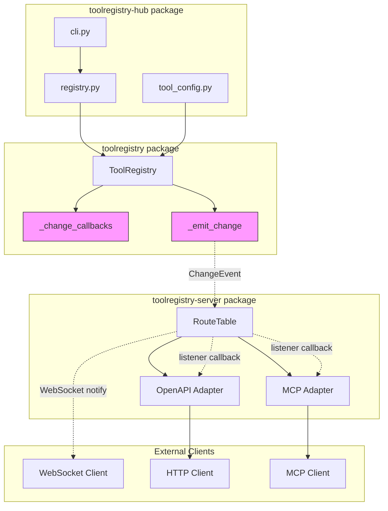

# Phase 6: Callback Mechanism Design for ToolRegistry

## 1. Overview

This document describes the design for adding `on_change()` and `remove_on_change()` callback mechanisms to `ToolRegistry`. This feature enables subscribers to receive notifications when tool state changes occur, supporting use cases like:

- Real-time UI updates in admin panels
- Cache invalidation in protocol adapters
- Logging and monitoring
- Hot-reload synchronization

**Related Issue**: [GitHub Issue #68](https://github.com/Oaklight/ToolRegistry/issues/68)

---

## 2. Current Architecture Analysis

### 2.1 ToolRegistry (toolregistry package)

The core `ToolRegistry` class manages tool registration and availability:

```python
class ToolRegistry:
    _tools: dict[str, Tool]      # Registered tools
    _disabled: dict[str, str]    # Disabled tools with reasons
    
    def register(self, tool) -> None: ...
    def unregister(self, name: str) -> None: ...
    def enable(self, name: str) -> None: ...
    def disable(self, name: str, reason: str = "") -> None: ...
    def is_enabled(self, name: str) -> bool: ...
    def get_disable_reason(self, name: str) -> str | None: ...
```

**Current limitation**: No mechanism to notify external components when state changes.

### 2.2 RouteTable (toolregistry-server package)

The `RouteTable` class already implements an observer pattern:

```python
class RouteTable:
    _listeners: list[Callable[[str, str], None]]
    
    def add_listener(self, callback: Callable[[str, str], None]) -> None: ...
    def remove_listener(self, callback: Callable[[str, str], None]) -> None: ...
    def _notify_listeners(self, tool_name: str, event: str) -> None: ...
```

**Current limitation**: RouteTable must poll or proxy all state changes through its own methods.

### 2.3 Integration Flow

```
ToolRegistry ──(no notification)──> RouteTable ──(listeners)──> Adapters
                                         │
                                         └── OpenAPI Adapter
                                         └── MCP Adapter
```

**Goal**: Add native callback support to ToolRegistry so RouteTable can subscribe directly.

---

## 3. API Design

### 3.1 ChangeEvent Data Class

```python
from dataclasses import dataclass
from enum import Enum
from typing import Any


class ChangeEventType(str, Enum):
    """Types of change events that can occur in ToolRegistry."""
    
    REGISTER = "register"       # Tool registered
    UNREGISTER = "unregister"   # Tool unregistered
    ENABLE = "enable"           # Tool enabled
    DISABLE = "disable"         # Tool disabled
    REFRESH = "refresh"         # Single tool refreshed
    REFRESH_ALL = "refresh_all" # All tools refreshed/reloaded


@dataclass(frozen=True)
class ChangeEvent:
    """Immutable event object passed to change callbacks.
    
    Attributes:
        event_type: The type of change that occurred.
        tool_name: Name of the affected tool, or None for bulk operations.
        reason: Optional reason string, primarily used for disable events.
        metadata: Optional additional context data.
    """
    
    event_type: ChangeEventType
    tool_name: str | None = None
    reason: str | None = None
    metadata: dict[str, Any] | None = None
```

### 3.2 Callback Type Definition

```python
from typing import Callable, TypeAlias

# Callback signature: receives a ChangeEvent, returns nothing
ChangeCallback: TypeAlias = Callable[[ChangeEvent], None]
```

### 3.3 ToolRegistry API Extensions

```python
class ToolRegistry:
    """Extended ToolRegistry with callback support."""
    
    def on_change(self, callback: ChangeCallback) -> None:
        """Register a callback to be notified of tool state changes.
        
        The callback will be invoked synchronously whenever a tool is
        registered, unregistered, enabled, or disabled.
        
        Args:
            callback: Function that accepts a ChangeEvent parameter.
                     Must not raise exceptions that should propagate.
        
        Note:
            - Callbacks are invoked in registration order.
            - The same callback can be registered multiple times.
            - Callbacks should be lightweight; heavy processing should
              be offloaded to a separate thread/task.
        
        Example:
            >>> def my_handler(event: ChangeEvent) -> None:
            ...     print(f"{event.event_type}: {event.tool_name}")
            >>> registry.on_change(my_handler)
        """
        pass
    
    def remove_on_change(self, callback: ChangeCallback) -> None:
        """Remove a previously registered callback.
        
        Args:
            callback: The exact callback function to remove.
        
        Raises:
            ValueError: If the callback was not registered.
        
        Note:
            If the same callback was registered multiple times,
            only the first occurrence is removed.
        
        Example:
            >>> registry.remove_on_change(my_handler)
        """
        pass
```

---

## 4. Implementation Details

### 4.1 Internal State

```python
import threading
from typing import Callable


class ToolRegistry:
    def __init__(self, name: str = "default"):
        # ... existing initialization ...
        self._change_callbacks: list[ChangeCallback] = []
        self._callback_lock = threading.Lock()
```

### 4.2 Callback Registration

```python
def on_change(self, callback: ChangeCallback) -> None:
    """Register a callback for change notifications."""
    with self._callback_lock:
        self._change_callbacks.append(callback)


def remove_on_change(self, callback: ChangeCallback) -> None:
    """Remove a registered callback."""
    with self._callback_lock:
        try:
            self._change_callbacks.remove(callback)
        except ValueError:
            raise ValueError(
                f"Callback {callback!r} was not registered"
            ) from None
```

### 4.3 Event Emission

```python
def _emit_change(self, event: ChangeEvent) -> None:
    """Notify all registered callbacks of a change event.
    
    Callbacks are invoked synchronously in registration order.
    Exceptions in callbacks are logged but do not propagate.
    """
    # Copy callback list to allow modification during iteration
    with self._callback_lock:
        callbacks = self._change_callbacks.copy()
    
    for callback in callbacks:
        try:
            callback(event)
        except Exception as e:
            # Log but don't propagate - one bad callback shouldn't
            # break the entire notification chain
            logger.warning(
                f"Change callback {callback!r} raised exception: {e}"
            )
```

### 4.4 Integration Points

The `_emit_change` method should be called from:

```python
def register(self, tool, ...) -> None:
    # ... existing registration logic ...
    self._emit_change(ChangeEvent(
        event_type=ChangeEventType.REGISTER,
        tool_name=tool.name,
    ))


def unregister(self, name: str) -> None:
    # ... existing unregistration logic ...
    self._emit_change(ChangeEvent(
        event_type=ChangeEventType.UNREGISTER,
        tool_name=name,
    ))


def enable(self, name: str) -> None:
    # ... existing enable logic ...
    self._emit_change(ChangeEvent(
        event_type=ChangeEventType.ENABLE,
        tool_name=name,
    ))


def disable(self, name: str, reason: str = "") -> None:
    # ... existing disable logic ...
    self._emit_change(ChangeEvent(
        event_type=ChangeEventType.DISABLE,
        tool_name=name,
        reason=reason or None,
    ))
```

---

## 5. Thread Safety

### 5.1 Guarantees

1. **Callback list modification**: Protected by `_callback_lock`
2. **Callback invocation**: Uses a snapshot copy to allow concurrent modifications
3. **Event emission**: Synchronous, blocking until all callbacks complete

### 5.2 Considerations

```python
# Safe: Modifying callbacks during iteration
def my_callback(event: ChangeEvent) -> None:
    if event.event_type == ChangeEventType.DISABLE:
        # This is safe - we iterate over a copy
        registry.remove_on_change(my_callback)

# Safe: Nested registry operations
def my_callback(event: ChangeEvent) -> None:
    if event.event_type == ChangeEventType.REGISTER:
        # This is safe - will emit another event after current iteration
        registry.disable(event.tool_name, reason="Auto-disabled")
```

### 5.3 Async Considerations

For async contexts, callbacks should offload heavy work:

```python
import asyncio

def async_aware_callback(event: ChangeEvent) -> None:
    """Callback that schedules async work."""
    loop = asyncio.get_event_loop()
    loop.call_soon_threadsafe(
        lambda: asyncio.create_task(handle_event_async(event))
    )
```

---

## 6. Usage Examples

### 6.1 Basic Usage

```python
from toolregistry import ToolRegistry, ChangeEvent, ChangeEventType

registry = ToolRegistry()

def log_changes(event: ChangeEvent) -> None:
    print(f"[{event.event_type.value}] {event.tool_name}")
    if event.reason:
        print(f"  Reason: {event.reason}")

registry.on_change(log_changes)

# Register a tool - callback is invoked
registry.register(my_tool)
# Output: [register] my_tool

# Disable the tool - callback is invoked
registry.disable("my_tool", reason="Maintenance")
# Output: [disable] my_tool
#         Reason: Maintenance
```

### 6.2 RouteTable Integration

```python
from toolregistry_server import RouteTable

class RouteTable:
    def __init__(self, registry: ToolRegistry):
        self._registry = registry
        self._routes: dict[str, RouteEntry] = {}
        self._listeners: list[Callable[[str, str], None]] = []
        self._version = 0
        
        # Subscribe to registry changes
        registry.on_change(self._on_registry_change)
        self._rebuild()
    
    def _on_registry_change(self, event: ChangeEvent) -> None:
        """Handle registry change events."""
        if event.event_type == ChangeEventType.REGISTER:
            tool = self._registry.get_tool(event.tool_name)
            if tool:
                self._routes[event.tool_name] = self._tool_to_route(tool)
            self._notify_listeners(event.tool_name, "register")
        
        elif event.event_type == ChangeEventType.UNREGISTER:
            self._routes.pop(event.tool_name, None)
            self._notify_listeners(event.tool_name, "unregister")
        
        elif event.event_type in (ChangeEventType.ENABLE, ChangeEventType.DISABLE):
            self.refresh(event.tool_name)
            self._notify_listeners(event.tool_name, event.event_type.value)
        
        elif event.event_type == ChangeEventType.REFRESH_ALL:
            self._rebuild()
            self._notify_listeners("*", "refresh_all")
        
        self._version += 1
    
    def close(self) -> None:
        """Clean up resources."""
        self._registry.remove_on_change(self._on_registry_change)
```

### 6.3 Hot Reload Support

```python
from toolregistry_hub.server.tool_config import load_tool_config, apply_tool_config

def reload_config(registry: ToolRegistry, config_path: str) -> None:
    """Reload tool configuration and emit refresh event."""
    config = load_tool_config(config_path)
    if config:
        apply_tool_config(registry, config)
        # Emit refresh_all to notify all subscribers
        registry._emit_change(ChangeEvent(
            event_type=ChangeEventType.REFRESH_ALL,
            metadata={"config_source": config.source},
        ))
```

### 6.4 Metrics Collection

```python
from prometheus_client import Counter

tool_changes = Counter(
    "toolregistry_changes_total",
    "Total number of tool state changes",
    ["event_type", "namespace"]
)

def metrics_callback(event: ChangeEvent) -> None:
    """Record metrics for tool changes."""
    namespace = "unknown"
    if event.tool_name:
        tool = registry.get_tool(event.tool_name)
        if tool:
            namespace = tool.namespace or "default"
    
    tool_changes.labels(
        event_type=event.event_type.value,
        namespace=namespace
    ).inc()

registry.on_change(metrics_callback)
```

---

## 7. Edge Cases and Error Handling

### 7.1 Callback Exceptions

Callbacks that raise exceptions are logged but do not affect other callbacks:

```python
def bad_callback(event: ChangeEvent) -> None:
    raise RuntimeError("Oops!")

def good_callback(event: ChangeEvent) -> None:
    print("This still runs")

registry.on_change(bad_callback)
registry.on_change(good_callback)

registry.register(tool)
# Logs: WARNING - Change callback <function bad_callback> raised exception: Oops!
# Output: This still runs
```

### 7.2 Duplicate Registration

The same callback can be registered multiple times:

```python
registry.on_change(my_callback)
registry.on_change(my_callback)  # Allowed - callback runs twice

registry.remove_on_change(my_callback)  # Removes first occurrence
# my_callback still registered once
```

### 7.3 Removing Non-existent Callback

```python
registry.remove_on_change(unknown_callback)
# Raises: ValueError: Callback <function unknown_callback> was not registered
```

### 7.4 Callback Modifies Registry

Callbacks can safely modify the registry:

```python
def auto_disable_callback(event: ChangeEvent) -> None:
    if event.event_type == ChangeEventType.REGISTER:
        if not check_tool_requirements(event.tool_name):
            # This triggers another DISABLE event
            registry.disable(event.tool_name, reason="Missing requirements")
```

---

## 8. Migration Guide

### 8.1 For RouteTable

Before (polling/proxy approach):

```python
class RouteTable:
    def enable(self, tool_name: str) -> None:
        self._registry.enable(tool_name)
        self.refresh(tool_name)
        self._notify_listeners(tool_name, "enable")
```

After (event-driven approach):

```python
class RouteTable:
    def __init__(self, registry: ToolRegistry):
        registry.on_change(self._on_registry_change)
    
    def _on_registry_change(self, event: ChangeEvent) -> None:
        if event.event_type == ChangeEventType.ENABLE:
            self.refresh(event.tool_name)
            self._notify_listeners(event.tool_name, "enable")
```

### 8.2 For Protocol Adapters

MCP and OpenAPI adapters can now receive real-time updates:

```python
# MCP Adapter with change notifications
def create_mcp_server(route_table: RouteTable) -> Server:
    server = Server("ToolRegistry-Server")
    
    # RouteTable already subscribes to ToolRegistry changes
    # and exposes its own listener API
    route_table.add_listener(lambda name, event: 
        server.send_notification("tools/list_changed", {})
    )
    
    return server
```

---

## 9. Testing Strategy

### 9.1 Unit Tests

```python
import pytest
from toolregistry import ToolRegistry, ChangeEvent, ChangeEventType


class TestOnChange:
    def test_callback_invoked_on_register(self):
        registry = ToolRegistry()
        events = []
        registry.on_change(events.append)
        
        registry.register(some_tool)
        
        assert len(events) == 1
        assert events[0].event_type == ChangeEventType.REGISTER
        assert events[0].tool_name == "some_tool"
    
    def test_callback_invoked_on_disable_with_reason(self):
        registry = ToolRegistry()
        registry.register(some_tool)
        events = []
        registry.on_change(events.append)
        
        registry.disable("some_tool", reason="Testing")
        
        assert len(events) == 1
        assert events[0].event_type == ChangeEventType.DISABLE
        assert events[0].reason == "Testing"
    
    def test_remove_callback(self):
        registry = ToolRegistry()
        events = []
        callback = events.append
        registry.on_change(callback)
        registry.remove_on_change(callback)
        
        registry.register(some_tool)
        
        assert len(events) == 0
    
    def test_callback_exception_does_not_propagate(self):
        registry = ToolRegistry()
        
        def bad_callback(event):
            raise RuntimeError("Test error")
        
        events = []
        registry.on_change(bad_callback)
        registry.on_change(events.append)
        
        # Should not raise
        registry.register(some_tool)
        
        # Second callback should still run
        assert len(events) == 1
```

### 9.2 Thread Safety Tests

```python
import threading
import time


def test_concurrent_callback_modification():
    registry = ToolRegistry()
    results = []
    
    def callback(event):
        results.append(event.tool_name)
        time.sleep(0.01)  # Simulate slow callback
    
    registry.on_change(callback)
    
    def register_tools():
        for i in range(10):
            registry.register(make_tool(f"tool_{i}"))
    
    def modify_callbacks():
        for _ in range(5):
            new_cb = lambda e: None
            registry.on_change(new_cb)
            time.sleep(0.005)
            registry.remove_on_change(new_cb)
    
    t1 = threading.Thread(target=register_tools)
    t2 = threading.Thread(target=modify_callbacks)
    
    t1.start()
    t2.start()
    t1.join()
    t2.join()
    
    assert len(results) == 10
```

---

## 10. Architecture Diagram



---

## 11. Implementation Checklist

### Phase 1: Core Implementation (toolregistry)

- [ ] Add `ChangeEvent` and `ChangeEventType` to `toolregistry.types`
- [ ] Add `_change_callbacks` and `_callback_lock` to `ToolRegistry.__init__`
- [ ] Implement `on_change()` method
- [ ] Implement `remove_on_change()` method
- [ ] Implement `_emit_change()` method
- [ ] Add `_emit_change()` calls to `register()`, `unregister()`, `enable()`, `disable()`
- [ ] Add unit tests for callback mechanism
- [ ] Add thread safety tests
- [ ] Update documentation

### Phase 2: Integration (toolregistry-server)

- [ ] Update `RouteTable` to subscribe to `ToolRegistry.on_change()`
- [ ] Remove proxy methods that duplicate registry operations
- [ ] Add cleanup in `RouteTable.close()` to unsubscribe
- [ ] Update tests

### Phase 3: Hub Integration (toolregistry-hub)

- [ ] Add hot-reload support using `REFRESH_ALL` event
- [ ] Update CLI to support config file watching (optional)
- [ ] Add metrics/logging callbacks (optional)
- [ ] Update documentation

---

## 12. Open Questions

1. **Should we support async callbacks?**
   - Current design: No, callbacks are synchronous
   - Alternative: Add `on_change_async()` for async callbacks
   - Recommendation: Keep synchronous for simplicity; async users can schedule tasks

2. **Should duplicate callback registration be prevented?**
   - Current design: Allowed (callback runs multiple times)
   - Alternative: Use a set to deduplicate
   - Recommendation: Allow duplicates for flexibility; document behavior

3. **Should we add callback priority/ordering?**
   - Current design: FIFO order based on registration
   - Alternative: Add priority parameter
   - Recommendation: Keep simple FIFO; priority adds complexity

4. **Should we add event filtering?**
   - Current design: Callbacks receive all events
   - Alternative: Allow filtering by event type at registration
   - Recommendation: Keep simple; callbacks can filter internally

---

## 13. References

- [GitHub Issue #68](https://github.com/Oaklight/ToolRegistry/issues/68) - Original feature request
- [Phase 6 Router Table Design](plans/phase6-router-table-design.md) - RouteTable observer pattern
- [PLAN.md](PLAN.md) - Project roadmap and architecture decisions
