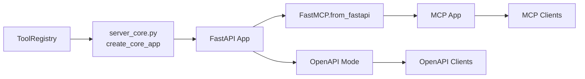
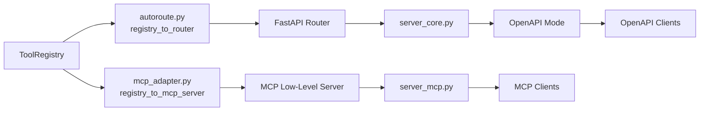

# Phase 6: MCP Adapter — Registry-Driven, MCP SDK Low-Level Server

## 1. Overview

### 1.1 Problem Statement

The current MCP implementation in [`server_mcp.py`](../src/toolregistry_hub/server/server_mcp.py) uses `FastMCP.from_fastapi(create_core_app())` from the standalone `fastmcp` package. This approach has several issues:

1. **Indirect tool derivation**: MCP tools are reverse-engineered from FastAPI routes, not generated directly from `ToolRegistry`.
2. **Enable/disable drift**: The `from_fastapi()` black-box conversion snapshots routes at creation time; runtime enable/disable changes in `ToolRegistry` may not propagate.
3. **Module-level instantiation**: `mcp_app = create_mcp_app()` at module scope means the registry is built at import time, before `--tools-config` can take effect.
4. **Unstable dependency**: The standalone `fastmcp` package is a third-party wrapper; the official MCP Python SDK (`mcp`) is the canonical, more stable upstream.

### 1.2 Target Architecture

```
ToolRegistry  ← single source of truth
    ├── OpenAPI Adapter  (autoroute.py — already implemented)
    │   └── registry_to_router(registry) → FastAPI APIRouter
    ├── MCP Adapter  (new — this design)
    │   └── registry_to_mcp_server(registry) → mcp.server.lowlevel.Server
    └── gRPC Adapter  (future)
```

### 1.3 Key Design Decision: MCP SDK Low-Level Server

Replace the standalone `fastmcp` package with the official **MCP Python SDK** (`mcp`), using its **low-level `Server`** API (`mcp.server.lowlevel.Server`).

**Rationale:**

| Concern | FastMCP (standalone) | MCP SDK Low-Level Server |
|---|---|---|
| Dependency stability | Third-party wrapper, fast-moving | Official SDK, canonical |
| Tool registration | Requires Python functions with proper signatures | Accepts raw JSON Schema via `inputSchema` |
| Schema handling | Infers schema from function annotations | Direct pass-through of `Tool.parameters` |
| Enable/disable | Separate state management | Dynamic via `list_tools` handler |
| Transport support | Built-in `mcp.run()` | Manual but straightforward setup |
| Control level | High-level abstraction | Full protocol control |

The low-level server is ideal because `ToolRegistry` already provides complete tool metadata (name, description, JSON Schema parameters, callable). We do not need FastMCP's function-introspection machinery.

---

## 2. `registry_to_mcp_server()` Function Design

### 2.1 Signature

```python
# src/toolregistry_hub/server/mcp_adapter.py

from mcp.server.lowlevel import Server
from toolregistry import ToolRegistry

def registry_to_mcp_server(
    registry: ToolRegistry,
    name: str = "ToolRegistry-Hub MCP Server",
) -> Server:
    """Convert a ToolRegistry into an MCP low-level Server.

    Args:
        registry: The tool registry (single source of truth).
        name: Server name advertised to MCP clients.

    Returns:
        A configured mcp.server.lowlevel.Server instance.
    """
```

### 2.2 Tool Listing — Dynamic, No Drift

```python
import mcp.types as types

@server.list_tools()
async def handle_list_tools() -> list[types.Tool]:
    tools = []
    for tool_name in registry.list_tools():  # Only enabled tools
        tool = registry.get_tool(tool_name)
        if tool is None:
            continue
        tools.append(types.Tool(
            name=tool.name,
            description=tool.description or "",
            inputSchema=tool.parameters,
        ))
    return tools
```

**Key points:**

- `registry.list_tools()` returns only **enabled** tool names. This is evaluated on every `list_tools` request, so enable/disable changes are reflected immediately — **zero drift**.
- `tool.parameters` is a JSON Schema dict, which maps directly to `inputSchema`. No Pydantic model conversion needed.
- Disabled tools are simply absent from the listing. No separate disable/enable state in the MCP layer.

### 2.3 Tool Invocation — Runtime Enable Check

```python
from mcp.shared.exceptions import McpError
from mcp.types import ErrorData, INTERNAL_ERROR

@server.call_tool()
async def handle_call_tool(
    name: str, arguments: dict
) -> list[types.TextContent | types.ImageContent | types.EmbeddedResource]:
    # Runtime enable check (defense in depth)
    if not registry.is_enabled(name):
        reason = registry.get_disable_reason(name) or "Tool is disabled"
        raise McpError(ErrorData(
            code=INTERNAL_ERROR,
            message=f"Tool '{name}' is currently disabled: {reason}",
        ))

    tool = registry.get_tool(name)
    if tool is None:
        raise McpError(ErrorData(
            code=INTERNAL_ERROR,
            message=f"Unknown tool: {name}",
        ))

    # Execute
    if tool.is_async:
        result = await tool.arun(arguments)
    else:
        result = tool.run(arguments)

    # Serialize result to MCP content
    return _serialize_result(result)
```

### 2.4 Result Serialization

```python
import json

def _serialize_result(result) -> list[types.TextContent]:
    """Convert a tool execution result to MCP content blocks.

    Handles:
    - str → TextContent directly
    - dict/list/Pydantic model → JSON-serialized TextContent
    - Other types → str() fallback
    """
    if result is None:
        return []

    if isinstance(result, str):
        return [types.TextContent(type="text", text=result)]

    # Try JSON serialization for structured data
    try:
        if hasattr(result, "model_dump"):
            # Pydantic model
            text = json.dumps(result.model_dump(), ensure_ascii=False, default=str)
        else:
            text = json.dumps(result, ensure_ascii=False, default=str)
        return [types.TextContent(type="text", text=text)]
    except (TypeError, ValueError):
        return [types.TextContent(type="text", text=str(result))]
```

### 2.5 Sync/Async Handling

The low-level MCP server's `call_tool` handler is always `async`. For sync tools:

- `tool.run(arguments)` is called directly (it's a synchronous call within an async context).
- If blocking is a concern, we can wrap with `asyncio.to_thread()` in a future optimization.
- For async tools, `await tool.arun(arguments)` is used directly.

This matches the existing pattern in [`autoroute.py`](../src/toolregistry_hub/server/autoroute.py) where sync tools use `def` endpoints and async tools use `async def` endpoints.

### 2.6 Complete `registry_to_mcp_server()` Implementation Sketch

```python
# src/toolregistry_hub/server/mcp_adapter.py

import json
from typing import Any, List

import mcp.types as types
from mcp.server.lowlevel import Server
from mcp.shared.exceptions import McpError
from mcp.types import ErrorData, INTERNAL_ERROR
from loguru import logger
from toolregistry import ToolRegistry


def _serialize_result(result: Any) -> list[types.TextContent]:
    """Convert tool result to MCP content blocks."""
    if result is None:
        return []
    if isinstance(result, str):
        return [types.TextContent(type="text", text=result)]
    try:
        if hasattr(result, "model_dump"):
            text = json.dumps(result.model_dump(), ensure_ascii=False, default=str)
        else:
            text = json.dumps(result, ensure_ascii=False, default=str)
        return [types.TextContent(type="text", text=text)]
    except (TypeError, ValueError):
        return [types.TextContent(type="text", text=str(result))]


def registry_to_mcp_server(
    registry: ToolRegistry,
    name: str = "ToolRegistry-Hub MCP Server",
) -> Server:
    """Convert a ToolRegistry into an MCP low-level Server."""
    server = Server(name)

    @server.list_tools()
    async def handle_list_tools() -> list[types.Tool]:
        tools = []
        for tool_name in registry.list_tools():
            tool = registry.get_tool(tool_name)
            if tool is None:
                continue
            tools.append(types.Tool(
                name=tool.name,
                description=tool.description or "",
                inputSchema=tool.parameters,
            ))
        return tools

    @server.call_tool()
    async def handle_call_tool(
        name: str, arguments: dict
    ) -> list[types.TextContent]:
        if not registry.is_enabled(name):
            reason = registry.get_disable_reason(name) or "Tool is disabled"
            raise McpError(ErrorData(
                code=INTERNAL_ERROR,
                message=f"Tool '{name}' is currently disabled: {reason}",
            ))

        tool = registry.get_tool(name)
        if tool is None:
            raise McpError(ErrorData(
                code=INTERNAL_ERROR,
                message=f"Unknown tool: {name}",
            ))

        if tool.is_async:
            result = await tool.arun(arguments)
        else:
            result = tool.run(arguments)

        return _serialize_result(result)

    logger.info(
        f"MCP server '{name}' created with {len(registry.list_tools())} "
        f"enabled tool(s) out of {len(registry.list_all_tools())} total"
    )
    return server
```

---

## 3. MCP Tool Naming

### 3.1 Current State

- `Tool.name` format: `{namespace}-{method_name}`, e.g. `calculator-evaluate`, `web/brave_search-search`
- OpenAPI path: `/tools/{namespace}/{method_name}`, e.g. `/tools/calculator/evaluate`

### 3.2 MCP Tool Name

MCP tool names are flat strings. We use **`Tool.name` directly** as the MCP tool name.

| Tool.name | MCP tool name | OpenAPI path |
|---|---|---|
| `calculator-evaluate` | `calculator-evaluate` | `/tools/calculator/evaluate` |
| `datetime-now` | `datetime-now` | `/tools/datetime/now` |
| `web/brave_search-search` | `web/brave_search-search` | `/tools/web/brave_search/search` |

**Rationale:**

- `Tool.name` is the canonical identifier in `ToolRegistry` — used for `is_enabled()`, `get_tool()`, `disable()`, etc.
- Using it directly avoids any name-mapping ambiguity.
- MCP clients see the same identifier that the registry uses internally.
- The `/` in nested namespaces (e.g. `web/brave_search-search`) is valid in MCP tool names.

---

## 4. Authentication

### 4.1 Current Auth Mechanism

Both OpenAPI and MCP modes use Bearer token authentication:

- Tokens are loaded from `API_BEARER_TOKEN` env var or `API_BEARER_TOKENS_FILE` via [`auth.py`](../src/toolregistry_hub/server/auth.py).
- OpenAPI: FastAPI global dependency with `HTTPBearer`.
- MCP (current): `fastmcp.server.auth.providers.debug.DebugTokenVerifier`.

### 4.2 New Auth: MCP SDK `TokenVerifier`

The MCP SDK defines a [`TokenVerifier`](https://github.com/modelcontextprotocol/python-sdk/blob/main/src/mcp/server/auth/provider.py) protocol:

```python
class TokenVerifier(Protocol):
    async def verify_token(self, token: str) -> AccessToken | None:
        """Verify a bearer token and return access info if valid."""
```

We implement a simple `TokenVerifier` that delegates to our existing `get_valid_tokens()`:

```python
# src/toolregistry_hub/server/mcp_auth.py

from mcp.server.auth.provider import AccessToken, TokenVerifier
from .auth import get_valid_tokens


class HubTokenVerifier(TokenVerifier):
    """Token verifier using Hub's existing bearer token configuration."""

    async def verify_token(self, token: str) -> AccessToken | None:
        valid_tokens = get_valid_tokens()

        # No tokens configured → allow all
        if not valid_tokens:
            return AccessToken(
                token=token,
                client_id="anonymous",
                scopes=["*"],
            )

        if token in valid_tokens:
            return AccessToken(
                token=token,
                client_id="bearer",
                scopes=["*"],
            )

        return None  # Invalid token
```

### 4.3 Auth Integration with MCP Server

The MCP SDK's `FastMCP` (from `mcp.server.fastmcp`) accepts `token_verifier` and `auth` parameters. For the low-level server, auth is handled at the transport layer.

For **streamable-http** and **SSE** transports, the MCP SDK provides ASGI middleware that validates tokens. We pass `HubTokenVerifier` when setting up the transport.

For **stdio** transport, there is no auth (stdio is local).

```python
from mcp.server.auth.settings import AuthSettings

# When creating the ASGI app for HTTP transports:
auth_settings = AuthSettings(...)  # if needed
# Pass token_verifier to the transport setup
```

> **Note**: The exact integration point depends on the MCP SDK version. The design should adapt to the SDK's transport-level auth API. If the low-level server doesn't directly support `TokenVerifier`, we may need to use `mcp.server.fastmcp.FastMCP` (from the `mcp` package, not standalone `fastmcp`) as a thin wrapper, or implement auth middleware at the ASGI level.

### 4.4 Auth Fallback Strategy

If the MCP SDK's low-level server does not natively support `TokenVerifier` for all transports, we have two fallback options:

1. **Use `mcp.server.fastmcp.FastMCP`** (SDK-bundled, not standalone `fastmcp`) which supports `token_verifier` parameter, and register tools programmatically via `@mcp.tool()` with wrapper functions.
2. **ASGI middleware**: For HTTP transports, wrap the MCP ASGI app with a Starlette middleware that validates Bearer tokens before passing requests to the MCP handler.

The design recommends **option 1 as fallback** since it's simpler and the SDK-bundled FastMCP is part of the stable `mcp` package.

---

## 5. `server_mcp.py` Refactoring

### 5.1 Current Issues

```python
# Current: module-level instantiation
mcp_app = create_mcp_app()  # Registry built at import time
```

This means:
- `--tools-config` applied in `cli.py` after import has no effect.
- `from_fastapi()` snapshots routes at creation time.

### 5.2 New Design

```python
# src/toolregistry_hub/server/server_mcp.py

from loguru import logger
from mcp.server.lowlevel import Server

from .mcp_adapter import registry_to_mcp_server
from .registry import get_registry


def create_mcp_server() -> Server:
    """Create MCP server from the current ToolRegistry.

    Returns:
        Configured mcp.server.lowlevel.Server instance.
    """
    registry = get_registry()
    server = registry_to_mcp_server(registry)

    logger.info(
        f"MCP server created – {len(registry.list_tools())} tool(s) enabled, "
        f"{len(registry.list_all_tools())} total"
    )
    return server


# NO module-level instantiation.
# The server is created lazily in cli.py after --tools-config is applied.
```

**Key changes:**

1. **Remove `FastMCP.from_fastapi()`** — replaced by `registry_to_mcp_server()`.
2. **Remove module-level `mcp_app = create_mcp_app()`** — server is created on demand.
3. **Remove `fastmcp` import** — replaced by `mcp.server.lowlevel.Server`.
4. **Remove `create_core_app()` dependency** — MCP no longer goes through FastAPI.

---

## 6. `server_core.py` Changes

### 6.1 Assessment

[`server_core.py`](../src/toolregistry_hub/server/server_core.py) creates the FastAPI app for OpenAPI mode. After this refactoring:

- **MCP mode no longer depends on `server_core.py`** — it uses `registry_to_mcp_server()` directly.
- `server_core.py` remains unchanged for OpenAPI mode.
- Both modes share the same `get_registry()` singleton from [`registry.py`](../src/toolregistry_hub/server/registry.py).

### 6.2 No Changes Required

`server_core.py` does not need modification. The registry management is already centralized in `registry.py`.

```
cli.py
  ├── --tools-config → rebuild_registry() → updates _registry singleton
  ├── --mode openapi → server_core.create_core_app() → uses get_registry()
  └── --mode mcp     → server_mcp.create_mcp_server() → uses get_registry()
```

---

## 7. `cli.py` Changes

### 7.1 Current Issue

```python
# Current cli.py (simplified)
if args.tools_config:
    _reg_mod._registry = build_registry(tools_config_path=args.tools_config)

if args.mode == "mcp":
    from .server_mcp import mcp_app  # ← import triggers module-level create_mcp_app()
    mcp_app.run(...)
```

The `from .server_mcp import mcp_app` import triggers `create_mcp_app()` at module level, which calls `get_registry()` and builds the registry **before** `--tools-config` is applied (if the import happens to be cached or the module was already loaded).

Actually, in the current code, `--tools-config` is applied before the import, so it works in the happy path. But the module-level instantiation is still fragile — any other import of `server_mcp` would trigger premature registry construction.

### 7.2 New Design

```python
# cli.py (MCP section, revised)

elif args.mode == "mcp":
    try:
        from .server_mcp import create_mcp_server
    except ImportError as e:
        logger.error(f"MCP server dependencies not installed: {e}")
        sys.exit(1)

    server = create_mcp_server()

    set_info(mode="mcp", mcp_transport=args.mcp_transport)

    if args.mcp_transport == "stdio":
        _run_mcp_stdio(server)
    else:
        _run_mcp_http(server, args.host, args.port, args.mcp_transport)
```

### 7.3 Transport Runner Functions

```python
import asyncio

def _run_mcp_stdio(server: "Server") -> None:
    """Run MCP server over stdio transport."""
    import mcp.server.stdio

    async def _main():
        async with mcp.server.stdio.stdio_server() as (read, write):
            await server.run(
                read, write,
                server.create_initialization_options(),
            )

    asyncio.run(_main())


def _run_mcp_http(
    server: "Server", host: str, port: int, transport: str
) -> None:
    """Run MCP server over HTTP transport (streamable-http or sse)."""
    import uvicorn

    # Build ASGI app from the low-level server
    # The exact API depends on MCP SDK version
    if transport == "streamable-http":
        from mcp.server.streamable_http import create_streamable_http_app
        app = create_streamable_http_app(server)
    elif transport == "sse":
        from mcp.server.sse import create_sse_app
        app = create_sse_app(server)

    uvicorn.run(app, host=host, port=port)
```

> **Note**: The exact transport setup functions (`create_streamable_http_app`, `create_sse_app`) are illustrative. The actual MCP SDK API may differ. Implementation should consult the SDK documentation for the correct transport setup.

---

## 8. Dependency Changes

### 8.1 `pyproject.toml` Updates

```toml
# Before
server_mcp = [
    "toolregistry>=0.5.0",
    "fastapi>=0.119.0",
    "fastmcp>=2.12.4; python_version >= '3.10'",
]

# After
server_mcp = [
    "toolregistry>=0.5.0",
    "mcp>=1.9.0; python_version >= '3.10'",
]
```

**Key changes:**

- **Remove `fastmcp`** — no longer needed.
- **Remove `fastapi`** from `server_mcp` — MCP mode no longer depends on FastAPI.
- **Add `mcp`** — the official MCP Python SDK.
- `fastapi` remains in `server_openapi` (unchanged).

### 8.2 Python Version Requirement

The MCP SDK requires Python 3.10+. This is already the case for the current `server_mcp` extra (`fastmcp>=2.12.4; python_version >= '3.10'`).

---

## 9. File Change Summary

### 9.1 New Files

| File | Purpose |
|---|---|
| `src/toolregistry_hub/server/mcp_adapter.py` | `registry_to_mcp_server()` — core MCP adapter logic |
| `src/toolregistry_hub/server/mcp_auth.py` | `HubTokenVerifier` — MCP SDK auth integration |

### 9.2 Modified Files

| File | Changes |
|---|---|
| `src/toolregistry_hub/server/server_mcp.py` | Rewrite: remove `FastMCP.from_fastapi()`, use `registry_to_mcp_server()`, remove module-level instantiation |
| `src/toolregistry_hub/server/cli.py` | Update MCP mode: lazy server creation, transport runner functions |
| `pyproject.toml` | Update `server_mcp` dependencies: `fastmcp` → `mcp`, remove `fastapi` from MCP extras |

### 9.3 Unchanged Files

| File | Reason |
|---|---|
| `src/toolregistry_hub/server/server_core.py` | Only used by OpenAPI mode |
| `src/toolregistry_hub/server/autoroute.py` | OpenAPI adapter, unaffected |
| `src/toolregistry_hub/server/registry.py` | Shared registry, no changes needed |
| `src/toolregistry_hub/server/auth.py` | Token parsing logic reused by `mcp_auth.py` |
| `src/toolregistry_hub/server/server_openapi.py` | OpenAPI mode, unaffected |

### 9.4 Potentially Deleted Files

None. `server_mcp.py` is rewritten in place, not deleted.

---

## 10. Architecture Comparison

### 10.1 Before (Current)



**Problems**: MCP tools derived from FastAPI routes; double indirection; `fastmcp` dependency.

### 10.2 After (Target)



**Benefits**: Both adapters consume `ToolRegistry` directly; no cross-dependency; clean separation.

---

## 11. Testing Strategy

### 11.1 Unit Tests for `mcp_adapter.py`

- **`test_registry_to_mcp_server_lists_enabled_tools`**: Verify `list_tools` returns only enabled tools.
- **`test_registry_to_mcp_server_excludes_disabled_tools`**: Disable a tool, verify it disappears from `list_tools`.
- **`test_registry_to_mcp_server_call_tool_success`**: Call an enabled tool, verify result.
- **`test_registry_to_mcp_server_call_tool_disabled`**: Call a disabled tool, verify `McpError`.
- **`test_registry_to_mcp_server_call_tool_unknown`**: Call a non-existent tool, verify `McpError`.
- **`test_registry_to_mcp_server_async_tool`**: Verify async tool execution.
- **`test_serialize_result_types`**: Test serialization of str, dict, list, Pydantic model, None.

### 11.2 Unit Tests for `mcp_auth.py`

- **`test_hub_token_verifier_valid_token`**: Verify valid token returns `AccessToken`.
- **`test_hub_token_verifier_invalid_token`**: Verify invalid token returns `None`.
- **`test_hub_token_verifier_no_tokens_configured`**: Verify anonymous access when no tokens set.

### 11.3 Integration Tests

- **`test_mcp_stdio_roundtrip`**: Start MCP server in stdio mode, connect with MCP client, list tools, call a tool.
- **`test_mcp_http_roundtrip`**: Start MCP server in streamable-http mode, connect with MCP client, verify tool listing and invocation.
- **`test_tools_config_mcp_mode`**: Verify `--tools-config` correctly disables tools in MCP mode.

---

## 12. Migration Notes

### 12.1 Breaking Changes

- **Dependency**: Users with `pip install toolregistry-hub[server_mcp]` will get `mcp` instead of `fastmcp`. The `fastmcp` package will no longer be installed.
- **API**: `server_mcp.mcp_app` (module-level `FastMCP` instance) is removed. Users who imported it directly need to use `create_mcp_server()` instead.

### 12.2 Backward Compatibility

- CLI interface (`toolregistry-server --mode mcp`) remains unchanged.
- Transport options (`--mcp-transport stdio|streamable-http|sse`) remain unchanged.
- Token authentication configuration (env vars) remains unchanged.
- Tool behavior and naming remain unchanged.

### 12.3 Rollout

1. Implement `mcp_adapter.py` and `mcp_auth.py`.
2. Rewrite `server_mcp.py`.
3. Update `cli.py` transport runners.
4. Update `pyproject.toml` dependencies.
5. Run full test suite.
6. Update documentation (if needed).

---

## 13. Open Questions

1. **MCP SDK transport API**: The exact API for creating ASGI apps from a low-level `Server` needs verification against the installed MCP SDK version. The design uses illustrative function names (`create_streamable_http_app`, `create_sse_app`) that may differ.

2. **Auth at transport level**: The low-level `Server` may not directly support `TokenVerifier`. If so, we fall back to using `mcp.server.fastmcp.FastMCP` (SDK-bundled) with `token_verifier` parameter, or implement ASGI-level auth middleware.

3. **Structured output**: The MCP SDK supports structured output (`structuredContent`). The current design returns `TextContent` only. A future enhancement could return structured content for dict/model results.

4. **Sync tool blocking**: Sync tools called within the async `call_tool` handler may block the event loop. Consider wrapping with `asyncio.to_thread()` for CPU-bound or I/O-blocking tools.
