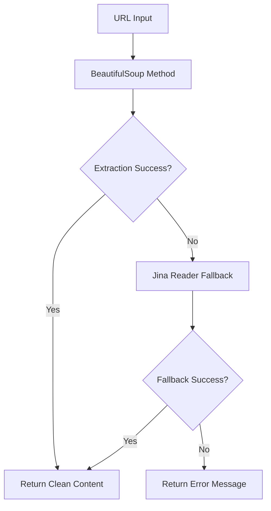

# Web Fetch Tool

The Web Fetch tool provides intelligent webpage content extraction from URLs. It uses a combination of BeautifulSoup parsing and Jina Reader API to extract clean, readable content from webpages while handling various website structures and formats.

## 🎯 Overview

The Fetch class offers robust webpage content extraction:

- **Dual Extraction Methods**: BeautifulSoup parsing + Jina Reader API
- **Intelligent Fallback**: Automatically switches methods if one fails
- **Content Cleaning**: Removes navigation, ads, and unnecessary elements
- **User Agent Rotation**: Uses realistic browser user agents
- **Timeout Handling**: Configurable timeouts and proxy support
- **Error Resilience**: Graceful handling of network errors and inaccessible content

## 🚀 Quick Start

```python
from toolregistry_hub import Fetch

# Basic webpage content extraction
url = "https://example.com"
content = Fetch.fetch_content(url)
print(f"Content length: {len(content)} characters")
print(f"Content preview: {content[:200]}...")

# With timeout and proxy
content = Fetch.fetch_content(
    url="https://example.com",
    timeout=15.0,
    proxy="http://proxy.example.com:8080"
)
```

## 🔧 API Reference

### `fetch_content(url: str, timeout: float = 10.0, proxy: Optional[str] = None) -> str`

Extract content from a given URL using available methods.

**Parameters:**

- `url` (str): The URL to fetch content from
- `timeout` (float): Request timeout in seconds (default: 10.0)
- `proxy` (Optional[str]): Proxy server URL (e.g., "http://proxy.example.com:8080")

**Returns:**

- `str`: Extracted content from the URL, or "Unable to fetch content" if extraction fails

**Raises:**

- `Exception`: If URL is invalid or network errors occur

## 🛠️ How It Works

### Dual Extraction Strategy

The Web Fetch tool uses a two-stage extraction approach:

1. **Primary Method**: BeautifulSoup with intelligent parsing
2. **Fallback Method**: Jina Reader API for complex websites

### Extraction Process



### Content Cleaning Process

The tool automatically removes:

- Navigation menus and headers
- Footer content and copyright notices
- Sidebars and advertisements
- Scripts and style blocks
- Navigation elements (`<nav>`, `<footer>`, `<sidebar>`)
- Interactive elements (`<iframe>`, `<noscript>`)

## 📋 Usage Examples

### Basic Content Extraction

```python
from toolregistry_hub import Fetch

# Extract content from a news article
news_url = "https://news.example.com/article/technology"
content = Fetch.fetch_content(news_url)

if content and content != "Unable to fetch content":
    print(f"Successfully extracted {len(content)} characters")
    print(f"Title preview: {content[:100]}...")
else:
    print("Failed to extract content")
```

### Blog Post Extraction

```python
from toolregistry_hub import Fetch

# Extract blog post content
blog_url = "https://techblog.example.com/ai-machine-learning"
content = Fetch.fetch_content(blog_url, timeout=15.0)

# Process the extracted content
if content:
    # Count words
    word_count = len(content.split())
    print(f"Blog post contains {word_count} words")

    # Find key sections
    if "introduction" in content.lower():
        print("Found introduction section")
    if "conclusion" in content.lower():
        print("Found conclusion section")
```

### Documentation Extraction

````python
from toolregistry_hub import Fetch

# Extract API documentation
docs_url = "https://docs.example.com/api-reference"
content = Fetch.fetch_content(docs_url)

# Look for specific documentation patterns
if content:
    # Check for code examples
    code_blocks = content.count("```")
    print(f"Found {code_blocks} code blocks")

    # Look for method signatures
    if "def " in content or "function " in content:
        print("Found function/method definitions")
````

### Research and Analysis

```python
from toolregistry_hub import Fetch

# Extract multiple sources for research
research_urls = [
    "https://arxiv.org/abs/2301.12345",
    "https://medium.com/ai-research",
    "https://towardsdatascience.com/machine-learning"
]

collected_content = []
for url in research_urls:
    content = Fetch.fetch_content(url, timeout=20.0)
    if content and content != "Unable to fetch content":
        collected_content.append({
            'url': url,
            'content': content,
            'length': len(content)
        })
        print(f"✓ Extracted {len(content)} chars from {url}")
    else:
        print(f"✗ Failed to extract from {url}")

print(f"\nSuccessfully collected content from {len(collected_content)} sources")
```

### With Proxy Configuration

```python
from toolregistry_hub import Fetch

# Use with corporate proxy
proxy_url = "http://corporate-proxy.company.com:8080"
target_url = "https://external-resource.com/data"

content = Fetch.fetch_content(
    url=target_url,
    timeout=30.0,
    proxy=proxy_url
)

if content:
    print("Successfully bypassed proxy restrictions")
else:
    print("Proxy configuration may be incorrect")
```

## 🎯 Best Practices

### Error Handling

```python
from toolregistry_hub import Fetch

def safe_web_fetch(url, retries=3):
    """Safely fetch web content with retry logic."""
    for attempt in range(retries):
        try:
            content = Fetch.fetch_content(url, timeout=15.0)
            if content and content != "Unable to fetch content":
                return content
            else:
                print(f"Attempt {attempt + 1} failed, retrying...")
        except Exception as e:
            print(f"Attempt {attempt + 1} error: {e}")

    return None

# Usage
url = "https://unreliable-source.com"
content = safe_web_fetch(url)
if content:
    print("Successfully fetched content")
else:
    print("All attempts failed")
```

### Batch Processing

```python
from toolregistry_hub import Fetch
import time

def batch_fetch(urls, delay=1.0):
    """Fetch multiple URLs with rate limiting."""
    results = []

    for i, url in enumerate(urls):
        print(f"Processing {i+1}/{len(urls)}: {url}")

        content = Fetch.fetch_content(url, timeout=10.0)
        results.append({
            'url': url,
            'content': content,
            'success': content is not None and content != "Unable to fetch content"
        })

        # Rate limiting
        if i < len(urls) - 1:
            time.sleep(delay)

    return results

# Usage
urls = ["https://site1.com", "https://site2.com", "https://site3.com"]
results = batch_fetch(urls, delay=2.0)

successful = [r for r in results if r['success']]
print(f"Successfully fetched {len(successful)}/{len(results)} URLs")
```

### Content Validation

```python
from toolregistry_hub import Fetch

def validate_extracted_content(content, min_length=100):
    """Validate extracted content quality."""
    if not content:
        return False, "No content extracted"

    if content == "Unable to fetch content":
        return False, "Extraction failed"

    if len(content) < min_length:
        return False, f"Content too short ({len(content)} chars)"

    # Check for meaningful content
    meaningful_words = ["the", "and", "content", "information"]
    has_meaningful_content = any(word in content.lower() for word in meaningful_words)

    if not has_meaningful_content:
        return False, "Content appears to be empty or template"

    return True, "Content validation passed"

# Usage
url = "https://example.com"
content = Fetch.fetch_content(url)
is_valid, message = validate_extracted_content(content)

print(f"Content validation: {message}")
if is_valid:
    print(f"Valid content: {len(content)} characters")
```

## 🚨 Important Considerations

### Legal and Ethical Use

- **Respect robots.txt**: Check website's robots.txt before scraping
- **Rate limiting**: Don't overwhelm servers with too many requests
- **Terms of service**: Review website terms before automated access
- **Copyright**: Be mindful of copyrighted content usage

### Technical Limitations

- **JavaScript-heavy sites**: May not fully render dynamic content
- **Authentication**: Cannot access password-protected content
- **Large files**: Very large pages may timeout or be truncated
- **Complex layouts**: Some sites may require custom parsing

### Performance Tips

- **Timeouts**: Use appropriate timeouts (10-30 seconds typical)
- **Proxies**: Use proxies for blocked or rate-limited sites
- **User agents**: Tool automatically rotates user agents
- **Caching**: Consider caching results for frequently accessed content

## 🔍 Content Quality

### What Gets Extracted

**✅ Extracted Content:**

- Main article text
- Blog post content
- Documentation text
- Product descriptions
- News article body
- Tutorial content

**❌ Filtered Out:**

- Navigation menus
- Footer copyright text
- Sidebar advertisements
- Header banners
- Comment sections
- Related posts
- Social media widgets

### Quality Indicators

```python
def assess_content_quality(content):
    """Assess the quality of extracted content."""
    if not content:
        return {"quality": "poor", "reason": "empty content"}

    length = len(content)

    if length < 50:
        return {"quality": "poor", "reason": "too short", "length": length}
    elif length < 500:
        return {"quality": "fair", "reason": "short content", "length": length}
    elif length < 2000:
        return {"quality": "good", "reason": "adequate length", "length": length}
    else:
        return {"quality": "excellent", "reason": "comprehensive content", "length": length}

# Usage
url = "https://example.com"
content = Fetch.fetch_content(url)
quality = assess_content_quality(content)
print(f"Content quality: {quality}")
```
