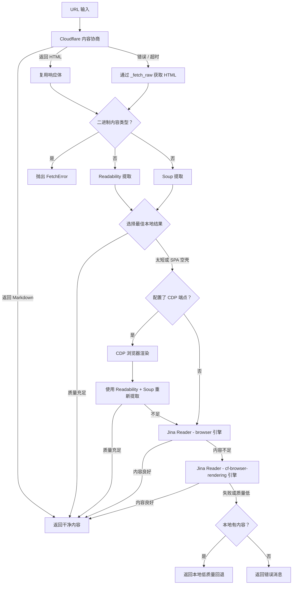

# 网页获取工具

网页获取工具提供从 URL 智能提取网页内容的功能。它采用五级策略链 — Cloudflare 内容协商、Readability 提取、zerodep soup 解析、CDP 浏览器渲染和 Jina Reader API — 并结合**内容质量评估**和**智能回退**机制，从网页中提取干净、可读的内容，同时处理各种网站结构和格式，包括 JavaScript 密集型的单页应用（SPA）。

## 概览

Fetch 类提供强大的网页内容提取功能：

- **五级策略链**：Cloudflare 内容协商 → Readability 提取 → Soup 解析 → CDP 浏览器渲染 → Jina Reader API
- **响应复用**：内容协商阶段获取的 HTTP 响应会被直接传递给后续提取策略，避免重复网络请求
- **二进制内容拦截**：自动识别图片、PDF、音视频等二进制 MIME 类型，在进入提取流程前提前终止并返回明确错误
- **内容质量评估**：检测 SPA 空壳页面和内容不足的情况，自动触发回退
- **智能回退与低质量恢复**：如果 Jina Reader 也失败，返回本地低质量内容作为最后手段（有总比没有好）
- **内容清理**：移除导航、广告和不必要的元素
- **用户代理轮换**：通过内置的 zerodep useragent 模块使用真实的浏览器用户代理
- **超时处理**：可配置的超时（默认 30 秒）和代理支持
- **错误恢复**：优雅处理网络错误和不可访问的内容

## 快速开始

```python
from toolregistry_hub import Fetch

fetcher = Fetch()  # 或 Fetch(api_keys="key1,key2") 启用 Jina API 密钥轮转

# 基本网页内容提取
url = "https://example.com"
content = fetcher.fetch_content(url)
print(f"内容长度: {len(content)} 字符")
# 输出: 内容长度: 127 字符
print(f"内容预览: {content[:200]}...")
# 输出: 内容预览: Example Domain This domain is for use in documentation examples without needing permission. Avoid us...

# 使用超时和代理
content = fetcher.fetch_content(
    url="https://example.com",
    timeout=15.0,
    proxy="http://proxy.example.com:8080"
)
```

## API 参考

### `Fetch(api_keys=None, cdp_endpoint=None)`

初始化 Fetch 内容提取器。

**参数：**

- `api_keys` (str, 可选): 逗号分隔的 Jina API 密钥。回退到 `JINA_API_KEY` 环境变量。设置后，Jina Reader 请求会包含 `Authorization: Bearer <key>` 头部，并使用轮询式密钥轮换。
- `cdp_endpoint` (str, 可选): CDP 兼容浏览器的 WebSocket URL（例如 `ws://localhost:9222`）。回退到 `CDP_ENDPOINT` 环境变量。设置后，启用 CDP 浏览器渲染阶段以提取 SPA 内容。

### `fetch_content(url: str, timeout: float = 30.0, proxy: Optional[str] = None) -> str`

从给定 URL 使用可用方法提取内容。

**参数：**

- `url` (str): 要获取内容的 URL
- `timeout` (float): 请求超时时间（秒）（默认：30.0）
- `proxy` (Optional[str]): 代理服务器 URL（例如："http://proxy.example.com:8080"）

**返回值：**

- `str`: 从 URL 提取的内容，如果提取失败则返回 "Unable to fetch content"

**异常：**

- `FetchError`: 如果所有提取策略均失败、URL 无效、发生网络错误，或 URL 指向不支持的二进制内容类型（如图片、PDF、音视频等）

## 工作原理

### 五级策略链

网页获取工具使用五阶段提取方法，每一步都进行**内容质量评估**：

1. **Cloudflare 内容协商**：零成本尝试，直接从源站获取 markdown 内容
2. **Readability 提取**：使用 Mozilla Readability 风格的文章评分算法，识别并提取主要内容
3. **Soup 解析**：使用 zerodep soup（零外部依赖）进行轻量级 HTML 解析与 CSS 选择器回退
4. **CDP 浏览器渲染**：通过 Chrome DevTools Protocol 使用自托管无头浏览器渲染 SPA 页面（需配置 `CDP_ENDPOINT`）
5. **Jina Reader（降级方案）**：外部 API，使用多引擎重试（`browser` → `cf-browser-rendering`）进行 JavaScript 渲染（SPA 支持）

工具尽量减少 HTTP 请求次数：如果 Cloudflare 内容协商返回 `text/html` 而非 markdown（绝大多数情况），响应体会被保留并直接传给 Readability/Soup 提取流程——不会再发送冗余的第二次请求。两种本地策略共享这份 HTML。工具会比较两种本地策略的结果，选择更好的一个。如果本地提取不足且配置了 CDP 端点，工具会在无头浏览器中渲染页面并从渲染后的 HTML 中重新提取内容。如果 CDP 不可用或仍然产生不足的内容，则回退到 Jina Reader。

在进入提取流程之前，工具会检查响应的内容类型。二进制内容类型（`image/*`、`audio/*`、`video/*`、`font/*`、`application/pdf`、`application/zip`、`application/octet-stream` 等）会被提前拦截并抛出 `FetchError`，避免在无法提取的内容上浪费 CPU。

### 提取过程



### 内容质量评估

本地提取（Readability + Soup）完成后，工具使用 `_is_content_sufficient()` 评估内容质量，决定是接受结果还是回退到 Jina Reader：

**最小长度检查：**

- 内容短于 **100 个字符**被视为不足，触发 Jina Reader 回退

**SPA 空壳检测：**

工具检测单页应用空壳页面的常见标志。如果提取的文本中出现以下任何短语，则内容被视为 JavaScript 应用空壳：

- `"please enable javascript"`
- `"you need to enable javascript"`
- `"this app requires javascript"`
- `"loading..."`
- `"noscript"`
- `"we're sorry but"`
- `"doesn't work properly without javascript"`
- `"requires a modern browser"`
- `"enable cookies"`

当检测到 SPA 空壳内容时，Jina Reader 会自动使用其 `browser` 引擎来渲染 JavaScript 并提取实际内容。如果 `browser` 引擎仍然返回不足的内容，工具会使用 `cf-browser-rendering` 引擎重试，该引擎专为 JS 密集型网站设计。

**低质量回退：**

如果 Jina Reader 也无法产生足够质量的内容，工具会回退到本地的低质量结果（如果有的话）— 因为部分内容总比没有内容好。

### Cloudflare 内容协商

第一个策略利用了 [Cloudflare 的 "Markdown for Agents"](https://blog.cloudflare.com/markdown-for-agents/) 功能。它发送一个带有 `Accept: text/markdown` 头的标准 HTTP GET 请求。如果源站（或 Cloudflare 边缘节点）支持内容协商并能提供 markdown 格式，响应将包含高质量、预格式化的 markdown 内容 — 非常适合 LLM 消费。

**工作机制：**

- 工具在 HTTP 请求头中发送 `Accept: text/markdown`
- 如果服务器以 `Content-Type: text/markdown` 响应，则直接使用该 markdown 内容
- 如果服务器返回非 markdown 的 `2xx` 响应（通常是 `text/html`），响应体会被**保留并复用**于后续的 Readability/Soup 提取阶段——避免了冗余的 HTTP 请求
- 对于错误响应（`4xx`/`5xx`）或网络失败，响应体会被丢弃，工具回退到带重试逻辑的 `_fetch_raw` 请求
- 这是一次**零成本**尝试：无需外部 API 调用，无需额外处理 — 只是一个使用不同 `Accept` 头的标准 HTTP 请求

**优势：**

- 在支持的站点上获得高质量、结构化的 markdown 输出
- 不依赖第三方服务
- 保留原始文档结构（标题、列表、代码块等）
- 响应复用：即使服务器不支持 markdown，已获取的 HTML 响应体也不会被浪费，而是直接传递给后续提取阶段
- Cloudflare 还会提供 `x-markdown-tokens` 响应头，指示 markdown 内容的 token 数量

### 二进制内容拦截

在获取到 HTTP 响应后、进入 Readability/Soup 提取流程之前，工具会检查响应的 `Content-Type` 是否为二进制类型。如果是，工具会立即报错（`FetchError`），而不是将二进制数据当作文本解码并在乱码上运行提取算法。

**拦截的内容类型前缀：**

- `image/*`（PNG、JPEG、GIF、WebP 等）
- `audio/*`（MP3、OGG 等）
- `video/*`（MP4、WebM 等）
- `font/*`（WOFF2、TTF 等）

**拦截的精确 MIME 类型：**

- `application/pdf`、`application/zip`、`application/gzip`
- `application/octet-stream`、`application/wasm`
- Office 文档格式（`.docx`、`.xlsx`、`.pptx` 等）

这是一个防御性措施：避免将二进制文件（可能达数十 MB）当作文本解码后送入提取算法，浪费 CPU 并产生无意义的输出。

### CDP 浏览器渲染

当本地提取产生不足的内容（SPA 空壳或内容太短）且配置了 CDP 端点时，工具会通过 Chrome DevTools Protocol 在无头浏览器中渲染页面，然后再回退到 Jina Reader。

**工作机制：**

- 通过 WebSocket 连接到 CDP 兼容的浏览器（无头 Chrome、Chromium、[Lightpanda](https://github.com/nichochar/lightpanda) 等）
- 导航到 URL 并等待页面完全渲染（包括 JavaScript 执行）
- 从 DOM 中提取渲染后的 HTML
- 对渲染后的 HTML 重新运行 Readability 和 Soup 提取，生成结构化内容

**配置：**

- 设置 `CDP_ENDPOINT` 环境变量（例如 `ws://localhost:9222`），或将 `cdp_endpoint` 传递给 `Fetch()` 构造函数
- CDP 阶段**完全可选** — 如果未配置，工具直接跳到 Jina Reader
- 所有 CDP 错误都会被静默捕获；CDP 尝试失败不会中断管道

**优势：**

- 自托管 SPA 渲染，无需依赖外部 API
- 无速率限制或 API 配额 — 渲染数量取决于浏览器实例的处理能力
- 兼容任何 CDP 兼容的浏览器

### Jina Reader API

Jina Reader 作为本地提取和 CDP 渲染无法良好处理的页面（如 JavaScript 密集型 SPA）的降级策略。实现采用**多引擎重试**方式：

**请求配置：**

- **POST 方法**，JSON 请求体（`{"url": "..."}`）进行结构化请求
- **`Accept: application/json`** 头部，接收结构化 JSON 响应
- **`X-Return-Format: markdown`**（默认），输出 LLM 友好的格式
- **`X-Remove-Selector: header, footer, nav, aside`** 在服务端移除非内容元素

**SPA 渲染参数：**

- **`X-Engine`**：先尝试 `browser` 引擎，如果内容不足则回退到 `cf-browser-rendering`（专为 JS 密集型网站优化）
- **`X-Wait-For-Selector`**：等待常见内容选择器（`main`、`article`、`.content`、`#content`、`.main-content`、`#main-content`、`[role='main']`）出现后再抓取页面，确保动态加载的内容已完全渲染
- **`X-Timeout`**：设置 Jina 渲染页面的最大等待时间（等于配置的 `timeout` 参数）

**超时分离：**

HTTP 客户端传输超时设置为 `timeout + 10秒`（缓冲），而 Jina 的 `X-Timeout` 设置为 `timeout`。这防止了 HTTP 客户端在 Jina 完成页面渲染之前超时 — 这是 SPA 页面需要额外渲染时间时的常见问题。

JSON 响应被解析以提取 `data.content` 字段，其中包含渲染后的页面内容。

### 内容清理过程

工具自动移除：

- 导航菜单和标题
- 页脚内容和版权声明
- 侧边栏和广告
- 脚本和样式块
- 导航元素（`<nav>`, `<footer>`, `<sidebar>`）
- 交互元素（`<iframe>`, `<noscript>`）

## 使用示例

### 基本内容提取

```python
from toolregistry_hub import Fetch

# 从新闻文章提取内容
news_url = "https://example.com"
content = Fetch().fetch_content(news_url)

if content and content != "Unable to fetch content":
    print(f"成功提取 {len(content)} 字符")
    # 输出: 成功提取 127 字符
    print(f"标题预览: {content[:100]}...")
    # 输出: 标题预览: Example Domain This domain is for use in documentation examples without needing permission. Avoid us...
else:
    print("提取内容失败")
```

### 博客文章提取

```python
from toolregistry_hub import Fetch

# 提取博客文章内容
blog_url = "https://example.com"
content = Fetch().fetch_content(blog_url, timeout=15.0)

# 处理提取的内容
if content:
    # 统计单词数
    word_count = len(content.split())
    print(f"博客文章包含 {word_count} 个单词")
    # 输出: 博客文章包含 23 个单词

    # 查找关键部分
    if "introduction" in content.lower():
        print("找到介绍部分")
    if "conclusion" in content.lower():
        print("找到结论部分")
```

### 文档提取

````python
from toolregistry_hub import Fetch

# 提取 API 文档
docs_url = "https://docs.example.com/api-reference"
content = Fetch().fetch_content(docs_url)

# 查找特定的文档模式
if content:
    # 检查代码示例
    code_blocks = content.count("```")
    print(f"找到 {code_blocks} 个代码块")

    # 查找方法签名
    if "def " in content or "function " in content:
        print("找到函数/方法定义")
````

### 研究和分析

```python
from toolregistry_hub import Fetch

# 为研究提取多个来源
research_urls = [
    "https://arxiv.org/abs/2301.12345",
    "https://medium.com/ai-research",
    "https://towardsdatascience.com/machine-learning"
]

collected_content = []
for url in research_urls:
    content = Fetch().fetch_content(url, timeout=20.0)
    if content and content != "Unable to fetch content":
        collected_content.append({
            'url': url,
            'content': content,
            'length': len(content)
        })
        print(f"✓ 从 {url} 提取 {len(content)} 字符")
    else:
        print(f"✗ 从 {url} 提取失败")

print(f"\n成功从 {len(collected_content)} 个来源收集内容")
```

### 使用代理配置

```python
from toolregistry_hub import Fetch

# 使用公司代理
proxy_url = "http://corporate-proxy.company.com:8080"
target_url = "https://external-resource.com/data"

content = Fetch().fetch_content(
    url=target_url,
    timeout=30.0,
    proxy=proxy_url
)

if content:
    print("成功绕过代理限制")
else:
    print("代理配置可能不正确")
```

## 最佳实践

### 错误处理

```python
from toolregistry_hub import Fetch

def safe_web_fetch(url, retries=3):
    """使用重试逻辑安全地获取网页内容。"""
    for attempt in range(retries):
        try:
            content = Fetch().fetch_content(url, timeout=15.0)
            if content and content != "Unable to fetch content":
                return content
            else:
                print(f"尝试 {attempt + 1} 失败，重试中...")
        except Exception as e:
            print(f"尝试 {attempt + 1} 错误: {e}")

    return None

# 使用
url = "https://unreliable-source.com"
content = safe_web_fetch(url)
if content:
    print("成功获取内容")
else:
    print("所有尝试都失败")
```

### 批量处理

```python
from toolregistry_hub import Fetch
import time

def batch_fetch(urls, delay=1.0):
    """使用速率限制获取多个 URL。"""
    results = []

    for i, url in enumerate(urls):
        print(f"处理 {i+1}/{len(urls)}: {url}")

        content = Fetch().fetch_content(url, timeout=10.0)
        results.append({
            'url': url,
            'content': content,
            'success': content is not None and content != "Unable to fetch content"
        })

        # 速率限制
        if i < len(urls) - 1:
            time.sleep(delay)

    return results

# 使用
urls = ["https://site1.com", "https://site2.com", "https://site3.com"]
results = batch_fetch(urls, delay=2.0)

successful = [r for r in results if r['success']]
print(f"成功获取 {len(successful)}/{len(results)} 个 URL")
```

### 内容验证

```python
from toolregistry_hub import Fetch

def validate_extracted_content(content, min_length=100):
    """验证提取内容的质量。"""
    if not content:
        return False, "未提取到内容"

    if content == "Unable to fetch content":
        return False, "提取失败"

    if len(content) < min_length:
        return False, f"内容太短 ({len(content)} 字符)"

    # 检查是否有意义的内容
    meaningful_words = ["the", "and", "content", "information"]
    has_meaningful_content = any(word in content.lower() for word in meaningful_words)

    if not has_meaningful_content:
        return False, "内容似乎是空的或模板"

    return True, "内容验证通过"

# 使用
url = "https://example.com"
content = Fetch().fetch_content(url)
is_valid, message = validate_extracted_content(content)

print(f"内容验证: {message}")
if is_valid:
    print(f"有效内容: {len(content)} 字符")
```

## 重要考虑事项

### 法律和道德使用

- **尊重 robots.txt**：在爬取前检查网站的 robots.txt
- **速率限制**：不要用太多请求压垮服务器
- **服务条款**：在自动访问前查看网站条款
- **版权**：注意版权内容的使用

### 技术限制

- **JavaScript 密集型网站**：通过 CDP 浏览器渲染（自托管）或 Jina Reader 的多引擎重试（`browser` → `cf-browser-rendering`）配合 `X-Wait-For-Selector` 处理动态内容，但某些复杂 SPA 可能仍无法完全渲染
- **二进制内容**：图片、PDF、音视频、字体、压缩包等二进制文件不支持提取，工具会在检测到这些内容类型时立即报错
- **认证**：无法访问密码保护的内容
- **二进制内容**：指向图片、PDF、压缩包等二进制格式的 URL 会被提前拦截并抛出 `FetchError`——工具仅提取文本类内容
- **大文件**：非常大的页面可能超时或被截断
- **复杂布局**：某些网站可能需要自定义解析
- **Jina Reader 可用性**：Jina Reader API 是免费的外部服务，不保证可用性

### 性能提示

- **超时**：使用适当的超时（默认 30 秒）
- **代理**：对阻止或速率限制的网站使用代理
- **用户代理**：工具自动轮换用户代理
- **缓存**：考虑缓存频繁访问的内容的结果

## 内容质量

### 提取的内容

**提取的内容：**

- 主要文章文本
- 博客文章内容
- 文档文本
- 产品描述
- 新闻文章正文
- 教程内容

**过滤掉的内容：**

- 导航菜单
- 页脚版权文本
- 侧边栏广告
- 标题横幅
- 评论部分
- 相关文章
- 社交媒体小部件

### 质量指标

```python
def assess_content_quality(content):
    """评估提取内容的质量。"""
    if not content:
        return {"quality": "poor", "reason": "空内容"}

    length = len(content)

    if length < 50:
        return {"quality": "poor", "reason": "太短", "length": length}
    elif length < 500:
        return {"quality": "fair", "reason": "短内容", "length": length}
    elif length < 2000:
        return {"quality": "good", "reason": "足够长度", "length": length}
    else:
        return {"quality": "excellent", "reason": "全面内容", "length": length}

# 使用
url = "https://example.com"
content = Fetch().fetch_content(url)
quality = assess_content_quality(content)
print(f"内容质量: {quality}")
