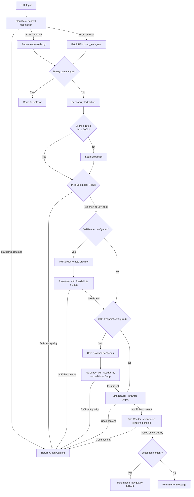

# Web Fetch Tool

The Web Fetch tool provides intelligent webpage content extraction from URLs. It uses a multi-stage strategy chain - Cloudflare Content Negotiation, Readability extraction, zerodep soup parsing, VeilRender remote browser, CDP Browser Rendering, and Jina Reader API - with **content quality evaluation** and **smart fallback** to extract clean, readable content from webpages while handling various website structures and formats, including JavaScript-heavy Single Page Applications (SPAs).

## Overview

The Fetch class offers robust webpage content extraction:

- **Multi-Stage Strategy Chain**: Cloudflare Content Negotiation → Readability extraction → Soup parsing → VeilRender remote browser → CDP Browser Rendering → Jina Reader API
- **Response Reuse**: HTTP responses from the content negotiation stage are passed directly to subsequent extraction strategies, avoiding redundant network requests
- **Binary Content Interception**: Automatically detects images, PDFs, audio/video, and other binary MIME types, rejecting them early with a clear error before entering the extraction pipeline
- **URL Result Cache**: Per-instance cache with TTL (default 5 min) and LRU eviction (128 entries) avoids redundant extraction for repeated URLs
- **Soup-Skip Optimisation**: Skips the soup extraction pass when readability already produced a high-confidence result (score ≥ 100, content ≥ 2,000 chars), saving 30–185 ms per page
- **Content Quality Evaluation**: Detects SPA shell pages and insufficient content, triggering automatic fallback
- **Smart Fallback with Low-Quality Recovery**: If Jina Reader also fails, returns local low-quality content as a last resort (better than nothing)
- **Content Cleaning**: Removes navigation, ads, and unnecessary elements
- **User Agent Rotation**: Uses realistic browser user agents via vendored zerodep useragent module
- **Timeout Handling**: Configurable timeouts (default: 30s) and proxy support
- **Error Resilience**: Graceful handling of network errors and inaccessible content

## Quick Start

```python
from toolregistry_hub import Fetch

fetcher = Fetch()  # or Fetch(api_keys="key1,key2") for Jina API key rotation

# Basic webpage content extraction
url = "https://example.com"
content = fetcher.fetch_content(url)
print(f"Content length: {len(content)} characters")
# Output: Content length: 127 characters
print(f"Content preview: {content[:200]}...")
# Output: Content preview: Example Domain This domain is for use in documentation examples without needing permission. Avoid us...

# With timeout and proxy
content = fetcher.fetch_content(
    url="https://example.com",
    timeout=15.0,
    proxy="http://proxy.example.com:8080"
)
```

## API Reference

### `Fetch(api_keys=None, cdp_endpoint=None, veilrender_endpoint=None, veilrender_token=None)`

Initialize the Fetch content extractor.

**Parameters:**

- `api_keys` (str, optional): Comma-separated Jina API keys. Falls back to `JINA_API_KEY` environment variable. When set, requests to Jina Reader include an `Authorization: Bearer <key>` header with round-robin key rotation.
- `cdp_endpoint` (str, optional): WebSocket URL of a CDP-compatible browser (e.g., `ws://localhost:9222`). Falls back to `CDP_ENDPOINT` environment variable. When set, enables the CDP Browser Rendering stage for SPA content extraction.
- `veilrender_endpoint` (str, optional): Base URL of a VeilRender remote browser service (e.g., `http://localhost:3000`). Falls back to `VEILRENDER_ENDPOINT` environment variable. When set, enables the VeilRender stage, positioned before CDP in the auto fallback chain.
- `veilrender_token` (str, optional): Bearer token for VeilRender authentication. Falls back to `VEILRENDER_TOKEN` environment variable. Optional — omit if your VeilRender instance requires no auth.

### `fetch_content(url: str, timeout: float = 30.0, proxy: Optional[str] = None, strategy: str = "auto") -> FetchResult`

Extract content from a given URL using available methods.

**Parameters:**

- `url` (str): The URL to fetch content from
- `timeout` (float): Request timeout in seconds (default: 30.0)
- `proxy` (Optional[str]): Proxy server URL (e.g., "http://proxy.example.com:8080")
- `strategy` (str): Extraction strategy to use (default: `"auto"`). Available values: `auto`, `markdown`, `readability`, `soup`, `jina` (always present), plus `veilrender` and `cdp` when their endpoints are configured. Explicit strategies bypass the auto fallback chain and run a single targeted extraction pass.

**Returns:**

- `FetchResult`: A TypedDict with fields: `content` (str), `url` (str), `strategy` (str used), `quality` (`"high"` or `"low"`), `content_type` (str), `cached` (bool), `elapsed_ms` (float), `metadata` (dict with strategy-specific fields such as `readability_score` and `content_length`).

**Raises:**

- `FetchError`: If all extraction strategies fail, the URL is invalid, a network error occurs, or the URL points to an unsupported binary content type (images, PDFs, audio/video, etc.)

## How It Works

### Strategy Chain

The Web Fetch tool uses a multi-stage extraction approach with **content quality evaluation** at each step:

1. **Cloudflare Content Negotiation**: Zero-cost attempt to get markdown directly from the origin server
2. **Readability Extraction**: Mozilla Readability-style article scoring to identify and extract main content
3. **Soup Parsing**: Lightweight HTML parsing with CSS selector fallback using zerodep soup (zero external dependencies)
4. **VeilRender Remote Browser** *(optional)*: REST-based remote browser rendering via a self-hosted VeilRender service (`POST /render`). Positioned before CDP; only active when `VEILRENDER_ENDPOINT` is configured. The `veilrender` strategy is hidden from the `strategy` parameter annotation when unconfigured.
5. **CDP Browser Rendering** *(optional)*: Self-hosted headless browser rendering via Chrome DevTools Protocol for SPA pages (requires `CDP_ENDPOINT` configuration)
6. **Jina Reader (Fallback)**: External API with multi-engine retry (`browser` → `cf-browser-rendering`) for JavaScript rendering (SPA support)

The tool minimises HTTP round-trips: if Cloudflare Content Negotiation returns `text/html` instead of markdown (the common case), the response body is preserved and passed directly to the Readability/Soup extraction pipeline - no redundant second request is made. Both local strategies share this single HTML copy. When readability produces a high-confidence result (score ≥ 100 and text ≥ 2 000 characters), the soup pass is **skipped entirely**, saving 30-180 ms depending on document size. Otherwise the tool compares results from both strategies and picks the better one. If local extraction is insufficient and a CDP endpoint is configured, the tool renders the page in a headless browser and re-extracts content from the rendered HTML. If CDP is unavailable or still produces insufficient content, it falls back to Jina Reader.

Before entering the extraction pipeline, the tool checks the response content type. Binary content types (`image/*`, `audio/*`, `video/*`, `font/*`, `application/pdf`, `application/zip`, `application/octet-stream`, etc.) are rejected early with a `FetchError`, preventing wasted CPU on un-extractable content.

### Extraction Process



### Content Quality Evaluation

After local extraction (Readability + Soup), the tool evaluates content quality using `_is_content_sufficient()` before deciding whether to accept the result or fall back to Jina Reader:

**Minimum Length Check:**

- Content shorter than **100 characters** is considered insufficient and triggers Jina Reader fallback

**SPA Shell Detection:**

The tool detects common indicators of Single Page Application shell pages that lack real content. If any of the following phrases appear in the extracted text, the content is considered a JavaScript app shell:

- `"please enable javascript"`
- `"you need to enable javascript"`
- `"this app requires javascript"`
- `"loading..."`
- `"noscript"`
- `"we're sorry but"`
- `"doesn't work properly without javascript"`
- `"requires a modern browser"`
- `"enable cookies"`

When SPA shell content is detected, Jina Reader is automatically triggered with its `browser` engine to render the JavaScript and extract the actual content. If the `browser` engine still returns insufficient content, the tool retries with the `cf-browser-rendering` engine, which is specifically designed for JS-heavy websites.

**Low-Quality Fallback:**

If Jina Reader also fails to produce sufficient content, the tool falls back to the local low-quality result (if available) - because partial content is better than no content at all.

### Soup-Skip Optimisation

After readability extraction, the tool decides whether to run soup at all.  When readability already produced a high-confidence result - `score ≥ 100` **and** `length ≥ 2 000` characters - the soup pass is skipped entirely.  This applies to both the main extraction pipeline and the CDP re-extraction path.

**Why it's safe:**  Profiling across short articles, long articles, navigation pages, and SPA shells showed that pages meeting both thresholds consistently have soup producing <16% additional content.  Pages below the thresholds (e.g. GitHub Trending at score 61.9, React docs at score 42.0) had soup producing 7-19× more content than readability, so they are never skipped.

**Savings:**  30-180 ms per page, representing ~30-35% of total local extraction time.

**Observability:**  Skipped soup calls are logged at `DEBUG` level with the readability score and content length, making it easy to audit the decision and adjust thresholds later.

### Cloudflare Content Negotiation

The first strategy leverages [Cloudflare's "Markdown for Agents"](https://blog.cloudflare.com/markdown-for-agents/) feature. It sends a standard HTTP GET request with the `Accept: text/markdown` header. If the origin server (or Cloudflare's edge) supports content negotiation and can serve markdown, the response will contain high-quality, pre-formatted markdown content - ideal for LLM consumption.

**How it works:**

- The tool sends a request with `Accept: text/markdown` in the HTTP headers
- If the server responds with `Content-Type: text/markdown`, the markdown content is used directly
- If the server returns a non-markdown `2xx` response (typically `text/html`), the response body is **preserved and reused** by the subsequent Readability/Soup extraction stages - avoiding a redundant HTTP round-trip
- On error responses (`4xx`/`5xx`) or network failures, the body is discarded and the tool falls back to a fresh `_fetch_raw` request (which has its own retry logic)
- This is a **zero-cost** attempt: no external API calls, no additional processing - just a standard HTTP request with a different `Accept` header

**Benefits:**

- High-quality, structured markdown output when supported
- No dependency on third-party services
- Preserves the original document structure (headings, lists, code blocks, etc.)
- Cloudflare also provides an `x-markdown-tokens` header indicating the token count of the markdown content
- Even when markdown is not supported, the HTML response body is reused, eliminating a redundant network request

### Binary Content Interception

After receiving the HTTP response and before entering the Readability/Soup extraction pipeline, the tool checks the response `Content-Type`. If it is a binary type, the tool raises `FetchError` immediately rather than decoding binary data as text and running extraction algorithms on garbage.

**Intercepted content-type prefixes:**

- `image/*` (PNG, JPEG, GIF, WebP, etc.)
- `audio/*` (MP3, OGG, etc.)
- `video/*` (MP4, WebM, etc.)
- `font/*` (WOFF2, TTF, etc.)

**Intercepted exact MIME types:**

- `application/pdf`, `application/zip`, `application/gzip`
- `application/octet-stream`, `application/wasm`
- Office document formats (`.docx`, `.xlsx`, `.pptx`, etc.)

This is a defensive measure: it prevents binary files (potentially tens of MB) from being decoded as text and fed into extraction algorithms, wasting CPU and producing meaningless output.

### CDP Browser Rendering

When local extraction produces insufficient content (SPA shell or too short) and a CDP endpoint is configured, the tool renders the page in a headless browser via the Chrome DevTools Protocol before falling back to Jina Reader.

**How it works:**

- Connects to a CDP-compatible browser (headless Chrome, Chromium, [Lightpanda](https://github.com/nichochar/lightpanda), etc.) via WebSocket
- Navigates to the URL and waits for the page to fully render (including JavaScript execution)
- Extracts the rendered HTML from the DOM
- Re-runs Readability and Soup extraction on the rendered HTML to produce structured content

**Configuration:**

- Set `CDP_ENDPOINT` environment variable (e.g., `ws://localhost:9222`) or pass `cdp_endpoint` to the `Fetch()` constructor
- The CDP stage is **entirely optional** — if unconfigured, the tool skips directly to Jina Reader
- All CDP errors are caught silently; a failed CDP attempt never breaks the pipeline

### VeilRender Remote Browser

VeilRender is an optional self-hosted remote browser service positioned **before CDP** in the auto fallback chain. It renders pages via a REST API (`POST /render`) and re-parses the returned HTML with Readability/Soup.

**How it works:**

- Sends the target URL to the VeilRender endpoint via HTTP POST
- Receives fully-rendered HTML and re-runs local extraction (Readability + Soup)
- Falls through to CDP → Jina Reader if VeilRender is unavailable or returns insufficient content

**Configuration:**

- Set `VEILRENDER_ENDPOINT` (e.g., `http://localhost:3000`) or pass `veilrender_endpoint` to `Fetch()`
- `VEILRENDER_TOKEN` is **optional** — only set it if your VeilRender instance requires authentication
- When unconfigured, the `veilrender` strategy is hidden from the `strategy` parameter's valid values at runtime
- All VeilRender errors are caught silently and fall through to the next stage

**Benefits:**

- Self-hosted SPA rendering without relying on external APIs
- No rate limits or API quotas - render as many pages as your browser instance can handle
- Works with any CDP-compatible browser

### Jina Reader API

The Jina Reader serves as the fallback strategy for pages that local extraction and CDP rendering cannot handle well (e.g., JavaScript-heavy SPAs). The implementation uses a **multi-engine retry** approach:

**Request Configuration:**

- **POST method** with JSON body (`{"url": "..."}`) for structured requests
- **`Accept: application/json`** header to receive structured JSON responses
- **`X-Return-Format: markdown`** (default) for LLM-friendly output
- **`X-Remove-Selector: header, footer, nav, aside`** to strip non-content elements server-side

**SPA Rendering Parameters:**

- **`X-Engine`**: Tries `browser` first, then falls back to `cf-browser-rendering` (optimised for JS-heavy websites) if content is insufficient
- **`X-Wait-For-Selector`**: Waits for common content selectors (`main`, `article`, `.content`, `#content`, `.main-content`, `#main-content`, `[role='main']`) to appear before capturing the page, ensuring dynamically loaded content is fully rendered
- **`X-Timeout`**: Sets the maximum time Jina should spend rendering the page (equal to the configured `timeout` parameter)

**Timeout Separation:**

The HTTP client transport timeout is set to `timeout + 10s` (buffer), while the Jina `X-Timeout` is set to `timeout`. This prevents the HTTP client from timing out before Jina finishes rendering the page - a common issue with SPA pages that require extra rendering time.

The JSON response is parsed to extract the `data.content` field, which contains the rendered page content.

### Content Cleaning Process

The tool automatically removes:

- Navigation menus and headers
- Footer content and copyright notices
- Sidebars and advertisements
- Scripts and style blocks
- Navigation elements (`<nav>`, `<footer>`, `<sidebar>`)
- Interactive elements (`<iframe>`, `<noscript>`)

## Usage Examples

### Basic Content Extraction

```python
from toolregistry_hub import Fetch

# Extract content from a news article
news_url = "https://example.com"
content = Fetch().fetch_content(news_url)

if content and content != "Unable to fetch content":
    print(f"Successfully extracted {len(content)} characters")
    # Output: Successfully extracted 127 characters
    print(f"Title preview: {content[:100]}...")
    # Output: Title preview: Example Domain This domain is for use in documentation examples without needing permission. Avoid us...
else:
    print("Failed to extract content")
```

### Blog Post Extraction

```python
from toolregistry_hub import Fetch

# Extract blog post content
blog_url = "https://example.com"
content = Fetch().fetch_content(blog_url, timeout=15.0)

# Process the extracted content
if content:
    # Count words
    word_count = len(content.split())
    print(f"Blog post contains {word_count} words")
    # Output: Blog post contains 23 words

    # Find key sections
    if "introduction" in content.lower():
        print("Found introduction section")
    if "conclusion" in content.lower():
        print("Found conclusion section")
```

### Documentation Extraction

````python
from toolregistry_hub import Fetch

# Extract API documentation
docs_url = "https://docs.example.com/api-reference"
content = Fetch().fetch_content(docs_url)

# Look for specific documentation patterns
if content:
    # Check for code examples
    code_blocks = content.count("```")
    print(f"Found {code_blocks} code blocks")

    # Look for method signatures
    if "def " in content or "function " in content:
        print("Found function/method definitions")
````

### Research and Analysis

```python
from toolregistry_hub import Fetch

# Extract multiple sources for research
research_urls = [
    "https://arxiv.org/abs/2301.12345",
    "https://medium.com/ai-research",
    "https://towardsdatascience.com/machine-learning"
]

collected_content = []
for url in research_urls:
    content = Fetch().fetch_content(url, timeout=20.0)
    if content and content != "Unable to fetch content":
        collected_content.append({
            'url': url,
            'content': content,
            'length': len(content)
        })
        print(f"✓ Extracted {len(content)} chars from {url}")
    else:
        print(f"✗ Failed to extract from {url}")

print(f"\nSuccessfully collected content from {len(collected_content)} sources")
```

### With Proxy Configuration

```python
from toolregistry_hub import Fetch

# Use with corporate proxy
proxy_url = "http://corporate-proxy.company.com:8080"
target_url = "https://external-resource.com/data"

content = Fetch().fetch_content(
    url=target_url,
    timeout=30.0,
    proxy=proxy_url
)

if content:
    print("Successfully bypassed proxy restrictions")
else:
    print("Proxy configuration may be incorrect")
```

## Best Practices

### Error Handling

```python
from toolregistry_hub import Fetch

def safe_web_fetch(url, retries=3):
    """Safely fetch web content with retry logic."""
    for attempt in range(retries):
        try:
            content = Fetch().fetch_content(url, timeout=15.0)
            if content and content != "Unable to fetch content":
                return content
            else:
                print(f"Attempt {attempt + 1} failed, retrying...")
        except Exception as e:
            print(f"Attempt {attempt + 1} error: {e}")

    return None

# Usage
url = "https://unreliable-source.com"
content = safe_web_fetch(url)
if content:
    print("Successfully fetched content")
else:
    print("All attempts failed")
```

### Batch Processing

```python
from toolregistry_hub import Fetch
import time

def batch_fetch(urls, delay=1.0):
    """Fetch multiple URLs with rate limiting."""
    results = []

    for i, url in enumerate(urls):
        print(f"Processing {i+1}/{len(urls)}: {url}")

        content = Fetch().fetch_content(url, timeout=10.0)
        results.append({
            'url': url,
            'content': content,
            'success': content is not None and content != "Unable to fetch content"
        })

        # Rate limiting
        if i < len(urls) - 1:
            time.sleep(delay)

    return results

# Usage
urls = ["https://site1.com", "https://site2.com", "https://site3.com"]
results = batch_fetch(urls, delay=2.0)

successful = [r for r in results if r['success']]
print(f"Successfully fetched {len(successful)}/{len(results)} URLs")
```

### Content Validation

```python
from toolregistry_hub import Fetch

def validate_extracted_content(content, min_length=100):
    """Validate extracted content quality."""
    if not content:
        return False, "No content extracted"

    if content == "Unable to fetch content":
        return False, "Extraction failed"

    if len(content) < min_length:
        return False, f"Content too short ({len(content)} chars)"

    # Check for meaningful content
    meaningful_words = ["the", "and", "content", "information"]
    has_meaningful_content = any(word in content.lower() for word in meaningful_words)

    if not has_meaningful_content:
        return False, "Content appears to be empty or template"

    return True, "Content validation passed"

# Usage
url = "https://example.com"
content = Fetch().fetch_content(url)
is_valid, message = validate_extracted_content(content)

print(f"Content validation: {message}")
if is_valid:
    print(f"Valid content: {len(content)} characters")
```

## Important Considerations

### Legal and Ethical Use

- **Respect robots.txt**: Check website's robots.txt before scraping
- **Rate limiting**: Don't overwhelm servers with too many requests
- **Terms of service**: Review website terms before automated access
- **Copyright**: Be mindful of copyrighted content usage

### Technical Limitations

- **JavaScript-heavy sites**: Handled via CDP Browser Rendering (self-hosted) or Jina Reader's multi-engine retry (`browser` → `cf-browser-rendering`) with `X-Wait-For-Selector` for dynamic content, but some complex SPAs may still not render fully
- **Authentication**: Cannot access password-protected content
- **Binary content**: URLs pointing to images, PDFs, archives, and other binary formats are rejected early with `FetchError` - the tool only extracts text-based content
- **Large files**: Very large pages may timeout or be truncated
- **Complex layouts**: Some sites may require custom parsing
- **Jina Reader availability**: The Jina Reader API is a free external service; availability is not guaranteed
- **Soup skipping**: When readability scores high (≥ 100) with substantial content (≥ 2,000 chars), the soup extraction pass is skipped to save time. In rare cases this may miss content that soup would have caught. Skipped calls are logged at DEBUG level for monitoring

### Performance Tips

- **Timeouts**: Use appropriate timeouts (default is 30 seconds)
- **Proxies**: Use proxies for blocked or rate-limited sites
- **User agents**: Tool automatically rotates user agents
- **Caching**: Consider caching results for frequently accessed content

## Content Quality

### What Gets Extracted

**Extracted Content:**

- Main article text
- Blog post content
- Documentation text
- Product descriptions
- News article body
- Tutorial content

**Filtered Out:**

- Navigation menus
- Footer copyright text
- Sidebar advertisements
- Header banners
- Comment sections
- Related posts
- Social media widgets

### Quality Indicators

```python
def assess_content_quality(content):
    """Assess the quality of extracted content."""
    if not content:
        return {"quality": "poor", "reason": "empty content"}

    length = len(content)

    if length < 50:
        return {"quality": "poor", "reason": "too short", "length": length}
    elif length < 500:
        return {"quality": "fair", "reason": "short content", "length": length}
    elif length < 2000:
        return {"quality": "good", "reason": "adequate length", "length": length}
    else:
        return {"quality": "excellent", "reason": "comprehensive content", "length": length}

# Usage
url = "https://example.com"
content = Fetch().fetch_content(url)
quality = assess_content_quality(content)
print(f"Content quality: {quality}")
```
