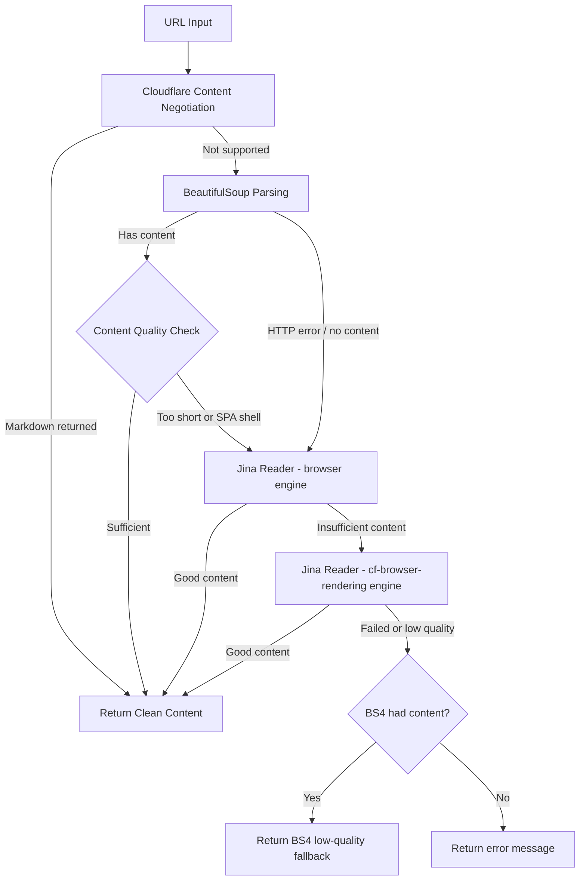

# Web Fetch Tool

The Web Fetch tool provides intelligent webpage content extraction from URLs. It uses a three-stage strategy chain — Cloudflare Content Negotiation, BeautifulSoup parsing, and Jina Reader API — with **content quality evaluation** and **smart fallback** to extract clean, readable content from webpages while handling various website structures and formats, including JavaScript-heavy Single Page Applications (SPAs).

## Overview

The Fetch class offers robust webpage content extraction:

- **Three-Stage Strategy Chain**: Cloudflare Content Negotiation → BeautifulSoup parsing → Jina Reader API
- **Content Quality Evaluation**: Detects SPA shell pages and insufficient content, triggering automatic fallback
- **Smart Fallback with Low-Quality Recovery**: If Jina Reader also fails, returns BS4 low-quality content as a last resort (better than nothing)
- **Content Cleaning**: Removes navigation, ads, and unnecessary elements
- **User Agent Rotation**: Uses realistic browser user agents via `ua-generator`
- **Timeout Handling**: Configurable timeouts (default: 30s) and proxy support
- **Error Resilience**: Graceful handling of network errors and inaccessible content

## Quick Start

```python
from toolregistry_hub import Fetch

# Basic webpage content extraction
url = "https://example.com"
content = Fetch.fetch_content(url)
print(f"Content length: {len(content)} characters")
# Output: Content length: 127 characters
print(f"Content preview: {content[:200]}...")
# Output: Content preview: Example Domain This domain is for use in documentation examples without needing permission. Avoid us...

# With timeout and proxy
content = Fetch.fetch_content(
    url="https://example.com",
    timeout=15.0,
    proxy="http://proxy.example.com:8080"
)
```

## API Reference

### `fetch_content(url: str, timeout: float = 30.0, proxy: Optional[str] = None) -> str`

Extract content from a given URL using available methods.

**Parameters:**

- `url` (str): The URL to fetch content from
- `timeout` (float): Request timeout in seconds (default: 30.0)
- `proxy` (Optional[str]): Proxy server URL (e.g., "http://proxy.example.com:8080")

**Returns:**

- `str`: Extracted content from the URL, or "Unable to fetch content" if extraction fails

**Raises:**

- `Exception`: If URL is invalid or network errors occur

## How It Works

### Three-Stage Strategy Chain

The Web Fetch tool uses a three-stage extraction approach with **content quality evaluation** at each step:

1. **Cloudflare Content Negotiation**: Zero-cost attempt to get markdown directly from the origin server
2. **BeautifulSoup Direct Parsing**: Intelligent HTML parsing with content cleaning + quality check
3. **Jina Reader (Fallback)**: External API with multi-engine retry (`browser` → `cf-browser-rendering`) for JavaScript rendering (SPA support)

### Extraction Process



### Content Quality Evaluation

After BeautifulSoup extraction, the tool evaluates content quality using `_is_content_sufficient()` before deciding whether to accept the result or fall back to Jina Reader:

**Minimum Length Check:**

- Content shorter than **100 characters** is considered insufficient and triggers Jina Reader fallback

**SPA Shell Detection:**

The tool detects common indicators of Single Page Application shell pages that lack real content. If any of the following phrases appear in the extracted text, the content is considered a JavaScript app shell:

- `"please enable javascript"`
- `"you need to enable javascript"`
- `"this app requires javascript"`
- `"loading..."`
- `"noscript"`
- `"we're sorry but"`
- `"doesn't work properly without javascript"`
- `"requires a modern browser"`
- `"enable cookies"`

When SPA shell content is detected, Jina Reader is automatically triggered with its `browser` engine to render the JavaScript and extract the actual content. If the `browser` engine still returns insufficient content, the tool retries with the `cf-browser-rendering` engine, which is specifically designed for JS-heavy websites.

**Low-Quality Fallback:**

If Jina Reader also fails to produce sufficient content, the tool falls back to the BS4 low-quality result (if available) — because partial content is better than no content at all.

### Cloudflare Content Negotiation

The first strategy leverages [Cloudflare's "Markdown for Agents"](https://blog.cloudflare.com/markdown-for-agents/) feature. It sends a standard HTTP GET request with the `Accept: text/markdown` header. If the origin server (or Cloudflare's edge) supports content negotiation and can serve markdown, the response will contain high-quality, pre-formatted markdown content — ideal for LLM consumption.

**How it works:**

- The tool sends a request with `Accept: text/markdown` in the HTTP headers
- If the server responds with `Content-Type: text/markdown`, the markdown content is used directly
- If the server does not support this content type, the response is discarded and the next strategy is tried
- This is a **zero-cost** attempt: no external API calls, no additional processing — just a standard HTTP request with a different `Accept` header

**Benefits:**

- High-quality, structured markdown output when supported
- No dependency on third-party services
- Preserves the original document structure (headings, lists, code blocks, etc.)
- Cloudflare also provides an `x-markdown-tokens` header indicating the token count of the markdown content

### Jina Reader API

The Jina Reader serves as the fallback strategy for pages that BeautifulSoup cannot handle well (e.g., JavaScript-heavy SPAs). The implementation uses a **multi-engine retry** approach:

**Request Configuration:**

- **POST method** with JSON body (`{"url": "..."}`) for structured requests
- **`Accept: application/json`** header to receive structured JSON responses
- **`X-Return-Format: markdown`** (default) for LLM-friendly output
- **`X-Remove-Selector: header, footer, nav, aside`** to strip non-content elements server-side

**SPA Rendering Parameters:**

- **`X-Engine`**: Tries `browser` first, then falls back to `cf-browser-rendering` (optimised for JS-heavy websites) if content is insufficient
- **`X-Wait-For-Selector`**: Waits for common content selectors (`main`, `article`, `.content`, `#content`, `.main-content`, `#main-content`, `[role='main']`) to appear before capturing the page, ensuring dynamically loaded content is fully rendered
- **`X-Timeout`**: Sets the maximum time Jina should spend rendering the page (equal to the configured `timeout` parameter)

**Timeout Separation:**

The httpx transport timeout is set to `timeout + 10s` (buffer), while the Jina `X-Timeout` is set to `timeout`. This prevents the HTTP client from timing out before Jina finishes rendering the page — a common issue with SPA pages that require extra rendering time.

The JSON response is parsed to extract the `data.content` field, which contains the rendered page content.

### Content Cleaning Process

The tool automatically removes:

- Navigation menus and headers
- Footer content and copyright notices
- Sidebars and advertisements
- Scripts and style blocks
- Navigation elements (`<nav>`, `<footer>`, `<sidebar>`)
- Interactive elements (`<iframe>`, `<noscript>`)

## Usage Examples

### Basic Content Extraction

```python
from toolregistry_hub import Fetch

# Extract content from a news article
news_url = "https://example.com"
content = Fetch.fetch_content(news_url)

if content and content != "Unable to fetch content":
    print(f"Successfully extracted {len(content)} characters")
    # Output: Successfully extracted 127 characters
    print(f"Title preview: {content[:100]}...")
    # Output: Title preview: Example Domain This domain is for use in documentation examples without needing permission. Avoid us...
else:
    print("Failed to extract content")
```

### Blog Post Extraction

```python
from toolregistry_hub import Fetch

# Extract blog post content
blog_url = "https://example.com"
content = Fetch.fetch_content(blog_url, timeout=15.0)

# Process the extracted content
if content:
    # Count words
    word_count = len(content.split())
    print(f"Blog post contains {word_count} words")
    # Output: Blog post contains 23 words

    # Find key sections
    if "introduction" in content.lower():
        print("Found introduction section")
    if "conclusion" in content.lower():
        print("Found conclusion section")
```

### Documentation Extraction

````python
from toolregistry_hub import Fetch

# Extract API documentation
docs_url = "https://docs.example.com/api-reference"
content = Fetch.fetch_content(docs_url)

# Look for specific documentation patterns
if content:
    # Check for code examples
    code_blocks = content.count("```")
    print(f"Found {code_blocks} code blocks")

    # Look for method signatures
    if "def " in content or "function " in content:
        print("Found function/method definitions")
````

### Research and Analysis

```python
from toolregistry_hub import Fetch

# Extract multiple sources for research
research_urls = [
    "https://arxiv.org/abs/2301.12345",
    "https://medium.com/ai-research",
    "https://towardsdatascience.com/machine-learning"
]

collected_content = []
for url in research_urls:
    content = Fetch.fetch_content(url, timeout=20.0)
    if content and content != "Unable to fetch content":
        collected_content.append({
            'url': url,
            'content': content,
            'length': len(content)
        })
        print(f"✓ Extracted {len(content)} chars from {url}")
    else:
        print(f"✗ Failed to extract from {url}")

print(f"\nSuccessfully collected content from {len(collected_content)} sources")
```

### With Proxy Configuration

```python
from toolregistry_hub import Fetch

# Use with corporate proxy
proxy_url = "http://corporate-proxy.company.com:8080"
target_url = "https://external-resource.com/data"

content = Fetch.fetch_content(
    url=target_url,
    timeout=30.0,
    proxy=proxy_url
)

if content:
    print("Successfully bypassed proxy restrictions")
else:
    print("Proxy configuration may be incorrect")
```

## Best Practices

### Error Handling

```python
from toolregistry_hub import Fetch

def safe_web_fetch(url, retries=3):
    """Safely fetch web content with retry logic."""
    for attempt in range(retries):
        try:
            content = Fetch.fetch_content(url, timeout=15.0)
            if content and content != "Unable to fetch content":
                return content
            else:
                print(f"Attempt {attempt + 1} failed, retrying...")
        except Exception as e:
            print(f"Attempt {attempt + 1} error: {e}")

    return None

# Usage
url = "https://unreliable-source.com"
content = safe_web_fetch(url)
if content:
    print("Successfully fetched content")
else:
    print("All attempts failed")
```

### Batch Processing

```python
from toolregistry_hub import Fetch
import time

def batch_fetch(urls, delay=1.0):
    """Fetch multiple URLs with rate limiting."""
    results = []

    for i, url in enumerate(urls):
        print(f"Processing {i+1}/{len(urls)}: {url}")

        content = Fetch.fetch_content(url, timeout=10.0)
        results.append({
            'url': url,
            'content': content,
            'success': content is not None and content != "Unable to fetch content"
        })

        # Rate limiting
        if i < len(urls) - 1:
            time.sleep(delay)

    return results

# Usage
urls = ["https://site1.com", "https://site2.com", "https://site3.com"]
results = batch_fetch(urls, delay=2.0)

successful = [r for r in results if r['success']]
print(f"Successfully fetched {len(successful)}/{len(results)} URLs")
```

### Content Validation

```python
from toolregistry_hub import Fetch

def validate_extracted_content(content, min_length=100):
    """Validate extracted content quality."""
    if not content:
        return False, "No content extracted"

    if content == "Unable to fetch content":
        return False, "Extraction failed"

    if len(content) < min_length:
        return False, f"Content too short ({len(content)} chars)"

    # Check for meaningful content
    meaningful_words = ["the", "and", "content", "information"]
    has_meaningful_content = any(word in content.lower() for word in meaningful_words)

    if not has_meaningful_content:
        return False, "Content appears to be empty or template"

    return True, "Content validation passed"

# Usage
url = "https://example.com"
content = Fetch.fetch_content(url)
is_valid, message = validate_extracted_content(content)

print(f"Content validation: {message}")
if is_valid:
    print(f"Valid content: {len(content)} characters")
```

## Important Considerations

### Legal and Ethical Use

- **Respect robots.txt**: Check website's robots.txt before scraping
- **Rate limiting**: Don't overwhelm servers with too many requests
- **Terms of service**: Review website terms before automated access
- **Copyright**: Be mindful of copyrighted content usage

### Technical Limitations

- **JavaScript-heavy sites**: Handled via Jina Reader's multi-engine retry (`browser` → `cf-browser-rendering`) with `X-Wait-For-Selector` for dynamic content, but some complex SPAs may still not render fully
- **Authentication**: Cannot access password-protected content
- **Large files**: Very large pages may timeout or be truncated
- **Complex layouts**: Some sites may require custom parsing
- **Jina Reader availability**: The Jina Reader API is a free external service; availability is not guaranteed

### Performance Tips

- **Timeouts**: Use appropriate timeouts (default is 30 seconds)
- **Proxies**: Use proxies for blocked or rate-limited sites
- **User agents**: Tool automatically rotates user agents
- **Caching**: Consider caching results for frequently accessed content

## Content Quality

### What Gets Extracted

**✅ Extracted Content:**

- Main article text
- Blog post content
- Documentation text
- Product descriptions
- News article body
- Tutorial content

**❌ Filtered Out:**

- Navigation menus
- Footer copyright text
- Sidebar advertisements
- Header banners
- Comment sections
- Related posts
- Social media widgets

### Quality Indicators

```python
def assess_content_quality(content):
    """Assess the quality of extracted content."""
    if not content:
        return {"quality": "poor", "reason": "empty content"}

    length = len(content)

    if length < 50:
        return {"quality": "poor", "reason": "too short", "length": length}
    elif length < 500:
        return {"quality": "fair", "reason": "short content", "length": length}
    elif length < 2000:
        return {"quality": "good", "reason": "adequate length", "length": length}
    else:
        return {"quality": "excellent", "reason": "comprehensive content", "length": length}

# Usage
url = "https://example.com"
content = Fetch.fetch_content(url)
quality = assess_content_quality(content)
print(f"Content quality: {quality}")
```
