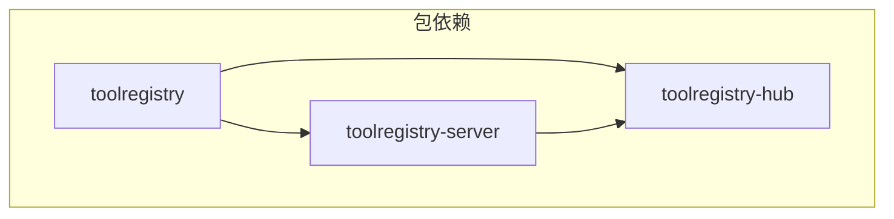
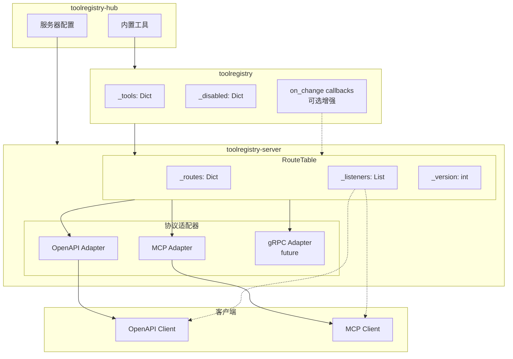

# Phase 6 续：中央 Router 表设计 + toolregistry-server 新包

## 1. 背景

### 1.1 当前架构问题

当前架构中，每个协议适配器（OpenAPI、MCP）直接从 `ToolRegistry` 读取工具信息：

```
ToolRegistry → OpenAPI Adapter (autoroute.py)
            → MCP Adapter (mcp_adapter.py)
```

问题：
1. **路由逻辑分散**：每个适配器独立实现路由生成逻辑
2. **状态同步困难**：OpenAPI 没有类似 MCP 的 `tools/on_change` 通知机制
3. **缓存失效**：无法高效通知客户端工具状态变化
4. **职责混合**：toolregistry-hub 同时包含工具实现和服务器逻辑

### 1.2 目标架构

创建 `toolregistry-server` 作为独立仓库和包：

```
github.com/Oaklight/
├── ToolRegistry/           # 核心库
├── toolregistry-server/    # 服务器库 ← 新仓库
└── toolregistry-hub/       # 工具集合
```

### 1.3 包职责划分

| 包 | 职责 | 依赖 |
|---|---|---|
| `toolregistry` | Tool 模型、ToolRegistry、客户端集成 | 无 |
| `toolregistry-server` | 服务器核心、路由表、协议适配器 | `toolregistry` |
| `toolregistry-hub` | 内置工具集合、默认服务器配置 | `toolregistry`, `toolregistry-server` |

---

## 2. toolregistry-server 仓库结构

### 2.1 目录结构

```
toolregistry-server/
├── .github/
│   └── workflows/
│       ├── ci.yml
│       └── release.yml
├── pyproject.toml
├── README.md
├── LICENSE
├── src/
│   └── toolregistry_server/
│       ├── __init__.py
│       ├── route_table.py          # 中央路由表
│       ├── openapi/
│       │   ├── __init__.py
│       │   ├── adapter.py          # registry_to_router()
│       │   ├── server.py           # FastAPI app 创建
│       │   └── dynamic_schema.py   # 动态 OpenAPI schema
│       ├── mcp/
│       │   ├── __init__.py
│       │   ├── adapter.py          # route_table_to_mcp_server()
│       │   └── server.py           # MCP server 创建
│       ├── auth/
│       │   ├── __init__.py
│       │   └── bearer.py           # Bearer token 认证
│       ├── cli/
│       │   ├── __init__.py
│       │   └── main.py             # CLI 入口
│       └── admin/                  # Future: Admin Panel
│           └── __init__.py
└── tests/
    ├── __init__.py
    ├── test_route_table.py
    ├── test_openapi_adapter.py
    └── test_mcp_adapter.py
```

### 2.2 pyproject.toml

```toml
[build-system]
requires = ["setuptools>=61.0"]
build-backend = "setuptools.build_meta"

[project]
name = "toolregistry-server"
dynamic = ["version"]
description = "Server library for ToolRegistry - OpenAPI and MCP protocol adapters"
readme = "README.md"
license = "MIT"
requires-python = ">=3.9"
authors = [{ name = "Oaklight", email = "oaklight@example.com" }]
classifiers = [
    "Development Status :: 4 - Beta",
    "Intended Audience :: Developers",
    "License :: OSI Approved :: MIT License",
    "Programming Language :: Python :: 3",
    "Programming Language :: Python :: 3.9",
    "Programming Language :: Python :: 3.10",
    "Programming Language :: Python :: 3.11",
    "Programming Language :: Python :: 3.12",
]
dependencies = [
    "toolregistry>=0.5.0",
    "loguru>=0.7.0",
]

[project.optional-dependencies]
openapi = [
    "fastapi>=0.119.0",
    "uvicorn[standard]>=0.24.0",
    "pydantic>=2.0.0",
]
mcp = [
    "mcp>=1.8.0; python_version >= '3.10'",
]
all = [
    "toolregistry-server[openapi]",
    "toolregistry-server[mcp]",
]
dev = [
    "pytest>=7.0.0",
    "pytest-asyncio>=0.21.0",
    "httpx>=0.24.0",
    "ruff>=0.1.0",
]

[project.scripts]
toolregistry-server = "toolregistry_server.cli.main:main"

[project.urls]
Documentation = "https://toolregistry-server.readthedocs.io"
Repository = "https://github.com/Oaklight/toolregistry-server"
Issues = "https://github.com/Oaklight/toolregistry-server/issues"

[tool.setuptools.dynamic]
version = { attr = "toolregistry_server.__version__" }

[tool.setuptools.packages.find]
where = ["src"]

[tool.setuptools.package-data]
"toolregistry_server" = ["py.typed"]
```

---

## 3. 中央 Router 表设计

### 3.1 核心概念

```python
# src/toolregistry_server/route_table.py

from dataclasses import dataclass
from typing import Callable, Any
from toolregistry import ToolRegistry
from toolregistry.tool import Tool


@dataclass
class RouteEntry:
    """A single route entry in the central router table."""
    
    # Tool identity
    tool_name: str          # e.g. "calculator-evaluate"
    namespace: str          # e.g. "calculator"
    method_name: str        # e.g. "evaluate"
    
    # Route metadata
    path: str               # e.g. "/tools/calculator/evaluate"
    description: str
    parameters_schema: dict  # JSON Schema
    
    # Execution
    handler: Callable       # The actual tool callable
    is_async: bool
    
    # State
    enabled: bool
    disable_reason: str | None


class RouteTable:
    """Central router table that bridges ToolRegistry and protocol adapters."""
    
    def __init__(self, registry: ToolRegistry):
        self._registry = registry
        self._routes: dict[str, RouteEntry] = {}
        self._listeners: list[Callable[[str, str], None]] = []
        self._version = 0
        self._rebuild()
    
    def _rebuild(self) -> None:
        """Rebuild route table from registry."""
        self._routes.clear()
        for tool_name, tool in self._registry._tools.items():
            self._routes[tool_name] = self._tool_to_route(tool)
    
    def _tool_to_route(self, tool: Tool) -> RouteEntry:
        """Convert a Tool to a RouteEntry."""
        namespace = tool.namespace or "default"
        method_name = tool.method_name or tool.name
        
        return RouteEntry(
            tool_name=tool.name,
            namespace=namespace,
            method_name=method_name,
            path=f"/tools/{namespace}/{method_name}",
            description=tool.description or "",
            parameters_schema=tool.parameters,
            handler=tool.callable,
            is_async=tool.is_async,
            enabled=self._registry.is_enabled(tool.name),
            disable_reason=self._registry.get_disable_reason(tool.name),
        )
    
    # ============== Query API ==============
    
    def list_routes(self, enabled_only: bool = True) -> list[RouteEntry]:
        """List all routes, optionally filtering by enabled state."""
        if enabled_only:
            return [r for r in self._routes.values() if r.enabled]
        return list(self._routes.values())
    
    def get_route(self, tool_name: str) -> RouteEntry | None:
        """Get a specific route by tool name."""
        return self._routes.get(tool_name)
    
    @property
    def etag(self) -> str:
        """Get ETag for cache validation."""
        return f'"{self._version}"'
    
    # ============== State Change API ==============
    
    def enable(self, tool_name: str) -> None:
        """Enable a tool and notify listeners."""
        self._registry.enable(tool_name)
        self.refresh(tool_name)
        self._notify_listeners(tool_name, "enable")
    
    def disable(self, tool_name: str, reason: str = "") -> None:
        """Disable a tool and notify listeners."""
        self._registry.disable(tool_name, reason)
        self.refresh(tool_name)
        self._notify_listeners(tool_name, "disable")
    
    def refresh(self, tool_name: str) -> None:
        """Refresh a single route's state from registry."""
        tool = self._registry.get_tool(tool_name)
        if tool:
            self._routes[tool_name] = self._tool_to_route(tool)
    
    def refresh_all(self) -> None:
        """Refresh all routes from registry."""
        self._rebuild()
        self._notify_listeners("*", "refresh_all")
    
    # ============== Observer Pattern ==============
    
    def add_listener(self, callback: Callable[[str, str], None]) -> None:
        """Add a listener for route changes.
        
        Callback signature: (tool_name: str, event: str) -> None
        Events: "enable", "disable", "refresh", "refresh_all"
        """
        self._listeners.append(callback)
    
    def remove_listener(self, callback: Callable[[str, str], None]) -> None:
        """Remove a listener."""
        self._listeners.remove(callback)
    
    def _notify_listeners(self, tool_name: str, event: str) -> None:
        """Notify all listeners of a change."""
        self._version += 1
        for listener in self._listeners:
            listener(tool_name, event)
```

### 3.2 与 ToolRegistry 的集成

采用**代理模式**：所有状态变更通过 RouteTable 代理，不需要修改上游 ToolRegistry。

如果后续 ToolRegistry 添加了 `on_change` 回调，RouteTable 可以注册回调实现自动刷新。

---

## 4. 协议适配器

### 4.1 OpenAPI 适配器

```python
# src/toolregistry_server/openapi/adapter.py

from fastapi import APIRouter
from ..route_table import RouteTable, RouteEntry


def route_table_to_router(
    route_table: RouteTable,
    prefix: str = "/tools",
) -> APIRouter:
    """Convert a RouteTable into a FastAPI router."""
    router = APIRouter(prefix=prefix)
    
    for route in route_table.list_routes(enabled_only=False):
        _add_route(router, route, route_table)
    
    return router
```

### 4.2 MCP 适配器

```python
# src/toolregistry_server/mcp/adapter.py

from mcp.server.lowlevel import Server
from mcp.types import Tool as MCPTool
from ..route_table import RouteTable


def route_table_to_mcp_server(
    route_table: RouteTable,
    name: str = "ToolRegistry-Server",
) -> Server:
    """Create an MCP server from a RouteTable."""
    server = Server(name)
    
    @server.list_tools()
    async def handle_list_tools() -> list[MCPTool]:
        return [
            MCPTool(
                name=route.tool_name,
                description=route.description,
                inputSchema=route.parameters_schema,
            )
            for route in route_table.list_routes(enabled_only=True)
        ]
    
    # ... call_tool handler
    
    return server
```

---

## 5. toolregistry-hub 的变化

迁移后，toolregistry-hub 变为薄封装：

### 5.1 pyproject.toml 更新

```toml
[project]
dependencies = [
    "toolregistry>=0.5.0",
]

[project.optional-dependencies]
server_core = [
    "toolregistry-server[openapi]",
]
server_mcp = [
    "toolregistry-server[mcp]",
]
server = [
    "toolregistry-hub[server_core]",
    "toolregistry-hub[server_mcp]",
]
```

### 5.2 服务器代码简化

```python
# toolregistry_hub/server/__init__.py

from toolregistry_server import RouteTable
from toolregistry_server.openapi import create_openapi_app
from toolregistry_server.mcp import create_mcp_server
from toolregistry_hub.server.registry import build_registry


def create_hub_server(mode: str = "openapi"):
    """Create a server with all hub tools registered."""
    registry = build_registry()
    route_table = RouteTable(registry)
    
    if mode == "openapi":
        return create_openapi_app(route_table)
    elif mode == "mcp":
        return create_mcp_server(route_table)
```

---

## 6. OpenAPI 状态变更通知

### 6.1 ETag / 条件请求

```python
# src/toolregistry_server/openapi/dynamic_schema.py

from fastapi import FastAPI, Request, Response
from ..route_table import RouteTable


def setup_dynamic_openapi(app: FastAPI, route_table: RouteTable) -> None:
    """Configure dynamic OpenAPI schema with ETag support."""
    
    @app.get("/openapi.json")
    async def get_openapi(request: Request) -> Response:
        # Check If-None-Match header
        if_none_match = request.headers.get("If-None-Match")
        if if_none_match == route_table.etag:
            return Response(status_code=304)
        
        # Generate schema
        schema = generate_openapi_schema(app, route_table)
        
        return Response(
            content=json.dumps(schema),
            media_type="application/json",
            headers={"ETag": route_table.etag},
        )
```

### 6.2 WebSocket 通知（可选）

```python
# src/toolregistry_server/openapi/websocket.py

from fastapi import WebSocket
from ..route_table import RouteTable


async def tool_changes_endpoint(websocket: WebSocket, route_table: RouteTable):
    """WebSocket endpoint for tool change notifications."""
    await websocket.accept()
    
    def on_change(tool_name: str, event: str):
        asyncio.create_task(
            websocket.send_json({"tool": tool_name, "event": event})
        )
    
    route_table.add_listener(on_change)
    try:
        while True:
            await websocket.receive_text()
    finally:
        route_table.remove_listener(on_change)
```

---

## 7. Issue 重组方案

### 7.1 ToolRegistry 仓库

| Issue | 标题 | 操作 | 说明 |
|-------|------|------|------|
| #68 | on_change 回调机制 | 更新描述 | 仅保留 on_change API 部分，标记为可选增强 |

### 7.2 toolregistry-hub 仓库

| Issue | 标题 | 操作 | 说明 |
|-------|------|------|------|
| #47 | MCP server migration | 更新描述 | 标记已完成部分，添加迁移到 toolregistry-server 的目标 |
| 新建 | MCP SDK 适配器实现 | 创建并关闭 | 记录已完成的 mcp_adapter.py 和 server_mcp.py |
| 新建 | 迁移服务器代码到 toolregistry-server | 创建 | 跟踪迁移工作 |

### 7.3 toolregistry-server 仓库（新建）

| Issue | 标题 | 说明 |
|-------|------|------|
| #1 | 初始化仓库结构 | 创建基础目录结构和 pyproject.toml |
| #2 | 实现 RouteTable | 中央路由表核心实现 |
| #3 | 迁移 OpenAPI 适配器 | 从 toolregistry-hub 迁移 autoroute.py |
| #4 | 迁移 MCP 适配器 | 从 toolregistry-hub 迁移 mcp_adapter.py |
| #5 | 实现 ETag 支持 | OpenAPI schema 缓存验证 |
| #6 | CLI 实现 | toolregistry-server 命令行工具 |

---

## 8. 实施计划

### Phase 6a: 创建 toolregistry-server 仓库

1. 创建 GitHub 仓库 `Oaklight/toolregistry-server`
2. 初始化项目结构和 pyproject.toml
3. 实现 `RouteTable` 类
4. 添加基础测试

### Phase 6b: 迁移适配器代码

1. 迁移 `autoroute.py` → `openapi/adapter.py`
2. 迁移 `mcp_adapter.py` → `mcp/adapter.py`
3. 迁移 `auth.py` → `auth/bearer.py`
4. 迁移 CLI 相关代码
5. 更新测试

### Phase 6c: 更新 toolregistry-hub

1. 添加 `toolregistry-server` 依赖
2. 简化 `server/` 目录为薄封装
3. 保持 CLI 兼容性
4. 更新文档

### Phase 6d: 增强功能

1. 实现 ETag 支持
2. （可选）实现 WebSocket 通知
3. （可选）在 ToolRegistry 中添加 on_change 回调

---

## 9. 架构图

### 9.1 包依赖关系



### 9.2 运行时架构



---

## 10. 迁移检查清单

### 从 toolregistry-hub 迁移的文件

| 源文件 | 目标文件 | 状态 |
|--------|----------|------|
| `server/autoroute.py` | `openapi/adapter.py` | 待迁移 |
| `server/mcp_adapter.py` | `mcp/adapter.py` | 待迁移 |
| `server/server_mcp.py` | `mcp/server.py` | 待迁移 |
| `server/server_openapi.py` | `openapi/server.py` | 待迁移 |
| `server/server_core.py` | `openapi/server.py` | 合并 |
| `server/auth.py` | `auth/bearer.py` | 待迁移 |
| `server/cli.py` | `cli/main.py` | 待迁移 |
| `server/tool_config.py` | 保留在 hub | 工具配置特定于 hub |
| `server/registry.py` | 保留在 hub | 工具注册特定于 hub |

### 保留在 toolregistry-hub 的文件

- `server/registry.py` - 工具注册逻辑
- `server/tool_config.py` - tools.jsonc 配置解析
- `server/routes/` - 非工具路由（如 version）
