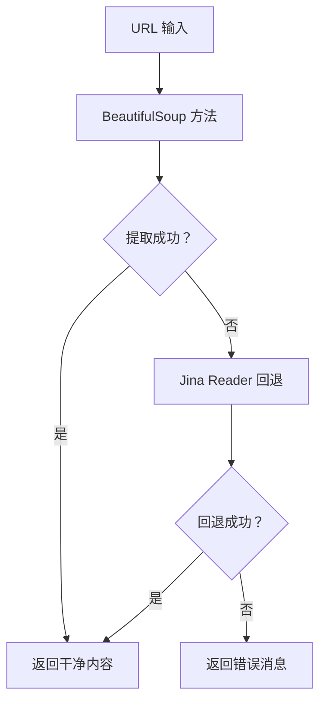

# 网页获取工具

网页获取工具提供从URL智能提取网页内容的功能。它结合使用BeautifulSoup解析和Jina Reader API，从网页中提取干净、可读的内容，同时处理各种网站结构和格式。

## 🎯 概览

Fetch类提供强大的网页内容提取功能：

- **双重提取方法**：BeautifulSoup解析 + Jina Reader API
- **智能回退**：如果一种方法失败，自动切换到另一种方法
- **内容清理**：移除导航、广告和不必要的元素
- **用户代理轮换**：使用真实的浏览器用户代理
- **超时处理**：可配置的超时和代理支持
- **错误恢复**：优雅处理网络错误和不可访问的内容

## 🚀 快速开始

```python
from toolregistry_hub import Fetch

# 基本网页内容提取
url = "https://example.com"
content = Fetch.fetch_content(url)
print(f"内容长度: {len(content)} 字符")
print(f"内容预览: {content[:200]}...")

# 使用超时和代理
content = Fetch.fetch_content(
    url="https://example.com",
    timeout=15.0,
    proxy="http://proxy.example.com:8080"
)
```

## 🔧 API 参考

### `fetch_content(url: str, timeout: float = 10.0, proxy: Optional[str] = None) -> str`

从给定 URL 使用可用方法提取内容。

**参数：**

- `url` (str): 要获取内容的 URL
- `timeout` (float): 请求超时时间（秒）（默认：10.0）
- `proxy` (Optional[str]): 代理服务器 URL（例如："http://proxy.example.com:8080"）

**返回值：**

- `str`: 从 URL 提取的内容，如果提取失败则返回 "Unable to fetch content"

**异常：**

- `Exception`: 如果 URL 无效或发生网络错误

## 🛠️ 工作原理

### 双重提取策略

网页获取工具使用两阶段提取方法：

1. **主要方法**：BeautifulSoup 智能解析
2. **回退方法**：Jina Reader API 用于复杂网站

### 提取过程



### 内容清理过程

工具自动移除：

- 导航菜单和标题
- 页脚内容和版权声明
- 侧边栏和广告
- 脚本和样式块
- 导航元素（`<nav>`, `<footer>`, `<sidebar>`）
- 交互元素（`<iframe>`, `<noscript>`）

## 📋 使用示例

### 基本内容提取

```python
from toolregistry_hub import Fetch

# 从新闻文章提取内容
news_url = "https://news.example.com/article/technology"
content = Fetch.fetch_content(news_url)

if content and content != "Unable to fetch content":
    print(f"成功提取 {len(content)} 字符")
    print(f"标题预览: {content[:100]}...")
else:
    print("提取内容失败")
```

### 博客文章提取

```python
from toolregistry_hub import Fetch

# 提取博客文章内容
blog_url = "https://techblog.example.com/ai-machine-learning"
content = Fetch.fetch_content(blog_url, timeout=15.0)

# 处理提取的内容
if content:
    # 统计单词数
    word_count = len(content.split())
    print(f"博客文章包含 {word_count} 个单词")

    # 查找关键部分
    if "introduction" in content.lower():
        print("找到介绍部分")
    if "conclusion" in content.lower():
        print("找到结论部分")
```

### 文档提取

````python
from toolregistry_hub import Fetch

# 提取 API 文档
docs_url = "https://docs.example.com/api-reference"
content = Fetch.fetch_content(docs_url)

# 查找特定的文档模式
if content:
    # 检查代码示例
    code_blocks = content.count("```")
    print(f"找到 {code_blocks} 个代码块")

    # 查找方法签名
    if "def " in content or "function " in content:
        print("找到函数/方法定义")
````

### 研究和分析

```python
from toolregistry_hub import Fetch

# 为研究提取多个来源
research_urls = [
    "https://arxiv.org/abs/2301.12345",
    "https://medium.com/ai-research",
    "https://towardsdatascience.com/machine-learning"
]

collected_content = []
for url in research_urls:
    content = Fetch.fetch_content(url, timeout=20.0)
    if content and content != "Unable to fetch content":
        collected_content.append({
            'url': url,
            'content': content,
            'length': len(content)
        })
        print(f"✓ 从 {url} 提取 {len(content)} 字符")
    else:
        print(f"✗ 从 {url} 提取失败")

print(f"\n成功从 {len(collected_content)} 个来源收集内容")
```

### 使用代理配置

```python
from toolregistry_hub import Fetch

# 使用公司代理
proxy_url = "http://corporate-proxy.company.com:8080"
target_url = "https://external-resource.com/data"

content = Fetch.fetch_content(
    url=target_url,
    timeout=30.0,
    proxy=proxy_url
)

if content:
    print("成功绕过代理限制")
else:
    print("代理配置可能不正确")
```

## 🎯 最佳实践

### 错误处理

```python
from toolregistry_hub import Fetch

def safe_web_fetch(url, retries=3):
    """使用重试逻辑安全地获取网页内容。"""
    for attempt in range(retries):
        try:
            content = Fetch.fetch_content(url, timeout=15.0)
            if content and content != "Unable to fetch content":
                return content
            else:
                print(f"尝试 {attempt + 1} 失败，重试中...")
        except Exception as e:
            print(f"尝试 {attempt + 1} 错误: {e}")

    return None

# 使用
url = "https://unreliable-source.com"
content = safe_web_fetch(url)
if content:
    print("成功获取内容")
else:
    print("所有尝试都失败")
```

### 批量处理

```python
from toolregistry_hub import Fetch
import time

def batch_fetch(urls, delay=1.0):
    """使用速率限制获取多个 URL。"""
    results = []

    for i, url in enumerate(urls):
        print(f"处理 {i+1}/{len(urls)}: {url}")

        content = Fetch.fetch_content(url, timeout=10.0)
        results.append({
            'url': url,
            'content': content,
            'success': content is not None and content != "Unable to fetch content"
        })

        # 速率限制
        if i < len(urls) - 1:
            time.sleep(delay)

    return results

# 使用
urls = ["https://site1.com", "https://site2.com", "https://site3.com"]
results = batch_fetch(urls, delay=2.0)

successful = [r for r in results if r['success']]
print(f"成功获取 {len(successful)}/{len(results)} 个 URL")
```

### 内容验证

```python
from toolregistry_hub import Fetch

def validate_extracted_content(content, min_length=100):
    """验证提取内容的质量。"""
    if not content:
        return False, "未提取到内容"

    if content == "Unable to fetch content":
        return False, "提取失败"

    if len(content) < min_length:
        return False, f"内容太短 ({len(content)} 字符)"

    # 检查是否有意义的内容
    meaningful_words = ["the", "and", "content", "information"]
    has_meaningful_content = any(word in content.lower() for word in meaningful_words)

    if not has_meaningful_content:
        return False, "内容似乎是空的或模板"

    return True, "内容验证通过"

# 使用
url = "https://example.com"
content = Fetch.fetch_content(url)
is_valid, message = validate_extracted_content(content)

print(f"内容验证: {message}")
if is_valid:
    print(f"有效内容: {len(content)} 字符")
```

## 🚨 重要考虑事项

### 法律和道德使用

- **尊重 robots.txt**：在爬取前检查网站的 robots.txt
- **速率限制**：不要用太多请求压垮服务器
- **服务条款**：在自动访问前查看网站条款
- **版权**：注意版权内容的使用

### 技术限制

- **JavaScript 密集型网站**：可能无法完全渲染动态内容
- **认证**：无法访问密码保护的内容
- **大文件**：非常大的页面可能超时或被截断
- **复杂布局**：某些网站可能需要自定义解析

### 性能提示

- **超时**：使用适当的超时（通常 10-30 秒）
- **代理**：对阻止或速率限制的网站使用代理
- **用户代理**：工具自动轮换用户代理
- **缓存**：考虑缓存频繁访问的内容的结果

## 🔍 内容质量

### 提取的内容

**✅ 提取的内容：**

- 主要文章文本
- 博客文章内容
- 文档文本
- 产品描述
- 新闻文章正文
- 教程内容

**❌ 过滤掉的内容：**

- 导航菜单
- 页脚版权文本
- 侧边栏广告
- 标题横幅
- 评论部分
- 相关文章
- 社交媒体小部件

### 质量指标

```python
def assess_content_quality(content):
    """评估提取内容的质量。"""
    if not content:
        return {"quality": "poor", "reason": "空内容"}

    length = len(content)

    if length < 50:
        return {"quality": "poor", "reason": "太短", "length": length}
    elif length < 500:
        return {"quality": "fair", "reason": "短内容", "length": length}
    elif length < 2000:
        return {"quality": "good", "reason": "足够长度", "length": length}
    else:
        return {"quality": "excellent", "reason": "全面内容", "length": length}

# 使用
url = "https://example.com"
content = Fetch.fetch_content(url)
quality = assess_content_quality(content)
print(f"内容质量: {quality}")
